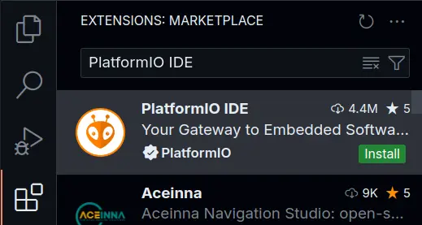
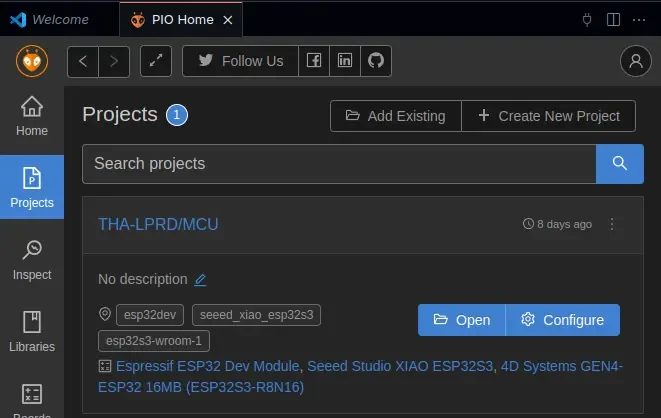
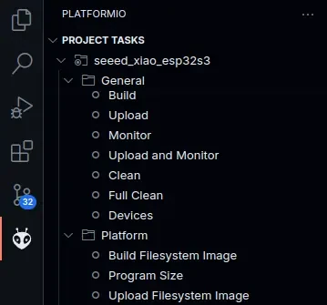
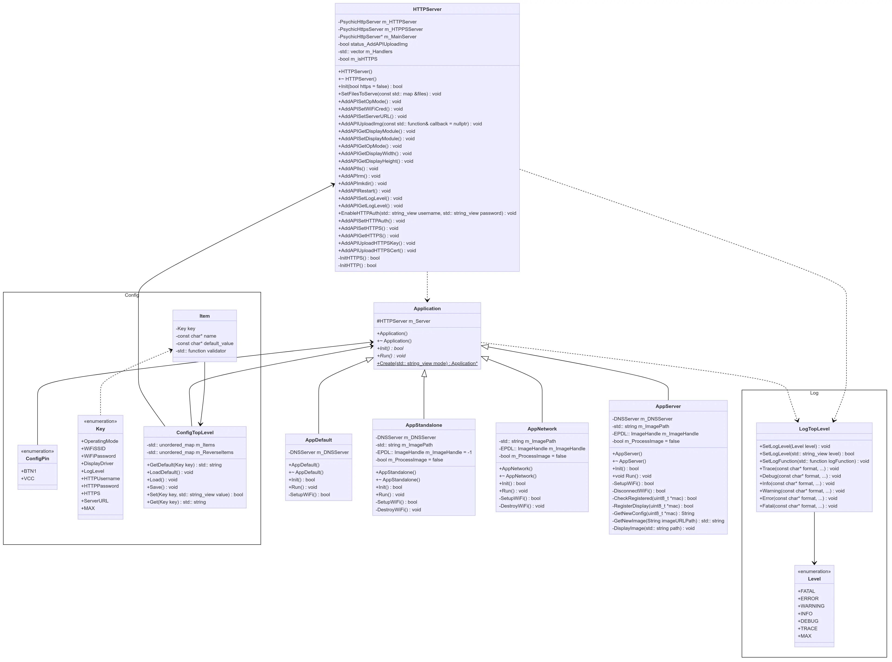
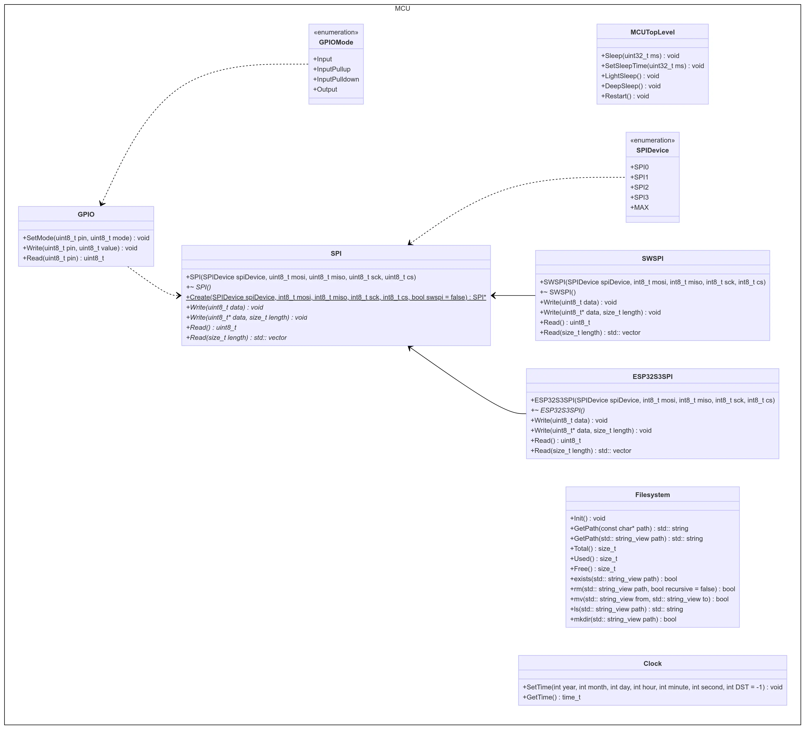
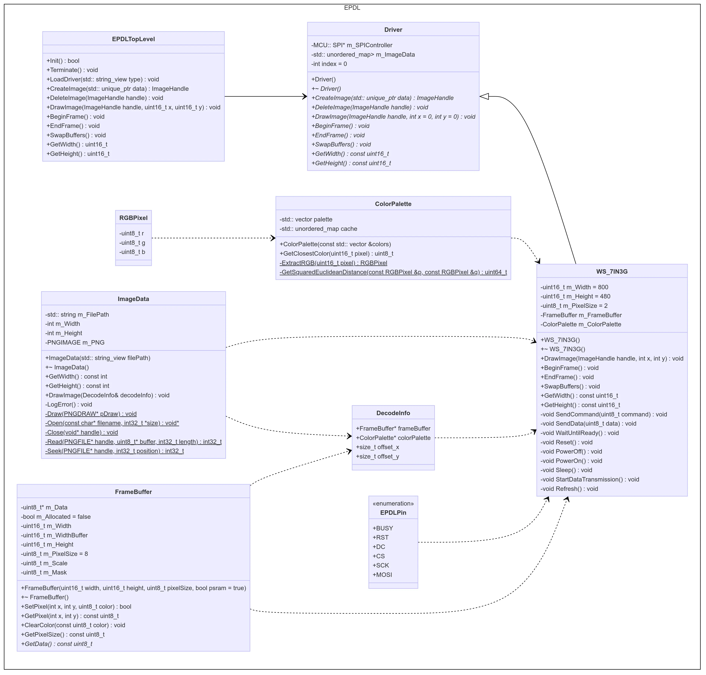

# Firmware

## Entwicklungsumgebung
**Ahmet Emirhan Göktas**

[PlatformIO](PraktischeUTheoretischeGrund.md#platformio) wurde als Entwicklungsumgebung für die LPRD-Firmware ausgewählt. Da die [Arduino IDE](PraktischeUTheoretischeGrund.md#arduino) für die Komplexität des Projekts nicht geeignet ist, wird [PlatformIO](PraktischeUTheoretischeGrund.md#platformio) als fortschrittlichere Alternative verwendet.

### PlatformIO mit Visual Studio Code
**Ahmet Emirhan Göktas**

Wie im Abschnitt [Grundlagen](PraktischeUTheoretischeGrund.md#firmwarebibliotheken) erwähnt, kann [PlatformIO](PraktischeUTheoretischeGrund.md#platformio) mit verschiedenen IDEs verwendet werden. Die meisten unserer Teammitglieder nutzen [Visual Studio Code](https://code.visualstudio.com/) als ihre IDE. Daher möchten wir zeigen, wie man [PlatformIO](PraktischeUTheoretischeGrund.md#platformio) für [Visual Studio Code](https://code.visualstudio.com/) einrichtet.

#### Installation
**Ahmet Emirhan Göktas**

1. Installieren Sie [Visual Studio Code](https://code.visualstudio.com/).
2. Öffnen Sie das Erweiterungspanel entweder über die Seitenleiste oder durch Drücken von ++ctrl+shift+x++ und geben Sie `PlatformIO IDE` ein.
3. Klicken Sie auf die `Install`, um die PlatformIO IDE-Erweiterung zu installieren.
4. Nachdem die Erweiterung installiert ist, können Sie die PlatformIO-Seitenleiste öffnen, indem Sie auf das PlatformIO-Symbol in der Seitenleiste klicken. Dies kann einige Minuten dauern, da PlatformIO das Backend herunterlädt und die Umgebung einrichtet.
[[AEG_06]](Quellenverzeichnis.md#AEG_06)

Figure: Abbildung 7.1: PlatformIO-Erweiterung in Visual Studio { #_abb7_1 }

{ width=60% }

#### Projekt erstellen
**Ahmet Emirhan Göktas**

1. Öffnen Sie die VS Code-Befehlszeile durch Drücken von ++ctrl+shift+p++ und geben Sie `>PlatformIO:PlatformIO Home` ein.
2. Drücken Sie `Enter`, um die PlatformIO-Startseite zu öffnen.
3. Klicken Sie auf der linken Seite der PlatformIO-Startseite auf die Registerkarte `Projects`.
4. Klicken Sie auf die `New Project`.
5. Wählen Sie das Board, das Sie verwenden. In unserem Fall verwenden wir das Board `Seeed Studio XIAO ESP32S3`.
6. Wählen Sie das Framework. In unserem Fall verwenden wir das `Arduino`-Framework.
7. Drücken Sie abschließend die `Finish`, um das Projekt zu erstellen.
[[AEG_07]](Quellenverzeichnis.md#AEG_07)

Figure: Abbildung 7.2: Neues PlatformIO-Projekt erstellen { #_abb8_2 }

{ width=60% }

#### Mikrocontroller flashen
**Ahmet Emirhan Göktas**

1. Verbinden Sie den Mikrocontroller mit Ihrem Computer.
2. Öffnen Sie die PlatformIO-Seitenleiste, indem Sie auf das PlatformIO-Symbol in der Seitenleiste klicken.
3. Klicken Sie auf die Projektumgebung im Abschnitt `Project Tasks`.
4. Klicken Sie auf die `Upload` im Abschnitt `General`, um die Firmware auf den Mikrocontroller zu flashen.
5. Die `Upload File System Image` Taste im Abschnitt `Platform` kann verwendet werden, um das Dateisystem-Image auf den Mikrocontroller hochzuladen.

Figure: Abbildung 7.3: Firmware auf den Mikrocontroller hochladen { #_abb8_3 }



### Versionskontrolle
**Ahmet Emirhan Göktas**

In diesem Projekt haben wir [git](https://git-scm.com/) als unser Versionskontrollsystem verwendet und dem Git-Flow-Modell gefolgt. Das Git-Flow-Modell ist ein von Vincent Driessen erstelltes Branching model für git. Es ist eine Reihe von Regeln, die verwendet werden, um die Verzweigungen in einem git-Repository zu verwalten. Die haupt Branches sind `master` und `dev`. Der `master`-Branch wird für produktionsbereiten Code verwendet, während der `dev`-Branch für Code verwendet wird, der sich in der Entwicklung befindet. Der `dev`-Branch wird abgezweigt, um Feature-Branches zu erstellen. Sobald das Feature abgeschlossen ist, wird der Feature-Branch wieder in den `dev`-Branch integriert. Wenn der Code im `dev`-Branch bereit für die Produktion ist, wird er in den `master`-Branch integriert. [[AEG_08]](Quellenverzeichnis.md#AEG_08)

## Anforderungen
**Ahmet Emirhan Göktas**

Wie bereits erwähnt, muss das LPRD bestimmte Anforderungen erfüllen. Diese Anforderungen bilden die Grundlage für die Firmware-Entwicklung. Die folgenden Anforderungen ergeben sich aus den Hardwareanforderungen:

### Drahtlose Kommunikation
**Ahmet Emirhan Göktas**

Das Gerät soll drahtlos gesteuert werden, um eine einfache Installation und Konfiguration zu ermöglichen und die Steuerung des Geräts von einem zentralen Server aus zu erlauben. Es gibt zwei Möglichkeiten, dies zu erreichen:

- Verbindung mit einem bestehenden drahtlosen Netzwerk.
- Erstellung eines eigenen drahtlosen Netzwerks.

### Dateisystem
**Ahmet Emirhan Göktas**

Das Displaymodul benötigt einen nichtflüchtigen Speicher, um die angezeigten Bilder sowie die Konfigurationen wie Netzwerkeinstellungen und Betriebsmodi zu speichern. Der ESP32-S3-Mikrocontroller bietet 8 MB Flash-Speicher, der mit dem LittleFS-Dateisystem genutzt wird.

### Konfiguration
**Ahmet Emirhan Göktas**

Das Displaymodul ist flexibel gestaltet und hat keine fest kodierte Konfiguration in der Firmware. Die Konfiguration kann vom Benutzer geändert werden und umfasst:

- WLAN-Netzwerkkonfiguration (SSID, Passwort)
- E-Paper-Display-Konfiguration (Modell)
- Betriebsmodus (Standalone, Netzwerk, Server)
- Serverkonfiguration (URL)
- Log-Level (für Debugging)
- HTTP-Server-Konfiguration (HTTP, HTTPS)
- Authentifizierung (Benutzername, Passwort)

### Betriebsmodi
**Ahmet Emirhan Göktas**

Das Displaymodul unterstützt verschiedene Betriebsmodi:

- **Standalone**: Funktioniert ohne ein bestehendes WLAN-Netzwerk.
- **Netzwerk**: Funktioniert mit einem bestehenden WLAN-Netzwerk.
- **Server**: Wird von einem zentralen Server gesteuert.
- **Default**: Der Standardmodus bei der ersten Inbetriebnahme oder bei nicht behebbaren Fehlern. Dieser Modus entspricht dem Standalone-Modus mit fest kodierten Einstellungen.

### SPI-Schnittstelle
**Ahmet Emirhan Göktas**

Das E-Paper-Display ist über die SPI-Schnittstelle mit dem ESP32-S3-Mikrocontroller verbunden. Diese Schnittstelle wird zur Kommunikation und Anzeige von Bildern auf dem E-Paper-Display genutzt und muss entsprechend initialisiert und konfiguriert werden.

### Niedriger Energieverbrauch
**Ahmet Emirhan Göktas**

Die Akkulaufzeit ist ein wichtiger Faktor. Das Displaymodul muss in den Schlafmodus gehen können, wenn es nicht in Gebrauch ist, und bei Bedarf wieder aufwachen, um Energie zu sparen und die Akkulaufzeit zu verlängern.

## Klassendiagramm
**Ahmet Emirhan Göktas**

Figure: Abbildung 7.4: Klassendiagramm der Application { #_abb8_4 }



Figure: Abbildung 7.5: Klassendiagramm der Systemansteuerung { #_abb8_5 }



Figure: Abbildung 7.6: Klassendiagramm der E-Paper-Display-Library { #_abb8_6 }



## Application
**Ahmet Emirhan Göktas**

Die Applikation ist der Hauptteil der Firmware. Sie ist verantwortlich für die Konfiguration des Displaymoduls, die drahtlose Kommunikation, die Betriebsmodi und die SPI-Schnittstelle. Die Applikation ist in verschiedene Klassen unterteilt, die jeweils für unterschiedliche Teile der Applikation verantwortlich sind. Diese sind:

- [`Application`](#application): Die Hauptklasse der Applikation. Sie ist eine Schnittstelle, die von den verschiedenen Betriebsmodi implementiert wird.
- [`AppStandalone`](#standalone-modus): Der Standalone-Betriebsmodus. Das Displaymodul funktioniert ohne ein bestehendes WLAN.
- [`AppNetwork`](#netzwerkmodus): Der Netzwerk-Betriebsmodus. Das Displaymodul funktioniert mit einem bestehenden WLAN.
- [`AppServer`](#servermodus): Der Server-Betriebsmodus. Das Displaymodul wird von einem zentralen Server gesteuert.
- [`AppDefault`](#standardmodus): Der Standard-Betriebsmodus. Das Displaymodul befindet sich im Standardmodus, wenn es zum ersten Mal eingeschaltet wird oder wenn ein nicht behebbarer Fehler auftritt.
- `Log`: Ein Namensraum, der für das Loggen von Nachrichten auf den seriellen Port verantwortlich ist.
- `Config`: Ein Namensraum, der für die Konfiguration des Displaymoduls verantwortlich ist.

### Ablauf der Applikation
**Ahmet Emirhan Göktas**

Die `Application`-Klasse ist die Hauptklasse der Anwendung. Der grundlegende Ablauf der Anwendung ist wie folgt:

1. Initialisierung des Dateisystems.
2. Lesen der Konfiguration aus dem Dateisystem.
3. Initialisierung des entsprechenden Modus.
4. Ausführen der Anwendung.

### Betriebsmodi

#### Standardmodus
**Ahmet Emirhan Göktas**

In diesem Modus wird das WLAN im Access-Point-Modus initialisiert, um dem Benutzer die direkte Verbindung mit dem Gerät zu ermöglichen. Nachdem das WLAN initialisiert ist, wird der HTTP-Server gestartet. Die Standardseite ist die Einstellungsseite, wobei keine Endpunkte für den Bild-Upload enthalten sind.

Der Zweck dieses Modus besteht darin, dem Benutzer die Konfiguration des Geräts zu ermöglichen, unabhängig davon, ob etwas schiefgelaufen ist oder ein Werksreset durchgeführt wurde.

#### Standalone-Modus
**Ahmet Emirhan Göktas**

In diesem Modus arbeitet das Gerät unabhängig von bestehenden Infrastrukturen. Es beginnt mit der Initialisierung des WLANs im Access-Point-Modus. Anschließend wird der HTTP-Server mit Endpunkten für alle Einstellungen sowie für den Bild-Upload initialisiert. Eine Callback-Funktion wird übergeben, die aufgerufen wird, wenn ein Bild hochgeladen wird, sodass das Bild auf dem E-Paper-Display angezeigt werden kann. Schließlich wird das E-Paper-Display initialisiert, um bereit zu sein, die Bilder anzuzeigen.

Nachdem all diese Schritte erfolgreich abgeschlossen sind, ist das Gerät einsatzbereit. Man verbindet sich mit dem WLAN-Netzwerk des Geräts und ruft die Weboberfläche unter `http://192.168.4.1/index.html` auf. Das Gerät bleibt wach, bis ein Bild hochgeladen wird. Nach dem Hochladen wird das Bild auf dem E-Paper-Display angezeigt und das Modul geht in den Tiefschlaf, um die Akkulaufzeit zu verlängern und den Stromverbrauch zu minimieren.

#### Netzwerkmodus
**Ahmet Emirhan Göktas**

Dieser Modus bietet einfachen Zugriff auf das Gerät, indem es sich mit einem bestehenden WLAN-Netzwerk verbindet. Das Gerät stellt die Verbindung zum WLAN-Netzwerk her, indem es die in der Konfigurationsdatei gespeicherten Anmeldeinformationen verwendet. Nach der Herstellung der Verbindung wird der HTTP-Server genauso wie im [Standalone-Modus](#standalone-modus) initialisiert. Nachdem das Gerät im Netzwerk gefunden wurde, kann es über die IP-Adresse des Geräts ähnlich wie im [Standalone-Modus](#standalone-modus) aufgerufen werden.

Wenn während der Initialisierung ein Fehler auftritt, wie z. B. falsche WLAN-Anmeldeinformationen, die dazu führen, dass das Gerät nicht mehr erreichbar ist, wechselt das Gerät zurück in den [Standardmodus](#standardmodus), um dem Benutzer die Neukonfiguration des Geräts zu ermöglichen. Andernfalls bleibt die Routine dieselbe wie im [Standalone-Modus](#standalone-modus).

#### Servermodus
**Mario Wegmann**

In diesem Modus wird mit einem Webbrowser nicht direkt auf das Displaymodul selbst zugegriffen, stattdessen holt sich jedes Displaymodul die notwendigen Informationen von einem zentralen Linux Webserver ab. Beim Konfigurieren im Standard-Modus wird neben den Zugangsdaten vom bestehenden WLAN-Netzwerk auch eine Server-URL mit angegeben. Bei jedem Aufwecken aus dem Deep-sleep verbindet sich das Displaymodul dann mit dem bestehenden WLAN und versucht den Server über HTTP(S) zu erreichen. Als Erstes wird überprüft, ob das Displaymodul dem Server bekannt ist, falls dies noch nicht der Fall ist, dann ruft das Displaymodul eine API-Route auf, um sich selbst als neues Display zu registrieren. Falls das Display bereits dem Server bekannt ist, wird die API-Route aufgerufen, um eine neue Darstellungs-Konfiguration anzufragen. In dieser Konfiguration meldet der Server dem Displaymodul, unter welcher URL das Displaymodul das aktuelle Asset heruntergeladen werden kann und wie lange dieses Asset angezeigt werden soll. Nach der erfolgreichen Kommunikation mit dem Server setzt das Displaymodul einen Wakeup Timer auf die Dauer der übergebenen Anzeigedauer und geht in den Deep-sleep Modus. 

### Konfiguration
**Ahmet Emirhan Göktas**

Der `Config`-Namensraum ist für die Konfiguration des Moduls verantwortlich. Die Konfiguration wird in einer JSON-Datei im Dateisystem gespeichert. Beim Booten wird die `Load`-Methode verwendet, um die Konfiguration aus dem Dateisystem zu laden, sodass die Konfiguration direkt aus dem RAM verfügbar ist. Die `Save`-Methode kann dann verwendet werden, um die Konfiguration zurück in das Dateisystem zu speichern. Dabei verwenden wir die [ArduinoJson-Bibliothek](https://arduinojson.org/), um die JSON-Datei zu lesen und zu schreiben.

### Logging
**Ahmet Emirhan Göktas**

Der `Log`-Namensraum ist für das Loggen von Nachrichten auf den seriellen Port verantwortlich. Das Log-Level kann in der Konfigurationsdatei festgelegt werden. Die Protokollstufe kann auf `TRACE`, `DEBUG`, `INFO`, `WARN`, `ERROR` oder `FATAL` eingestellt werden. Das Log-Level wird über die Konfigurationsdatei festgelegt und die Nachrichten werden nur geloggt, wenn die Protokollstufe auf eine Stufe eingestellt ist, die gleich oder höher ist als die Stufe der Nachricht.

## HTTP-Server
**Ahmet Emirhan Göktas**

The HTTP-Server is responsible for handling incoming HTTP requests. It is implemented using the [`PsychicHttp`](https://github.com/hoeken/PsychicHttp) library, a lightweight and easy-to-use HTTP server library for the ESP32. We utilize the following features from the library:

- Handling HTTP requests such as GET and POST with file upload support
- Basic authentication
- HTTPS support
[[AEG_09]](Quellenverzeichnis.md#AEG_09)
 
### HTTP Requests
**Ahmet Emirhan Göktas**

Der HTTP-Server ist dafür verantwortlich, eingehende HTTP-Anfragen zu bearbeiten. Er wird mit der [`PsychicHttp`](https://github.com/hoeken/PsychicHttp)-Bibliothek implementiert, einer leichtgewichtigen und einfach zu verwendenden HTTP-Server-Bibliothek für den ESP32. Wir nutzen die folgenden Funktionen der Bibliothek:

- Bearbeitung von HTTP-Anfragen wie GET und POST mit Unterstützung für Dateiupload
- Basis-Authentifizierung
- HTTPS-Unterstützung

### HTTP-Anfragen
**Ahmet Emirhan Göktas**

HTTP definiert Methoden, um die gewünschte Aktion an einer gegebenen Ressource anzugeben. Die Methodennamen sind groß- und kleinschreibungssensitiv und müssen in Großbuchstaben geschrieben werden, im Gegensatz zu Header-Namen. Diese Methoden können wie folgt kategorisiert werden:

- **Sicher**: Methoden, die nichts auf dem Server ändern.
- **Idempotent**: Methoden, die mehrfach mit dem gleichen Ergebnis aufgerufen werden können.
- **Cachefähig**: Methoden, deren Antworten gespeichert und später wiederverwendet werden können.

[[AEG_10]](Quellenverzeichnis.md#AEG_10)
[[AEG_11]](Quellenverzeichnis.md#AEG_11)

#### GET-Anfrage
**Ahmet Emirhan Göktas**

Die GET-Methode fordert eine Darstellung der angegebenen Ressource an. Anfragen mit GET sollten nur Daten abrufen und keine anderen Auswirkungen auf die Daten haben. Zum Beispiel sendet der Browser eine GET-Anfrage an den Server, um die HTML-Datei der Website abzurufen, wenn eine Website aufgerufen wird.

Die Anfrage [unten](#__codelineno-0-1) ist eine einfache GET-Anfrage, um die `index.html`-Datei vom Server abzurufen. Dies sollte die Hauptseite der Website zurückgeben.

```http
GET /index.html HTTP/1.1
Host: 192.168.4.1
```

[Ein weiteres Beispiel](#__codelineno-1-1) für eine GET-Anfrage ist unten gezeigt, bei dem die aktuelle Konfiguration des Geräts angefordert wird. Dies sollte den Betriebsmodus des Geräts (z.B. `Standalone`, `Netzwerk` oder `Server`) im Klartext zurückgeben.

```http
GET /api/v1/GetOpMode HTTP/1.1
Host: 192.168.4.1
```
[[AEG_12]](Quellenverzeichnis.md#AEG_12)

Derzeit hat der Server folgende Endpunkte:

<div style="margin: 10px; background-color: var(--md-code-bg-color); padding: 10px; border-radius: 5px; color: var(--md-code-fg-color);">
    <strong style="color: var(--md-code-hl-keyword-color);">GET
        <code>/api/v1/GetDisplayModule</code></strong><br>
    <p style="margin: 5px 0;">Gibt das angeschlossene E-Paper-Display-Modell zurück.</p>
    <p style="margin: 5px 0;"><strong>Mögliche Rückgabewerte:</strong></p>
    <ul style="margin-left: 10px;">
        <li><code style="color: var(--md-code-hl-string-color);">WS_7IN3G</code></li>
        <li><code style="color: var(--md-code-hl-string-color);">WS_9IN7</code></li>
    </ul>
</div>

<div style="margin: 10px; background-color: var(--md-code-bg-color); padding: 10px; border-radius: 5px; color: var(--md-code-fg-color);">
    <strong style="color: var(--md-code-hl-keyword-color);">GET <code>/api/v1/GetOpMode</code></strong><br>
    <p style="margin: 5px 0;">Gibt den aktuellen Betriebsmodus des Geräts zurück.</p>
    <p style="margin: 5px 0;"><strong>Mögliche Rückgabewerte:</strong></p>
    <ul style="margin-left: 10px;">
        <li><code style="color: var(--md-code-hl-string-color);">Standalone</code></li>
        <li><code style="color: var(--md-code-hl-string-color);">Network</code></li>
        <li><code style="color: var(--md-code-hl-string-color);">Server</code></li>
    </ul>
</div>

<div style="margin: 10px; background-color: var(--md-code-bg-color); padding: 10px; border-radius: 5px; color: var(--md-code-fg-color);">
    <strong style="color: var(--md-code-hl-keyword-color);">GET <code>/api/v1/GetDisplayWidth</code></strong><br>
    <p style="margin: 5px 0;">Gibt die Breite des angeschlossenen E-Paper-Displays in Pixel zurück.</p>
    <p style="margin: 5px 0;"><strong>Mögliche Rückgabewerte:</strong></p>
    <ul style="margin-left: 10px;">
        <li><code style="color: var(--md-code-hl-string-color);">Positive integer</code></li>
    </ul>
</div>


<div style="margin: 10px; background-color: var(--md-code-bg-color); padding: 10px; border-radius: 5px; color: var(--md-code-fg-color);">
    <strong style="color: var(--md-code-hl-keyword-color);">GET <code>/api/v1/GetDisplayHeight</code></strong><br>
    <p style="margin: 5px 0;">Gibt die Höhe des angeschlossenen E-Paper-Displays in Pixel zurück.</p>
    <p style="margin: 5px 0;"><strong>Mögliche Rückgabewerte:</strong></p>
    <ul style="margin-left: 10px;">
        <li><code style="color: var(--md-code-hl-string-color);">Positive integer</code></li>
    </ul>
</div>

<div style="margin: 10px; background-color: var(--md-code-bg-color); padding: 10px; border-radius: 5px; color: var(--md-code-fg-color);">
    <strong style="color: var(--md-code-hl-keyword-color);">GET <code>/api/v1/GetLogLevel</code></strong><br>
    <p style="margin: 5px 0;">Gibt das aktuelle Log-Level des Geräts zurück.</p>
    <p style="margin: 5px 0;"><strong>Mögliche Rückgabewerte:</strong></p>
    <ul style="margin-left: 10px;">
        <li><code style="color: var(--md-code-hl-string-color);">Trace</code></li>
        <li><code style="color: var(--md-code-hl-string-color);">Debug</code></li>
        <li><code style="color: var(--md-code-hl-string-color);">Info</code></li>
        <li><code style="color: var(--md-code-hl-string-color);">Warn</code></li>
        <li><code style="color: var(--md-code-hl-string-color);">Error</code></li>
        <li><code style="color: var(--md-code-hl-string-color);">Fatal</code></li>
    </ul>
</div>

<div style="margin: 10px; background-color: var(--md-code-bg-color); padding: 10px; border-radius: 5px; color: var(--md-code-fg-color);">
    <strong style="color: var(--md-code-hl-keyword-color);">GET <code>/api/v1/GetHTTPS</code></strong><br>
    <p style="margin: 5px 0;">Gibt zurück, ob das Gerät HTTPS verwendet.</p>
    <p style="margin: 5px 0;"><strong>Mögliche Rückgabewerte:</strong></p>
    <ul style="margin-left: 10px;">
        <li><code style="color: var(--md-code-hl-string-color);">true</code></li>
        <li><code style="color: var(--md-code-hl-string-color);">false</code></li>
    </ul>
</div>

Und diese Dateien sind derzeit auf dem Server verfügbar:

<div style="margin: 10px; background-color: var(--md-code-bg-color); padding: 10px; border-radius: 5px; color: var(--md-code-fg-color);">
    <strong style="color: var(--md-code-hl-keyword-color);">GET
        <code>/index.html</code></strong><br>
    <p style="margin: 5px 0;">Gibt die Hauptseite der Website zurück.</p>
</div>

<div style="margin: 10px; background-color: var(--md-code-bg-color); padding: 10px; border-radius: 5px; color: var(--md-code-fg-color);">
    <strong style="color: var(--md-code-hl-keyword-color);">GET
        <code>/settings.html</code></strong><br>
    <p style="margin: 5px 0;">Gibt die Einstellungsseite der Website zurück.</p>
</div>

<div style="margin: 10px; background-color: var(--md-code-bg-color); padding: 10px; border-radius: 5px; color: var(--md-code-fg-color);">
    <strong style="color: var(--md-code-hl-keyword-color);">GET
        <code>/utils.js</code></strong><br>
    <p style="margin: 5px 0;">Gibt die Hilfs-JavaScript-Datei zurück.</p>
</div>

<div style="margin: 10px; background-color: var(--md-code-bg-color); padding: 10px; border-radius: 5px; color: var(--md-code-fg-color);">
    <strong style="color: var(--md-code-hl-keyword-color);">GET
        <code>/LPRD-Logo.webp</code></strong><br>
    <p style="margin: 5px 0;">Gibt das LPRD-Logo-Bild zurück.</p>
</div>

<div style="margin: 10px; background-color: var(--md-code-bg-color); padding: 10px; border-radius: 5px; color: var(--md-code-fg-color);">
    <strong style="color: var(--md-code-hl-keyword-color);">GET
        <code>/html2canvas.min.js</code></strong><br>
    <p style="margin: 5px 0;">Gibt die html2canvas-Bibliothek zurück.</p>
</div>

<div style="margin: 10px; background-color: var(--md-code-bg-color); padding: 10px; border-radius: 5px; color: var(--md-code-fg-color);">
    <strong style="color: var(--md-code-hl-keyword-color);">GET
        <code>/icons88-settings-25-w.png</code></strong><br>
    <p style="margin: 5px 0;">Gibt das Einstellungs-Icon-Bild zurück.</p>
</div>

<div style="margin: 10px; background-color: var(--md-code-bg-color); padding: 10px; border-radius: 5px; color: var(--md-code-fg-color);">
    <strong style="color: var(--md-code-hl-keyword-color);">GET
        <code>/script.js</code></strong><br>
    <p style="margin: 5px 0;">Gibt die Haupt-JavaScript-Datei zurück.</p>
</div>

<div style="margin: 10px; background-color: var(--md-code-bg-color); padding: 10px; border-radius: 5px; color: var(--md-code-fg-color);">
    <strong style="color: var(--md-code-hl-keyword-color);">GET 
        <code>/style.css</code></strong><br>
    <p style="margin: 5px 0;">Gibt die Haupt-CSS-Datei zurück.</p>
</div>

<div style="margin: 10px; background-color: var(--md-code-bg-color); padding: 10px; border-radius: 5px; color: var(--md-code-fg-color);">
    <strong style="color: var(--md-code-hl-keyword-color);">GET 
        <code>/layouts/various_templates</code></strong><br>
    <p style="margin: 5px 0;">Gibt die Seite mit verschiedenen Vorlagen der Website zurück.</p>
    <p style="margin: 5px 0;"><strong>Hinweis:</strong> Dieses Verzeichnis enthält mehrere HTML-Vorlagen, die zum Generieren von Bildern verwendet werden, nicht zum direkten Seitenserver.</p>
</div>

#### POST Request
**Ahmet Emirhan Göktas**

Die POST-Methode wird verwendet, um eine Entität an die angegebene Ressource zu übermitteln, was oft eine Änderung des Zustands des Servers zur Folge hat. Zum Beispiel, wenn ein Benutzer ein Formular auf einer Website absendet, sendet der Browser eine POST-Anfrage mit den Formulardaten an den Server. Der Typ der Anfrage wird durch den `Content-Type`-Header definiert.

Die [untenstehende](#__codelineno-2-1) Anfrage ist eine einfache POST-Anfrage, um den Betriebsmodus des Geräts festzulegen. Der Anfrage-Body sollte den neuen Betriebsmodus des Geräts enthalten (z.B. `Standalone`, `Network` oder `Server`). Der Server sollte mit einer Erfolgsmeldung oder einer Fehlermeldung antworten, wenn der angegebene Modus ungültig ist.

```http
POST /api/v1/SetOpMode HTTP/1.1
Host: 192.168.4.1
Content-Type: application/x-www-form-urlencoded
Content-Length: 16

mode=Standalone
```
[[AEG_13]](Quellenverzeichnis.md#AEG_13)

Derzeit hat der Server folgende Endpunkte:

<div style="margin: 10px; background-color: var(--md-code-bg-color); padding: 10px; border-radius: 5px; color: var(--md-code-fg-color);">
    <strong style="color: var(--md-code-hl-keyword-color);">POST
        <code>/api/v1/SetOpMode</code></strong><br>
    <p style="margin: 5px 0;">Legt den Betriebsmodus des Geräts fest.</p>
    <p style="margin: 5px 0;"><strong>Anfrage-Body:</strong></p>
    <ul style="margin-left: 10px;">
        <li><code style="color: var(--md-code-hl-string-color);">mode</code> - Der neue Betriebsmodus des Geräts.</li>
    </ul>
    <p style="margin: 5px 0;"><strong>Mögliche Werte:</strong></p>
    <ul style="margin-left: 10px;">
        <li><code style="color: var(--md-code-hl-string-color);">Standalone</code></li>
        <li><code style="color: var(--md-code-hl-string-color);">Network</code></li>
        <li><code style="color: var(--md-code-hl-string-color);">Server</code></li>
    </ul>
</div>

<div style="margin: 10px; background-color: var(--md-code-bg-color); padding: 10px; border-radius: 5px; color: var(--md-code-fg-color);">
    <strong style="color: var(--md-code-hl-keyword-color);">POST
        <code>/api/v1/SetWiFiCred</code></strong><br>
    <p style="margin: 5px 0;">Legt die WLAN-Zugangsdaten des Geräts fest.</p>
    <p style="margin: 5px 0;"><strong>Anfrage-Body:</strong></p>
    <ul style="margin-left: 10px;">
        <li><code style="color: var(--md-code-hl-string-color);">ssid</code> - Die SSID des WLAN-Netzwerks.</li>
        <li><code style="color: var(--md-code-hl-string-color);">password</code> - Das Passwort des WLAN-Netzwerks.</li>
    </ul>
</div>

<div style="margin: 10px; background-color: var(--md-code-bg-color); padding: 10px; border-radius: 5px; color: var(--md-code-fg-color);">
    <strong style="color: var(--md-code-hl-keyword-color);">POST
        <code>/api/v1/SetServerURL</code></strong><br>
    <p style="margin: 5px 0;">Legt die Server-URL des Geräts fest.</p>
    <p style="margin: 5px 0;"><strong>Anfrage-Body:</strong></p>
    <ul style="margin-left: 10px;">
        <li><code style="color: var(--md-code-hl-string-color);">url</code> - Die URL des Servers.</li>
    </ul>
</div>

<div style="margin: 10px; background-color: var(--md-code-bg-color); padding: 10px; border-radius: 5px; color: var(--md-code-fg-color);">
    <strong style="color: var(--md-code-hl-keyword-color);">POST
        <code>/api/v1/SetDisplayModule</code></strong><br>
    <p style="margin: 5px 0;">Legt das angeschlossene E-Paper-Display-Modell des Geräts fest.</p>
    <p style="margin: 5px 0;"><strong>Anfrage-Body:</strong></p>
    <ul style="margin-left: 10px;">
        <li><code style="color: var(--md-code-hl-string-color);">model</code> - Das Modell des E-Paper-Displays.</li>
    </ul>
    <p style="margin: 5px 0;"><strong>Mögliche Werte:</strong></p>
    <ul style="margin-left: 10px;">
        <li><code style="color: var(--md-code-hl-string-color);">WS_7IN3G</code></li>
        <li><code style="color: var(--md-code-hl-string-color);">WS_9IN7</code></li>
    </ul>
</div>

<div style="margin: 10px; background-color: var(--md-code-bg-color); padding: 10px; border-radius: 5px; color: var(--md-code-fg-color);">
    <strong style="color: var(--md-code-hl-keyword-color);">POST
        <code>/api/v1/restart</code></strong><br>
    <p style="margin: 5px 0;">Startet das Gerät neu.</p>
</div>

<div style="margin: 10px; background-color: var(--md-code-bg-color); padding: 10px; border-radius: 5px; color: var(--md-code-fg-color);">
    <strong style="color: var(--md-code-hl-keyword-color);">POST
        <code>/api/v1/SetLogLevel</code></strong><br>
    <p style="margin: 5px 0;">Legt das Log-Level des Geräts fest.</p>
    <p style="margin: 5px 0;"><strong>Anfrage-Body:</strong></p>
    <ul style="margin-left: 10px;">
        <li><code style="color: var(--md-code-hl-string-color);">level</code> - Das Log-Level des Geräts.</li>
    </ul>
    <p style="margin: 5px 0;"><strong>Mögliche Werte:</strong></p>
    <ul style="margin-left: 10px;">
        <li><code style="color: var(--md-code-hl-string-color);">Trace</code></li>
        <li><code style="color: var(--md-code-hl-string-color);">Debug</code></li>
        <li><code style="color: var(--md-code-hl-string-color);">Info</code></li>
        <li><code style="color: var(--md-code-hl-string-color);">Warn</code></li>
        <li><code style="color: var(--md-code-hl-string-color);">Error</code></li>
        <li><code style="color: var(--md-code-hl-string-color);">Fatal</code></li>
    </ul>
</div>

<div style="margin: 10px; background-color: var(--md-code-bg-color); padding: 10px; border-radius: 5px; color: var(--md-code-fg-color);">
    <strong style="color: var(--md-code-hl-keyword-color);">POST
        <code>/api/v1/SetHTTPAuth</code></strong><br>
    <p style="margin: 5px 0;">Legt die HTTP-Authentifizierung des Geräts fest.</p>
    <p style="margin: 5px 0;"><strong>Anfrage-Body:</strong></p>
    <ul style="margin-left: 10px;">
        <li><code style="color: var(--md-code-hl-string-color);">username</code> - Der Benutzername für die HTTP-Authentifizierung.</li>
        <li><code style="color: var(--md-code-hl-string-color);">password</code> - Das Passwort für die HTTP-Authentifizierung.</li>
    </ul>
</div>

<div style="margin: 10px; background-color: var(--md-code-bg-color); padding: 10px; border-radius: 5px; color: var(--md-code-fg-color);">
    <strong style="color: var(--md-code-hl-keyword-color);">POST
        <code>/api/v1/SetHTTPS</code></strong><br>
    <p style="margin: 5px 0;">Legt fest, ob das Gerät HTTPS verwendet oder nicht.</p>
    <p style="margin: 5px 0;"><strong>Anfrage-Body:</strong></p>
    <ul style="margin-left: 10px;">
        <li><code style="color: var(--md-code-hl-string-color);">https</code> - Ob das Gerät HTTPS verwendet oder nicht.</li>
    </ul>
    <p style="margin: 5px 0;"><strong>Mögliche Werte:</strong></p>
    <ul style="margin-left: 10px;">
        <li><code style="color: var(--md-code-hl-string-color);">true</code></li>
        <li><code style="color: var(--md-code-hl-string-color);">false</code></li>
    </ul>
</div>

<div style="margin: 10px; background-color: var(--md-code-bg-color); padding: 10px; border-radius: 5px; color: var(--md-code-fg-color);">
    <strong style="color: var(--md-code-hl-keyword-color);">POST
        <code>/api/v1/mkdir</code></strong><br>
    <p style="margin: 5px 0;">Erstellt ein neues Verzeichnis im Dateisystem.</p>
    <p style="margin: 5px 0;"><strong>Anfrage-Body:</strong></p>
    <ul style="margin-left: 10px;">
        <li><code style="color: var(--md-code-hl-string-color);">path</code> - Der Pfad des neuen Verzeichnisses.</li>
    </ul>
    <p style="margin: 5px 0;"><strong>Hinweis:</strong> Dieser Endpunkt dient nur zu Debugging-Zwecken und ist nicht in der finalen Version enthalten.</p>
</div>

<div style="margin: 10px; background-color: var(--md-code-bg-color); padding: 10px; border-radius: 5px; color: var(--md-code-fg-color);">
    <strong style="color: var(--md-code-hl-keyword-color);">POST
        <code>/api/v1/ls</code></strong><br>
    <p style="margin: 5px 0;">Listet die Dateien im angegebenen Verzeichnis auf.</p>
    <p style="margin: 5px 0;"><strong>Anfrage-Body:</strong></p>
    <ul style="margin-left: 10px;">
        <li><code style="color: var(--md-code-hl-string-color);">path</code> - Der Pfad des Verzeichnisses.</li>
    </ul>
    <p style="margin: 5px 0;"><strong>Hinweis:</strong> Dieser Endpunkt dient nur zu Debugging-Zwecken und ist nicht in der finalen Version enthalten.</p>
</div>

<div style="margin: 10px; background-color: var(--md-code-bg-color); padding: 10px; border-radius: 5px; color: var(--md-code-fg-color);">
    <strong style="color: var(--md-code-hl-keyword-color);">POST
        <code>/api/v1/rm</code></strong><br>
    <p style="margin: 5px 0;">Entfernt die angegebene Datei aus dem Dateisystem.</p>
    <p style="margin: 5px 0;"><strong>Anfrage-Body:</strong></p>
    <ul style="margin-left: 10px;">
        <li><code style="color: var(--md-code-hl-string-color);">path</code> - Der Pfad der zu entfernenden Datei.</li>
    </ul>
    <p style="margin: 5px 0;"><strong>Hinweis:</strong> Dieser Endpunkt dient nur zu Debugging-Zwecken und ist nicht in der finalen Version enthalten.</p>
</div>

### File Upload
**Ahmet Emirhan Göktas**

Datei-Uploads werden typischerweise mit der [POST](#post-request) Methode behandelt. Für eine Datei-Upload-Anfrage muss der `Content-Type` Header auf `multipart/form-data` gesetzt sein und der Body entsprechend formatiert werden.

`Multipart/form-data` ist ein Medientyp, der das Senden mehrere verschiedene Inhaltsteile in einer einzigen HTTP-Anfrage ermöglicht. Jeder Teil wird durch eine einzigartige Begrenzungszeichenfolge getrennt und besteht aus einem Header und einem Body. Dieses Format ermöglicht die gleichzeitige Übertragung von Dateien und anderen Daten.

Die Begrenzungszeichenfolge ist ein einzigartiger Trennstrich, der verwendet wird, um jeden Teil des multipart-Inhalts zu trennen. Der Server analysiert den Body der Anfrage und behandelt jeden Teil einzeln. Dies stellt sicher, dass Dateien, auch große, hochgeladen werden können, ohne typische Größenbeschränkungen für einzelne HTTP-Anfragen zu überschreiten.

[Nachfolgend](#__codelineno-3-1) ist ein Beispiel für eine POST-Anfrage zum Hochladen einer Datei, die "Hello, World!" enthält, an den Server. Der Server sollte mit einer Erfolgsmeldung antworten, wenn die Datei erfolgreich gespeichert wird, oder mit einer Fehlermeldung, wenn dies fehlschlägt.

```http
POST /upload HTTP/1.1
Host: example.com
Content-Type: multipart/form-data; boundary=----WebKitFormBoundary7MA4YWxkTrZu0gW
Content-Length: 210

------WebKitFormBoundary7MA4YWxkTrZu0gW
Content-Disposition: form-data; name="file"; filename="example.txt"
Content-Type: text/plain

Hello World!
------WebKitFormBoundary7MA4YWxkTrZu0gW--
```
[[AEG_14]](Quellenverzeichnis.md#AEG_14)
[[AEG_15]](Quellenverzeichnis.md#AEG_15)
[[AEG_16]](Quellenverzeichnis.md#AEG_16)

Der Server hat derzeit folgende Endpunkte:

<div style="margin: 10px; background-color: var(--md-code-bg-color); padding: 10px; border-radius: 5px; color: var(--md-code-fg-color);">
    <strong style="color: var(--md-code-hl-keyword-color);">POST
        <code>/api/v1/UploadImg</code></strong><br>
    <p style="margin: 5px 0;">Lädt eine Bilddatei auf den Server hoch.</p>
    <p style="margin: 5px 0;"><strong>Anfrage-Body:</strong></p>
    <ul style="margin-left: 10px;">
        <li><code style="color: var(--md-code-hl-string-color);">file</code> - Die hochzuladende Bilddatei.</li>
    </ul>
</div>

<div style="margin: 10px; background-color: var(--md-code-bg-color); padding: 10px; border-radius: 5px; color: var(--md-code-fg-color);">
    <strong style="color: var(--md-code-hl-keyword-color);">POST
        <code>/api/v1/UploadHTTPSKey</code></strong><br>
    <p style="margin: 5px 0;">Lädt die HTTPS-Schlüsseldatei auf den Server hoch.</p>
    <p style="margin: 5px 0;"><strong>Anfrage-Body:</strong></p>
    <ul style="margin-left: 10px;">
        <li><code style="color: var(--md-code-hl-string-color);">file</code> - Die hochzuladende HTTPS-Schlüsseldatei.</li>
    </ul>
</div>

<div style="margin: 10px; background-color: var(--md-code-bg-color); padding: 10px; border-radius: 5px; color: var(--md-code-fg-color);">
    <strong style="color: var(--md-code-hl-keyword-color);">POST
        <code>/api/v1/UploadHTTPSCert</code></strong><br>
    <p style="margin: 5px 0;">Lädt die HTTPS-Zertifikatsdatei auf den Server hoch.</p>
    <p style="margin: 5px 0;"><strong>Anfrage-Body:</strong></p>
    <ul style="margin-left: 10px;">
        <li><code style="color: var(--md-code-hl-string-color);">file</code> - Die hochzuladende HTTPS-Zertifikatsdatei.</li>
    </ul>
</div>

### Basic Authentication
**Ahmet Emirhan Göktas**

HTTP Basic Authentication ist ein einfaches Authentifizierungsschema, das im HTTP-Protokoll integriert ist. Der Client sendet HTTP-Anfragen mit einem Authorization-Header, der das Wort `Basic` gefolgt von einem Leerzeichen und einer base64-codierten Zeichenkette `username:password` enthält. Der Server decodiert die base64-Zeichenkette und extrahiert den Benutzernamen und das Passwort zur Authentifizierung. Dann überprüft der Server die Anmeldeinformationen in seiner Datenbank und antwortet mit einem `401 Unauthorized`-Statuscode, wenn die Anmeldeinformationen ungültig sind. Das [untenstehende](#__codelineno-5-1) Beispiel zeigt eine Anfrage mit grundlegender Authentifizierung.

```http
GET /api/v1/GetDisplayModule HTTP/1.1
Host: 192.168.4.1
Authorization: Basic YWRtaW46YWRtaW4K=
```
[[AEG_17]](Quellenverzeichnis.md#AEG_17)

Alle oben aufgeführten Endpunkte sind mit Basic Authentication geschützt. Der Standardbenutzername und das Standardpasswort sind jeweils `admin`.

### HTTPS Unterstützung
**Ahmet Emirhan Göktas**

HTTPS ist eine Erweiterung von HTTP, um es sicherer zu machen, indem die zwischen dem Client und dem Server ausgetauschten Daten verschlüsselt werden. HTTPS verwendet SSL/TLS zur Verschlüsselung der Daten, was das Abhören und Manipulieren der Daten verhindert. Die Unterstützung von HTTPS kann einfach aktiviert werden, indem dem Server die Zertifikats- und Schlüsseldateien zur Verfügung gestellt werden. Der Server verwendet diese Dateien dann, um nach einem Neustart eine sichere Verbindung mit dem Client herzustellen. [[AEG_18]](Quellenverzeichnis.md#AEG_18)

## Systemansteuerung
**Ahmet Emirhan Göktas**

Um das Gerät einfach steuern zu können, haben wir den MCU-Namespace implementiert. Er bietet uns Methoden zum Neustarten des ESP, zum Versetzen in den Schlafmodus oder zum Einrichten des SPI-Busses.

### Allgemeine Steuerung und GPIO
**Ahmet Emirhan Göktas**

Es gibt verschiedene General Purpose Input/Output (GPIO)-Pins auf dem ESP32, die zur Steuerung externer Geräte verwendet werden können. Diese Pins können als Eingänge oder Ausgänge konfiguriert werden und können verwendet werden, um digitale Signale zu lesen oder zu schreiben, um externe Geräte zu steuern. Insgesamt stehen 48 GPIO-Pins auf dem ESP32S3 zur Verfügung. Es wird jedoch generell nicht empfohlen, alle zu verwenden, da einige für andere interne Funktionen wie Flash, RAM usw. benötigt werden. Es gibt auch RTC-GPIO-Pins, die verwendet werden können, um den ESP32 aus dem Tiefschlaf zu wecken.

Zum Beispiel konfigurieren wir den GPIO-Pin 2 zu Beginn des Programms als Eingang, um zu überprüfen, ob ein Werksreset angefordert wird oder nicht. Später konfigurieren wir den Pin jedoch, um den ESP32 aus dem Tiefschlaf zu wecken.

Ein weiteres Beispiel ist der GPIO 43, der zur Steuerung der Stromversorgung des E-Paper-Displays verwendet wird. Wir konfigurieren den Pin als Ausgang und schreiben ein hohes Signal auf den Pin, um das Display einzuschalten.

Es gibt auch praktische Methoden wie Neustart, Tiefschlafmodus und Einstellen eines Weckers. Es gibt auch eine Verzögerungsmethode, die es uns ermöglicht, die Ausführung des Programms zu pausieren, ohne den Watchdog-Timer auszulösen.

[[AEG_19]](Quellenverzeichnis.md#AEG_19)

### SPI
**Ahmet Emirhan Göktas**

Das Serial Peripheral Interface (SPI) ist eine synchrone serielle Kommunikationsschnittstelle, die es Geräten ermöglicht, miteinander zu kommunizieren. Es wird häufig verwendet, um Mikrocontroller mit Peripheriegeräten wie Sensoren, Displays und Speichergeräten zu verbinden. Es besteht aus vier Signalen: MOSI (Master Out Slave In), MISO (Master In Slave Out), SCK (Serial Clock) und CS (Chip Select). Die Steuerung des SPI-Busses ist etwas mühsam, daher haben wir eine eigene Wrapper-Bibliothek um den esp-idf-SPI-Treiber erstellt. [[AEG_21]](Quellenverzeichnis.md#AEG_21)

Zum Beispiel ist das E-Paper-Display über den SPI-Bus mit dem ESP32 verbunden. Wir verwenden den SPI-Bus, um Befehle und Daten an das Display zu senden, um den Bildschirm zu aktualisieren. Nachdem die Pins 9 für MOSI, 3 für MISO, 7 für SCK und 4 für CS an den SPI-Treiber übergeben wurden, können wir Daten einfach an das Display senden, ohne uns um die low-level Details kümmern zu müssen.
[[AEG_20]](Quellenverzeichnis.md#AEG_20)

## E-Paper Display API
**Ahmet Emirhan Göktas**

Die E-Paper Display API ist verantwortlich für die Steuerung des E-Paper-Displays. Die API stellt Methoden zur Initialisierung des Displays und zur Aktualisierung des Displays mit neuen Bildern bereit. Sie abstrahiert die low-level Details des Displays und bietet eine einfache Schnittstelle zur Interaktion mit dem zugrundeliegenden Treiber. Jedes Displaymodell benötigt seinen eigenen Treiber. Derzeit haben wir Treiber für die Waveshare 7,3 Zoll (G) und 9,7 Zoll Displays.
[[AEG_22]](Quellenverzeichnis.md#AEG_22)
[[AEG_23]](Quellenverzeichnis.md#AEG_23)

### Framebuffer
**Ahmet Emirhan Göktas**

Der Framebuffer ist ein Speicherpuffer, der direkt aus dem PSRAM des ESP32S3 zugewiesen wird. Der Framebuffer wird verwendet, um die Bilddaten an das Display zu senden. Er speichert die gegebenen Daten bereit zur Übertragung an das Display, während er seinen Speicherbedarf so klein wie möglich hält. Zum Beispiel unterstützt das 7,3 Zoll Display 4 Farben, daher benötigt es nur 2 Bits pro Pixel, wie auch das Display die Daten erwartet. Wenn wir also die ersten vier Pixel auf Schwarz setzen wollen, sollten die Daten `0000 0000` im Binärformat sein, wobei jedes 2 Bits einen Pixel darstellen. Die Anzahl der Bits pro Pixel kann beim Initialisieren des Framebuffers übergeben werden, der diese dann zur Kompression der Daten so weit wie möglich nutzt, um Speicher zu sparen, während dennoch ein einfacher Zugriff auf jeden Pixel möglich bleibt. Die Kompression für das 7,3 Zoll Display beträgt 2 Bits pro Pixel und ergibt eine Speicherersparnis von 75 % im Vergleich zu 8 Bits pro Pixel. Anstatt also 375 KB (480 × 800 / 1024) zuzuweisen, benötigen wir nur 93,75 KB (480 × 800 / 1024 / 4).

### ImageData
**Ahmet Emirhan Göktas**

Die ImageData Struktur wird verwendet, um die Bilddaten zu speichern, die auf dem E-Paper Display angezeigt werden sollen. Da wir begrenzte Mengen an RAM im ESP haben, erwartet die Struktur, dass Bilder in einer Datei im Dateisystem gespeichert werden. Das unterstützte Bildformat ist PNG, welches bereits Informationen wie Breite, Höhe und Farbtiefe enthält. Die Struktur wird vom Treiber gesteuert. Nachdem sie generiert wurde, können wir sie beim Treiber registrieren und ein Handle zur späteren Verwendung erhalten. Der Treiber kümmert sich dann um den Rest.

Später können wir die Draw-Methode mit den gewünschten x- und y-Offsets aufrufen, um das Bild auf den Framebuffer zu zeichnen, das dann auf dem Bildschirm angezeigt wird. Der Treiber übergibt intern dem Bilddecoder die Farbpalette und den Framebuffer zum Zeichnen des Bildes. Der Bilddecoder verwendet die [PNGdec](https://github.com/bitbank2/PNGdec) Bibliothek zum Dekodieren des Bildes und erhält die Pixeldaten. Diese Daten werden dann in tatsächlich darstellbare Farben umgewandelt, indem die nächstgelegene Farbe aus der Farbpalette ermittelt wird.
[[AEG_24]](Quellenverzeichnis.md#AEG_24)
[[AEG_25]](Quellenverzeichnis.md#AEG_25)

### Colorpalette
**Ahmet Emirhan Göktas**

Dies ist eine Struktur, die wir verwenden können, um die Farben zu definieren, die wir haben möchten. Es kann später ein 16-Bit-Farbwert (RGB565) übergeben werden, um die nächstgelegene Farbe aus der Palette zu erhalten. Es verwendet den quadrierten euklidischen Abstand, um die nächstgelegene Farbe zu finden. Der euklidische Abstand ist die Quadratwurzel der Summe der quadrierten Differenzen zwischen den beiden Farben. Der quadrierte Abstand wird verwendet, um die Quadratwurzeloperation zu vermeiden, die rechnerisch aufwändig ist. Nach Berechnung jedes Abstands wird die Farbe mit dem kleinsten Abstand im Cache gespeichert, um später verwendet zu werden, und der Index der Farbe in der Palette wird zurückgegeben. Wenn wir zum Beispiel eine Palette mit 4 Farben haben: schwarz (0, 0, 0), weiß (255, 255, 255), rot (255, 0, 0) und gelb (255, 255, 0) und wir übergeben die Farbe (204, 0, 70) an die Palette, wird der Abstand zwischen jeder Farbe wie folgt berechnet:

Figure: {#_abb8_7}


Figure: {#_abb8_8}


Figure: {#_abb8_9}


Figure: {#_abb7_10}


Figure: {#_abb7_11}


Aus diesen Berechnungen ergibt sich, dass die Farbe (204, 0, 70) der Farbe Rot in der Palette am nächsten ist.
[[AEG_26]](Quellenverzeichnis.md#AEG_26)

### Treiber
**Ahmet Emirhan Göktas**

Der Treiber ist der Hauptteil der E-Paper Display API. Er ist verantwortlich für die Initialisierung des Displays, die Aktualisierung des Displays mit neuen Bilddaten und die Handhabung der low-level Details des Displays. Es gibt eine Interface-Klasse, die jeder Treiber erben muss. Die Interface-Klasse stellt die grundlegenden Methoden bereit, die der Treiber implementieren muss. Der Treiber ist verantwortlich für die Einrichtung des Displays, das Senden der Befehle an das Display und die Aktualisierung des Displays mit neuen Bilddaten. Der Treiber kümmert sich auch um die low-level Details des Displays, wie das Einrichten des SPI-Busses, das Senden der Daten an das Display und die Aktualisierung des Displays mit neuen Bilddaten.`