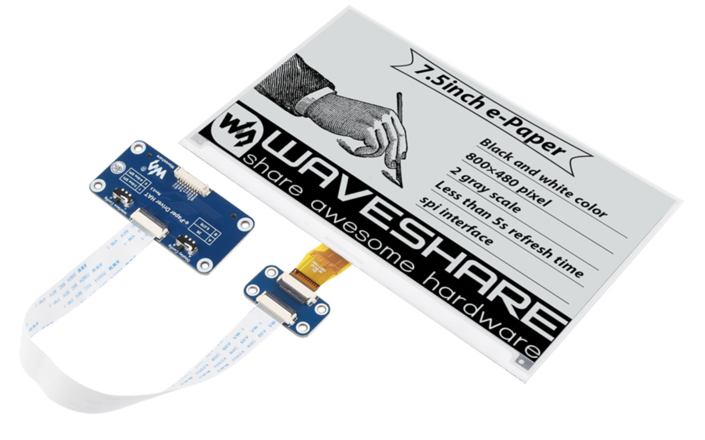

# Glossar

<a id="GL_01">**Displaymodul**</a>

Komplettes Set bestehend aus Display, Mikrocontroller, Akku, Platine und Gehäuse. 

<a id="GL_02">**Display**</a>

Das Display, welches angesteuert und mit Strom und Daten versorgt werden muss. Ein solches Display kann Beispielweise in [Abbildung 10.1](#_abb_10_1) gesehen werden.

Figure: Abbildung 10.1: Ein exemplarisches ePaper Display { #_abb_10_1 }

{ width=80% }

<a id="GL_03">**Mikrocontroller**</a>

Im Displaymodul verbauter Computer, welcher drahtlos mit Clients kommunizieren kann und die Ansteuerung des Displays übernimmt. 

<a id="GL_04">**Mikrocontroller Webserver**</a>

Kann immer Bitmaps über HTTP empfangen und im (Standalonemodus) zusätzlich die Client-Website an einen Client ausliefern. 

<a id="GL_05">**Client**</a>

Gerät (Smartphone, Tablet, Computer) worüber der Benutzer, mittels eines Browsers, mit dem Displaymodul direkt (Standalonemodus) oder alternativ mit dem zentralen Webserver (Servermodus) kommuniziert. 

<a id="GL_06">**Client Website**</a>

Die im Client sichtbare Website bestehend aus HTML, CSS und JavaScript. 

<a id="GL_07">**Server**</a>

Linux-Container, welcher den zentralen Webserver betreibt. 

<a id="GL_08">**Server Webserver**</a>

Die Anwendung läuft auf dem Server 24/7. Kann sich Daten von externen Quellen holen, diese von HTML in Bitmaps konvertieren und die Bitmaps an Displaymodule verteilen. 

<a id="GL_09">**Server Website**</a>

Website für den Client, welche auf dem zentralen Webserver läuft und womit sich mehrere Displaymodule steuern lassen. 

<a id="GL_10">**Standalonemodus**</a>

Der Client kommuniziert direkt mit dem Mikrocontroller, dabei erstellt der Mikrocontroller selber ein WLAN. Der Mikrocontroller arbeitet also als WLAN Access-Point. 

<a id="GL_11">**Netzwerkmodus**</a>

Der Client kommuniziert direkt mit dem Mikrocontroller, dabei wird ein vorhandenes WLAN benutzt. Der Mikrocontroller arbeitet also als WLAN-Client. 

<a id="GL_12">**Servermodus**</a>

Der Client kommuniziert nur über den Server Webserver mit dem Mikrocontroller, dabei wird ein vorhandenes WLAN benutzt. Der Mikrocontroller arbeitet also als WLAN-Client.

<a id="GL_13">**Asset**</a>

Den Inhalt, den ein Displaymodul anzeigen soll. Ein Asset wird als PNG dem Displaymodul zur Verfügung gestellt. Die Bezeichnung Asset unterscheidet sich von einem Bild in dem Aspekt, dass ein Asset eine Gültigkeitsdauer hat und auch aus HTML-Code generiert werden kann. Erst für die Übertragung an ein Displaymodul wird ein Asset in ein Bild gewandelt. 

