# Handbuch

## Erste Schritte und Display Inbetriebnahme 
**Julia Reuter**
<ol>
<li> Aufwecken des Display-Moduls per Knopfdruck am unteren Gehäuserand, damit es seinen Access-Point öffnet</li>
<li> Verfügbare WLANs checken und "THA-LPRD-..." (Endung je nach Modul) auswählen und mit dem Default Passwort: "password" verbinden</li>

  <li>Im Browser die Adresse 192.168.4.1/index.html aufrufen. Sie werden sich vermutlich beim ersten Aufrufen authentifizieren müssen.  
      Default-Benutzer: "admin" und Passwort: "admin"
  </li>
  <li>Nun sollten Sie auf diese Settings Page gelangen, wo Sie folgendes einstellen können:
    <ul>
      <li><strong>Modus:</strong> Festlegen des Betriebsmodus (Standalone ist der Default)</li>
      <li><strong>Displaymodul:</strong> Auswählen des gerade verbundenen Display-Moduls</li>
      <li><strong>WiFi-Konfiguration:</strong> Eintragen der eigenen WLAN-Daten für den Netzwerkmodus</li>
      <li><strong>Serielles Konsolen Log Level:</strong> Für Debugging können verschiedene Konsolennachrichten aktiviert werden</li>
      <li><strong>HTTP Auth:</strong> Benutzerauthentifizierung (Festlegen Benutzerpasswort und Zugangsdaten der Benutzeroberfläche)</li>
      <li><strong>HTTPS-Setting:</strong> Über Hochladen einer Zertifikatsdatei kann die Benutzeroberfläche verschlüsselt werden</li>
      <li><strong>Server URL:</strong> Einfügen einer Server URL für den Servermodus</li>
    </ul>
  </li>
</ol>

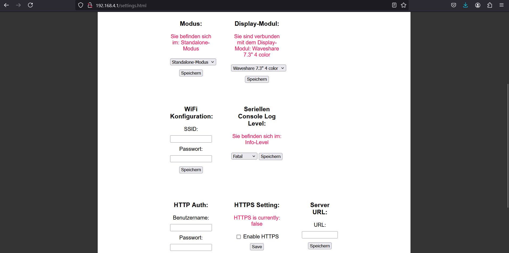{ width=100% }

Alle geänderten Einstellungen müssen jeweils gespeichert werden. Über den Restart-Button wird das System neu gestartet, damit die Änderungen übernommen werden.  
Bitte haben Sie hier einige Minuten Geduld. Falls das Verbinden mit einem externen WLAN oder Server nicht funktioniert hat, so öffnet das Display automatisch wieder nach ca. 5 min den eigenen Access Point und Sie können entweder die Konfiguration erneut versuchen oder fahren im Standalone-Modus fort.

Natürlich können die Einstellungen jederzeit geändert werden.

## Hochladen von Inhalten
**Julia Reuter**  

Wenn Sie das System erfolgreich neu gestartet haben, sollten Sie auf folgende Seite (Abbildung 3) gelangen und können Sie mit dem Upload fortfahren

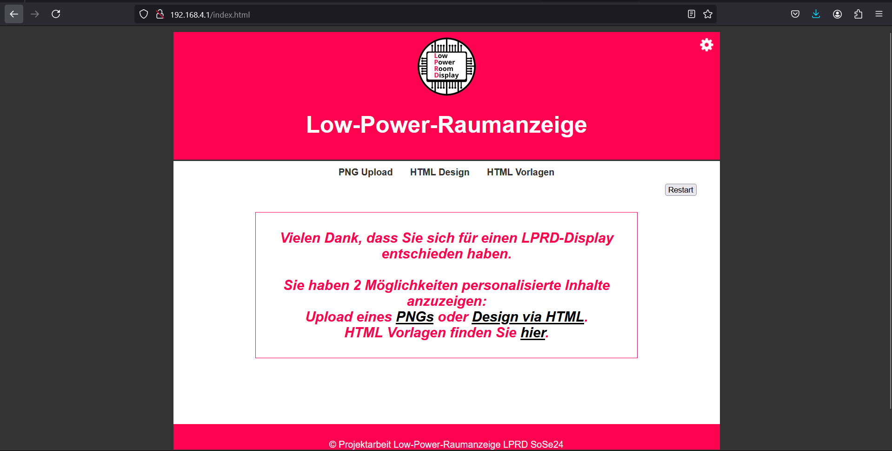{ width=100% }

Hierfür stehen zwei Optionen zur Verfügung:
<ul>
  <li><strong>PNG-Upload</strong> (Achtung: die Pixelauflösung des PNGs muss der Pixelauflösung des verbundenen Displays entsprechen)
    <ul>
      <li>Die Displayauflösung wird direkt beim Aufrufen an die Seite übermittelt und sollte angezeigt werden.</li>
    </ul>
  </li>
  <li><strong>HTML-Design:</strong> In dem Textfeld kann mithilfe von HTML Code ein Layout erstellt werden, was von der Webseite automatisch zu einem Bild konvertiert und an das Display geschickt wird.</li>
</ul>

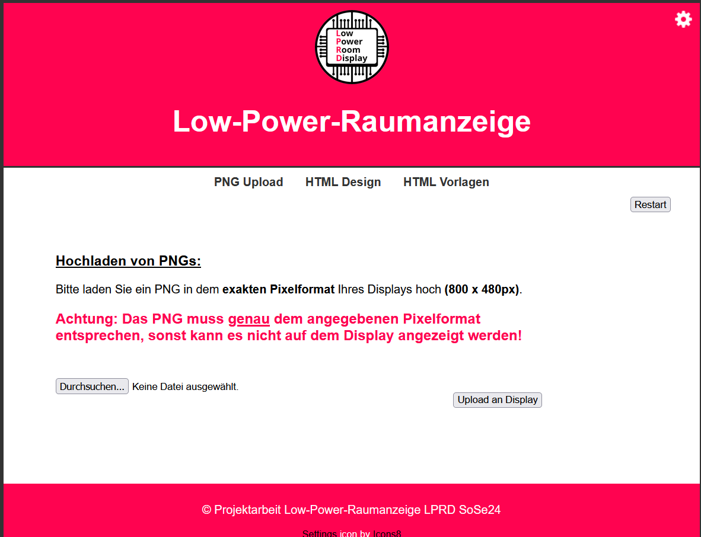{ width=80% }

<ul>
  <li><strong>HTML-Vorlagen:</strong> Es können auch bereits vorgefertigte HTML-Vorlagen verwendet werden.</li>
</ul>

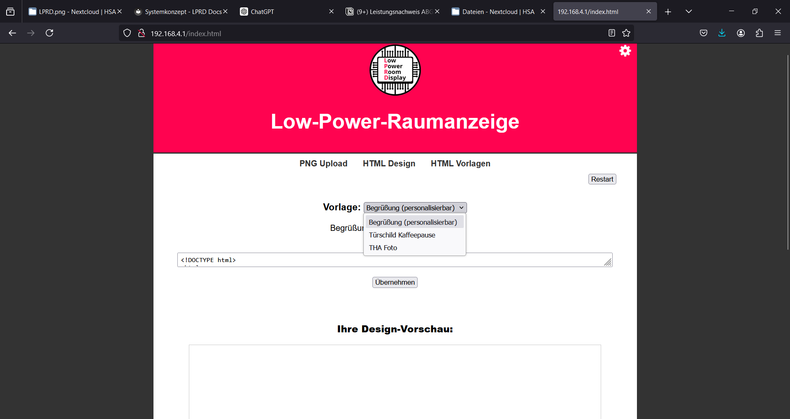{ width=100% }

War der Upload erfolgreich, so werden Sie benachrichtigt und das Bild sollte nach wenigen Sekunden auf dem Display erscheinen.

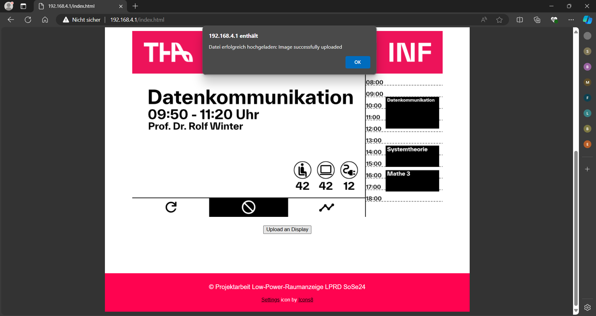{ width=100% }

**Denken Sie daran, dass nach jedem erfolgreichen Bild-Upload das System in den deep-sleep gesetzt wird und nicht mehr erreichbar ist. Um den Inhalt zu ändern oder Einstellungen vorzunehmen, drücken Sie bitte den Knopf am unteren Display-Rand.**

## Netzwerkmodus
**Julia Reuter**  
Nachdem Sie in den Einstellungen unter dem Punkt WiFi Konfiguration ihre WLAN-Daten eingeben und nach dem Speichern, das Display neu gestartet haben, sollte sich Ihr Modul automatisch mit dem entsprechenden WLAN verbinden.  
Unter der zugewiesenen IP: …/index.html können Sie mit dem Upload wie gehabt fortfahren.

## Aufsetzen des Linux Servers
**Mario Wegmann**

### Installation

In der folgenden Anleitung werden Platzhalter mit `<Platzhaltername>` markiert. 

Zu Beginn sollte ein Reverseproxy installiert werden, dies ist kein absolutes Muss, aber für weitere Funktionalitäten, wie HTTP BasicAuth und SSL-Zertifikate, durchaus hilfreich. 
Hier wurde der Caddy Reverse Proxy verwendet, aber auch Nginx oder Apache können problemlos eingesetzt werden. 

Um Caddy zu installieren, wird das Repository von den Caddy Maintainern hinzugefügt.

``` bash
sudo apt install -y debian-keyring debian-archive-keyring apt-transport-https curl
curl -1sLf 'https://dl.cloudsmith.io/public/caddy/stable/gpg.key' | sudo gpg --dearmor -o /usr/share/keyrings/caddy-stable-archive-keyring.gpg
curl -1sLf 'https://dl.cloudsmith.io/public/caddy/stable/debian.deb.txt' | sudo tee /etc/apt/sources.list.d/caddy-stable.list
```

Anschließend können die Repositorys neu geladen und Caddy installiert werden. 

``` bash
sudo apt-get update
sudo apt-get install caddy
```

Der Caddy Reverseproxy wird über eine Konfigurationsdatei verwaltet, diese sollte sich unter '/etc/caddy/Caddyfile' befinden. Mit dem folgenden Code wird ein einfacher Reverseproxy auf Port :3000 der Next.js Anwendung eingerichtet, dabei wird ein lokal liegendes SSL-Zertifikat verwendet und eine Basic Auth Authentifizierung.  
Den Passwort Hash kann man direkt mit Caddy generieren, indem `caddy hash-password` verwendet wird, diese Hilfsfunktion fragt nach dem Passwort und gibt dann den Hash aus, welcher in der Caddyfile eingetragen werden kann. 

```yml
lprd.informatik.tha.de {
        tls /etc/ssl/certs/lprd-fullchain.pem /etc/ssl/priavte/lprd-privkey.pem
        basicauth * {
                <Benutzername> <Passwort Hash>
        }
        reverse_proxy 127.0.0.1:3000
}
```

Danach muss Node.js installiert werden. 
Da über den apt Paketmanager nur sehr langsam aktuelle Versionen von Node.js bereitgestellt werden, wird hier der Node Version Manager (nvm) verwendet. 

Dieser lässt sich über folgendes Bash Skript installieren. 

`curl -o- https://raw.githubusercontent.com/nvm-sh/nvm/v0.39.7/install.sh | bash`

Nach der Installation empfiehlt es sich, die SSH-Sitzung neu zu starten, damit der `nvm` Befehl auch erkannt wird. 
Anschließend kann mit `nvm install 20` die LTS-Version Node.js 20 installiert werden. 
Mit Node.js kommt auch der `npm` Paketmanager. Mit diesem lässt sich React und Next.js installieren. 

`npm install next@latest react@latest react-dom@latest`

Als Nächstes wird `git`installiert, um den Sourcode herunterladen zu können. 

`sudo apt-get install git`

Danach muss ein SSH Key für Github hinterlegt werden, damit das Repository geklont werden kann. 
Dafür wird als Erstes ein SSH Key generiert. 
Es empfiehlt sich dabei auch, eine Passphrase zu vergeben und beim Speicherort einen eindeutigen Namen zu vergeben. 

`ssh-keygen -t ed25519 -C "<Github E-Mail Adresse>"`

Als Nächstes wird der SSH Agent einmal gestartet, um anschließend den SSH Key beim SSH Agent hinterlegen zu können. 

`eval "$(ssh-agent -s)"`

Beim Hinzufügen muss auch die zuvor festgelegte Passphrase eingegeben werden. 

`ssh-add <Speicherort des zuvor erstellten SSH Keys angeben>`

Der Public Teil des SSH Keys muss auch im Github Account hinterlegt werden. 
Dafür die URL https://github.com/settings/keys aufrufen und einen neuen SSH Key hinzufügen. 

Nun kann das Repository der Webanwendung geklont werden. 

`git clone git@github.com:THA-LPRD/web.git lprd`

Danach wird das Verzeichnis von der Next.js Anwendung betreten.

`cd lprd/lprd-server`

Die Anwendung verwendet die offizielle Schriftart der THA. Die Schriftart TWK Everett darf, wegen der von der THA erworbenen, Lizenz jedoch nur Studierenden und Mitarbeitern der Technischen Hochschule Augsburg zur Verfügung gestellt werden. Die Schriftart lässt sich unter folgender URL herunterladen: https://www.tha.de/Kommunikation/Corporate-Design.page 
Anschließend müssen die zwei Schriftfamilien TWKEverett-Bold-web.ttf und TWKEverett-Medium-web.ttf TWKEverett-Medium-web.ttf im Ordner lprd-server/components/fonts kopiert werden. 

Als Nächstes kann die PostgreSQL-Datenbank aufgesetzt werden. 
Dafür kann das Docker Image oder auch ein bestehender PostgreSQL Server verwendet werden. 

`sudo docker run --name lprd-postgres -v pgdata:/var/lib/postgresql/data -p 5432:5432 -e POSTGRES_PASSWORD=<SicherersDatenbankPasswort> -d postgres`

Die URL der Datenbank muss auch noch der Next.js Anwendung bekannt gemacht werden, dies geschieht über die .env Datei. 
Diese sollte neu angelegt werden und den folgenden Inhalt enthalten: 

`DATABASE_URL="postgresql://<PostgresUser>:<PostgresUserPassword>@<PostgresServerIP/Hostname>:5432"`

Nach der Installation der Datenbank kann diese mit Prisma mit den notwendigen Tabellen befüllt werden. 

`npx prisma migrate dev --name init`

Für die Konvertierung von HTML zu PNG wird die Library node-html-to-image verwendet. Diese nutzt Puppeteer als Basis für die Konvertierung. Beim direkten Testen auf dem Server kann es vorkommen, dass Puppeteer nicht startet, da es weitere Abhängigkeiten hat. Diese fehlenden Abhängigkeiten können mit dem folgenden Befehl herausgefunden werden: 

`ldd /home/<USER>/.cache/puppeteer/chrome/linux-<VERSION>/chrome-linux64/chrome | grep not`

Im Fall der hier verwendeten Debian Installation mussten folgende Pakete noch zusätzlich installiert werden. 

`sudo apt-get install libgbm1 libasound2 libxkbcommon0 libatk-bridge2.0-0 libnss3`

Die Vorbereitungen sind somit abgeschlossen und der Developmentserver kann gestartet werden.

`npm run dev` 

Unter http://localhost:3000 ist der Server nun erreichbar. 

Der Developmentserver kann mit dem Tastenkürzel Ctrl+C beendet werden. 

## Verwenden der Webanwendung
**Mario Wegmann**

### Unterseiten

Nachdem die Anwendung gestartet wurde, kann die Adresse im Browser eingegeben werden. Die Startseite, wie in [](#_fig_WA_Startseite) ersichtlich, zeigt das Menü für die Unterseiten an. Es gibt zwei Unterseiten, unter »Displays« werden alle bereits bekannten Displays aufgelistet. In der Unterseite »Assets« werden alle vorhandenen Assets angezeigt. 

Figure: Die Startseite der Webanwendung { #_fig_WA_Startseite }

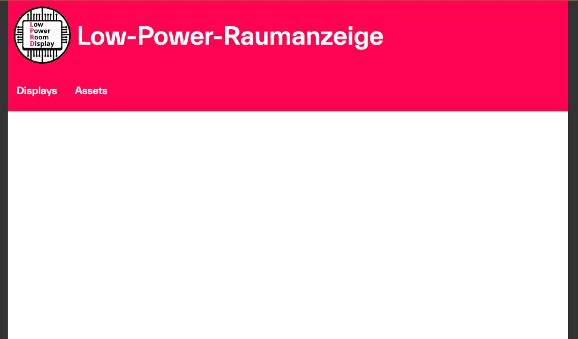{ width=60% }

### Neues Asset erstellen

Es gibt zwei Möglichkeiten, ein Asset zu erstellen, es kann entweder ein fertiges PNG hochgeladen werden oder ein PNG aus einem HTML-Code erstellt werden. Dazu kann in der »Assets«-Unterseite, welche in [](#_fig_WA_Assets) ersichtlich ist, einer der beiden Vorgänge über die Knöpfe gestartet werden. 

Figure: Eine Übersicht über alle vorhandenen Assets { #_fig_WA_Assets }

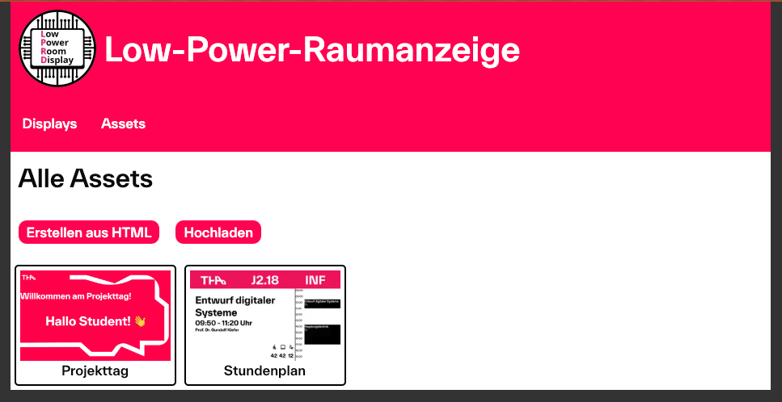{ width=60% }


**PNG hochladen**  

Ein PNG kann auf der Unterseite Assets über den »Hochladen«-Knopf hochgeladen werden. 
Beim Hochladen muss darauf geachtet werden, dass das PNG in der richtigen Auflösung für das Display ist, welches später das Asset anzeigen soll. Ebenso kann ein Name für das Asset und wie lange es angezeigt werden soll, angegeben werden. Das Hochladen beginnt mit einem Druck auf den »Hochladen«-Knopf. Die [](#_fig_WA_Upload) zeigt das Formular. 

Figure: Das Formular zum Hochladen von bestehenden PNGs { #_fig_WA_Upload }

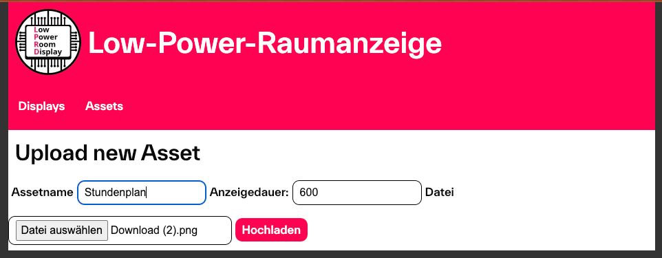{ width=60% }


**PNG aus HTML erstellen**  

Auf der Unterseite Assets gibt es auch den »Erstellen aus HTML«-Knopf, dieser öffnet ein Formular, in dem der Assetname, die Anzeigedauer und der HTML-Code eingegeben werden kann. Nach dem Druck auf den »Generieren«-Knopf wird ein PNG erstellt und lokal abgelegt. Die [](#_fig_WA_HTML) zeigt das Formular. 


Figure: Das Formular zum Erstellen von PNGs aus HTML Code { #_fig_WA_HTML }

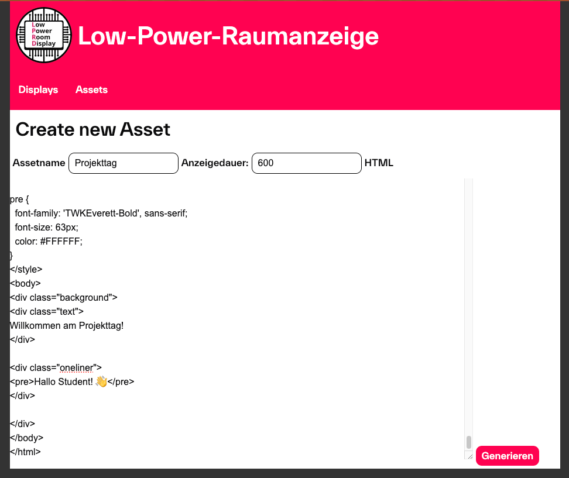{ width=60% }


### Vorhandenes Asset bearbeiten

In der »Assets« Übersichtsseite kann jedes vorhandene Asset ausgewählt werden, um eine Detailansicht, welche in [](#_fig_WA_Asset_Details) ersichtlich ist, anzuzeigen. Dort können der Name, die Anzeigedauer und der HTML-Code bearbeitet werden. 
Ebenso kann ein Asset auch gelöscht werden. 

Figure: Die Detailansicht eines Assets { #_fig_WA_Asset_Details }

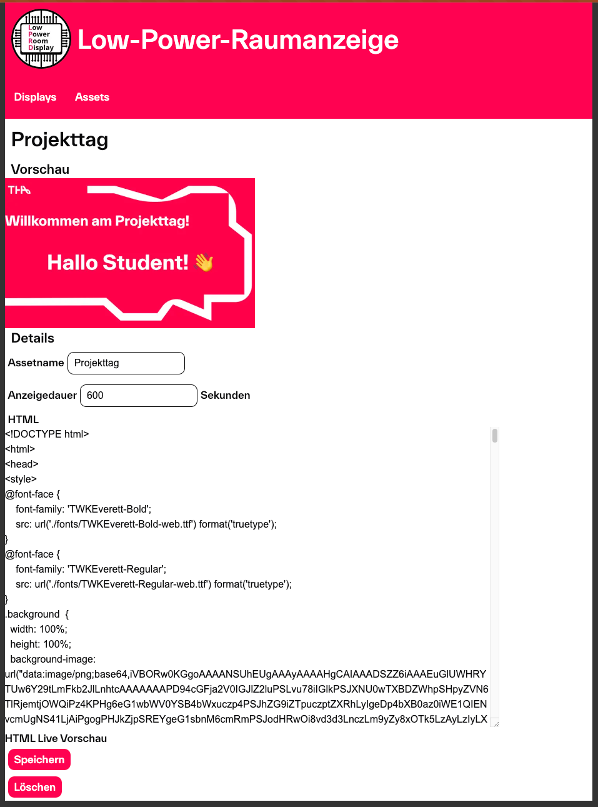{ width=60% }

### Neues Displaymodul verbinden

Beim erstmaligen Einschalten eines Displaymoduls, nach dem Flashen, kann in der Einrichtungsseite des Displaymoduls der Servermodus als Betriebsmodus ausgewählt werden. Ebenso kann die Server URL im dazugehörigen Textfeld angegeben werden. 

Die weiteren Einstellungen verhalten sich gleich, wie auch bei der Einrichtung des Netzwerkmodus bereits erläutert wurde. 

Nachdem die Erstkonfiguration gespeichert und das Displaymodul neu gestartet wurde, versucht es sich automatisch mit dem eingetragenen WLAN und anschließend mit dem eingetragenen Server zu verbinden. 

Falls das Displaymodul sich zum ersten Mal mit diesem Server verbindet, wird es automatisch in der Datenbank eingetragen, anschließend geht das Display in den Deep-sleep Modus. 

### Vorhandenes Display bearbeiten

Ähnlich wie bei der Assets-Übersicht können auch die Displays in der »Display«-Unterseite, welche in [](#_fig_WA_Displays) dargestellt ist, bearbeitet werden. In der Detailansicht, diese ist in [](#_fig_WA_Display_Details) zu erkennen, eines Displays kann die MAC-Adresse und der Zeitpunkt, zu dem sich das Display zum letzten Mal beim Server gemeldet hat, eingesehen werden. Der Name des Displays und die Auflösung können bearbeitet werden. 

Zuletzt kann ein Display auch wieder gelöscht werden. 

Figure: Die Übersichtsseite aller Displays { #_fig_WA_Displays}

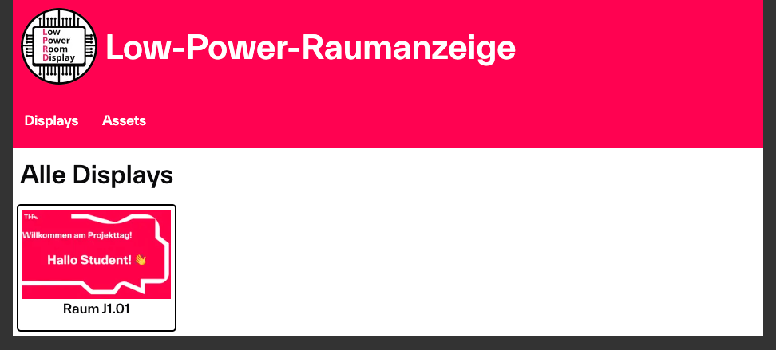{ width=60% }

Figure: Die Detailansicht eines Displays { #_fig_WA_Display_Details}

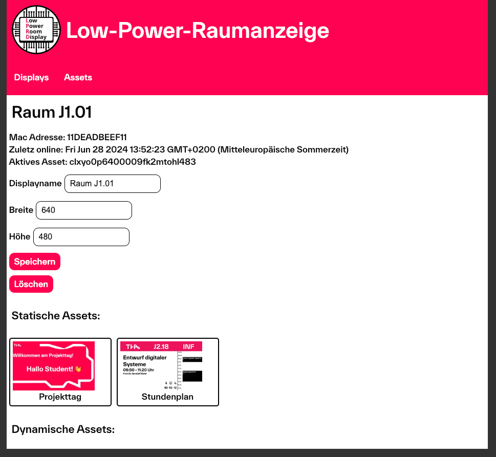{ width=60% }

### Neues Asset auf dem Display anzeigen

Sobald ein Displaymodul sich in der Webanwendung registriert hat, kann in der Webanwendung das Display ausgewählt werden. Hier können grundlegende Informationen zum Display bearbeitet und ein neues aktives Asset gesetzt werden. 

Mit einem Tastendruck auf den vorderseitigen Knopf kann das Display aus dem Deep-sleep Modus wieder aufgeweckt werden. Immer nach dem Aufwecken versucht das Displaymodul, sich mit dem Server zu verbinden und eine neue Konfiguration zu erhalten. Die Konfiguration enthält die URL des aktuell anzuzeigenden Assets und eine Dauer in Sekunden, die angibt, wie lange das Asset angezeigt werden soll. 

Das Displaymodul lädt anschließend das Asset von der angegebenen URL herunter, zeigt es an und versetzt sich anschließend wieder in den Deep-sleep Modus. Zusätzlich wird noch ein Wakeup Timer auf die angegebene Dauer gesetzt. Dieser Timer weckt somit das Displaymodul automatisch nach Ablauf der Anzeigedauer auf, damit sich das Displaymodul ein neues anzuzeigendes Asset herunterlädt. 

## Arbeiten an der Displaymodul-Firmware
**Ahmet Emirhan Göktas**

Um an diesem Projekt zu arbeiten, müssen folgende Werkzeuge auf Ihrem Computer installiert sein:

- PlatformIO
- Ein Code-Editor (z.B. Visual Studio Code)
- Git
- Verfügbarer USB-Anschluss (zum Flashen der Firmware)

### Einrichten des Projekts

Hier ist eine Schritt-für-Schritt-Anleitung, wie Sie das Projekt auf Ihrem lokalen Rechner für Visual Studio Code einrichten.

1. Installieren Sie die PlatformIO-Erweiterung für Visual Studio Code. Sie können die Erweiterung finden, indem Sie im Erweiterungstab nach `PlatformIO IDE` suchen.
2. Klonen Sie das Repository auf Ihren lokalen Rechner:
    ```bash
    git clone --recursive https://github.com/THA-LPRD/MCU.git
    ```
3. Klicken Sie auf das PlatformIO-Symbol auf der linken Seite von Visual Studio Code. Dort sollten Sie eine Taste namens `Pick a folder` sehen. Klicken Sie darauf und wählen Sie den Ordner aus, in den Sie das Repository geklont haben.

    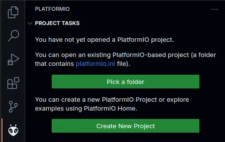

4. PlatformIO sollte das Projekt automatisch erkennen und die Umgebung für Sie konfigurieren. Nachdem Sie die richtige Umgebung ausgewählt haben, können Sie mit der Arbeit am Projekt beginnen.
5. Sie können die Firmware auf den ESP32 flashen, indem Sie auf das PlatformIO-Symbol auf der linken Seite von Visual Studio Code klicken und dann auf die Taste `Upload` klicken.
6. Wenn Sie die Ausgabe des seriellen Monitors sehen möchten, können Sie auf das PlatformIO-Symbol auf der linken Seite von Visual Studio Code klicken und dann auf die Taste `Serial Monitor` klicken.
7. Sie können auch die Taste `Upload File System Image` verwenden, um die Dateien im Ordner `data` auf den ESP32 hochzuladen.
   
    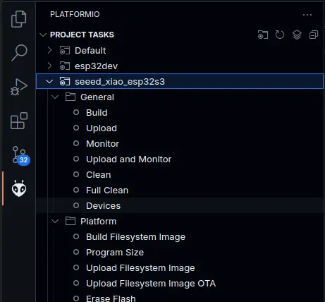

!!! note

    Abhängig vom verwendeten ESP32-Board kann es notwendig sein, die Boot-Taste zu drücken, bevor der ESP32 an den USB-Anschluss angeschlossen wird.

## Bestellung von der Platine und benötigten Bauteilen
**Benjamin Klaric**

Um die Platine zu bestellen muss man das erstens das GitHub Repo, auf dem sich die Files von der Platine befinden, clonen.  
    ```bash
    git clone https://github.com/bklaric1/xiao_esp32_s3_mainboard.git
    ```
Auf dem Repo gibt es zwei Branches, nämlich den **main** und den **feature_subsheets**. Beide Branches können für das Bestellen von der Platine benutzt sein werden.  
Nachdem soll man das ECAD Programm KiCad installieren, unter dem [https://www.kicad.org/download/](https://www.kicad.org/download/) Link. Man soll Version 8+ installieren, da die Files auf KiCad 8 erzeugt werden und sind nicht backwards kompatibel.  
Man soll einfach den *.kicad_pro* File öffnen und es soll sich automatisch KiCad öffnen.  
Unter den `Plugin and Content Manager`, die auf [](#_fig_KiCad) dargestellt ist, kann man ein Plugin für Aisler (oder JLCPCB) zu KiCad hinzufügen, um die Bestellung einfacher zu machen. Für Aisler sieht der Plugin so aus, wie es auf [](#_fig_Plugin) dargestellt ist.  

Figure: KiCad Fenster { #_fig_KiCad }

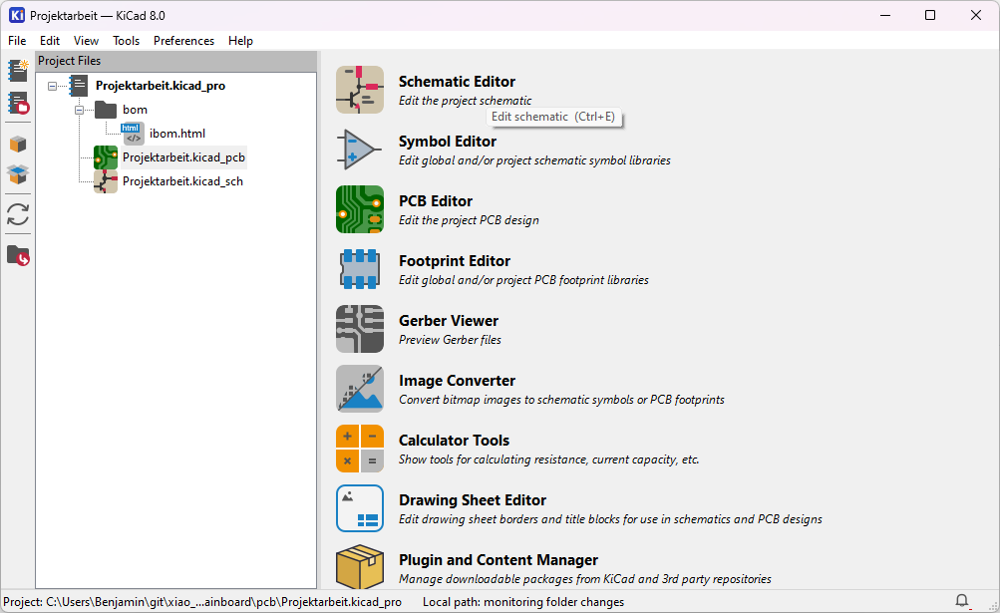{ width=60% }

Figure: Aisler Plugin { #_fig_Plugin }

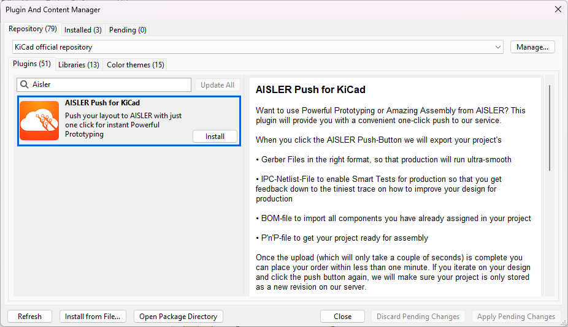{ width=60% }

Nachdem die Installation erfolgreich war, erschiet ein neues Knopf in PCB Editor Fenster, oben mittig, wie auf [](#_fig_Aisler-Button) zu sehen ist.  

Figure: Knopf für Aisler Plugin { #_fig_Aisler-Button }

{ width=60% }

Wenn man darauf druckt, wird man auf die Webseite von Aisler genommen, mit schon angelegten Projekt für das Bestellung. Nachher soll man einfach die Schritten von Aisler Webseite folgen um die Platine zu bestellen.  
Die Bauteilen kann man unter `/pcb/bom/ibom.html` sehen. Es öffnet sich ein Browser Fenster wo man interaktiv eine BOM Tabelle und die Platine sehen kann. Wenn man den Maus auf die Bauteile hinbewegt, wurde dementsprechenden Bauteilen auf die Platine in rot markiert sein werden.  

  
  

## Quellen
https://docs.github.com/en/authentication/connecting-to-github-with-ssh/generating-a-new-ssh-key-and-adding-it-to-the-ssh-agent?platform=linux#generating-a-new-ssh-key 
https://docs.github.com/en/authentication/connecting-to-github-with-ssh/adding-a-new-ssh-key-to-your-github-account
