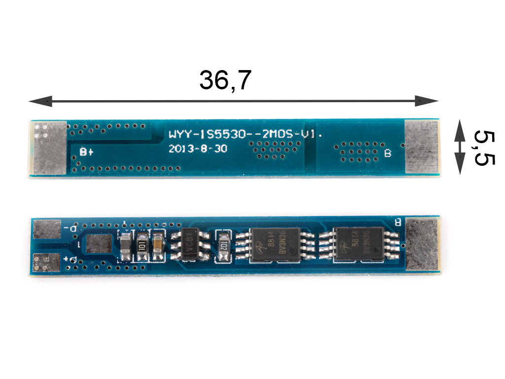

# Hardware

## Auswahl des Mikrocontrollers
- GPIO’s
- Stromverbrauch
- Vorteile (Charger, …)
- Bauform
- Speicher

## Auswahl der Displaytechnologie

## Zusammenbau der Akkupacks
#### Akku
Der ausgewählte Akku, aus verschiedenen Akku-Technologien, die in Kapitel 2 genannt waren, war der klassische Li-Ion-Akku, aus mehreren Gründen. Aufgrund der Anzahl und Position des Systems, die von Akku betrieben sein wurde, war der Sicherheitsaspekt ein entscheidender Faktor. Deswegen wurden die LiPo-Akkus nicht mehr betrachtet.  
Der Vergleich zwischen Li-Ion-Akkus und LiFePo~4~-Akkus hatte eindeutige Unterschiede geliefert. Die LiFePo~4~-Akkus repräsentieren die sicherste Variante, andererseits hatten die Li-Ion-Akkus eine höhere Nennspannung von 3,7V.  
Aus Sicherheitsblick betrachtet wurden die LiFePo~4~-Akkus ausgewählt. Die Nennspannung von 3,2V hat jedoch gegen die LiFePo~4~-Akkus gesprochen, da der ausgewählte Mikrocontroller, nämlich den XIAO ESP32-S3, Betriebsspannung zwischen 3,2V und 4,2V angefordert hat. Obwohl die LiFePo~4~-Akkus die Betriebsspannung liefern konnten, konnten sie das System nicht betreiben, da die genannte Betriebsspannung in Fall ohne schwere Last gemeint ist. Wegen dies wurden allerdings die Li-Ion-Akkus gewählt.  
Der nächste Schritt war, eine vernünftige Kapazität zu finden, sodass die Akkus das System lang genug betreiben konnten. Dazu hat man die Schätzungen mit Verbrauchmessungen unterstützt und ungefähr die benötigte Akku-Kapazität geschätzt. Eine Akkulaufzeit von einem Jahr war gewünscht und dementsprechend war die Große des Akkus gewählt, nämlich ~10000 mAh.  
Ein Akku mit so einer Kapazität war aber nicht einfach zu finden. Deswegen wurde das Akkupack aus zwei ~5000 mAh Akkus gebaut. Um von zwei ~5000 mAh auf die gewünschte Kapazität zu kommen, wurden die Akkus in parallel verbunden, da so die Kapazität sich verdoppelt; im Vergleich, wenn man die in Reihe anschließt, so wird die Spannung verdoppelt.  
Bei der Suche nach Akkus muss man einige Sachen beachten. Der Formfaktor der Akku, minimale Kapazität, ob der Akku schon ein eingebautes BMS hat und der Entladestrom.  
Es würde die BAK N21700CD-53E ausgewählt, die auf  zu sehen ist.

Figure: Li-Ion-Akku [[BK_09]](Quellenverzeichnis.md#bk_09) { #_fig_akku }

{ width=60% }

Aus der Tabelle der technischen Daten auf der  des betrachteten Akkus ist es klar zu sehen, dass alle benötigten Parameter erfüllt sind. Der Formfaktor ist aus der Durchmesser und Höhe (die ersten zwei Ziffern von Durchmesser und normalerweise erste drei Ziffern von Höhe → 21700).  

Figure: Technische Daten von BAK N21700CD-53E [[BK_10]](Quellenverzeichnis.md#bk_09) { #_fig_akku_tabelle }

{ width=60% }

#### BMS
Um den Akkupack sicher betreiben zu können, wurde ein BMS benötigt. Wie bereits in Kapitel 2 unter Akku-Technologien erwähnt, schützt ein BMS die Akkus vor Tiefentladung, Überladung, Kurzschluss und Überstrom.  

Beim genaueren Blick auf ein 1S-BMS, auf , wo 1S die Anzahl der Zellen in Serie repräsentiert, erkennt man ein IC und zwei NMOS-Transistoren. Die NMOS-Transistoren dienen als Schalter, die vom IC durch Gate-Spannung angesteuert werden.  

**Überladungsschutz**: Wenn die Ladespannung 4,2V überschreitet, sendet der IC ein Signal, das die Gate-Spannung eines NMOS-Transistors steuert, wodurch dieser den Stromkreis unterbricht.  

**Tiefentladungsschutz**: Bei Tiefentladung wird ein ähnlicher Mechanismus aktiviert, allerdings bei 2,5V. Der IC sendet ein Signal an den zweiten NMOS-Transistor, um den Stromfluss zu unterbrechen, sobald die Spannung einen kritischen Wert erreicht.  

**Überstromschutz**: Der IC überwacht den Stromfluss kontinuierlich. Wenn der Strom über den zulässigen Grenzwert steigt, schaltet der IC einen der NMOS-Transistoren ab, um den Stromfluss zu unterbrechen und die Batterie vor Schäden zu schützen.  

**Kurzschlussschutz**: Auch bei einem Kurzschluss, bei dem sehr hohe Ströme fließen, erkennt der IC diese Situation und unterbricht sofort den Stromfluss durch Abschalten der NMOS-Transistoren.  

Das BMS, das auf  dargestellt ist, liefert alle diese Features und wurde für den Aufbau von dem Akkupack ausgewählt.  

Figure: Li-Ion-Akku [[BK_11]](Quellenverzeichnis.md#bk_11) { #_fig_akku }

{ width=60% }

#### Ladegerät
Wie bereits in Kapitel 2 unter Akku-Technologien erwähnt, benötigen die Li-Ion-Akkus ein spezielles Ladegerät, nämlich ein Ladegerät, der in die Lage ist beim Laden der Akkus, erste 80% konstanter Strom zu liefern und danach 20% die Akkus mit konstanter Spannung zu laden. 
Man kann solche Ladegeräten ohen viele Schwierigkeiten finden, sind allerdings teuer. Bei der Suche nach einen muss man eine Sache beachten, nämlich den Zellenanzahl. Die ausgewählte Ladegerät ist auf die  zu sehen.

Figure: Ladegerät für Li-Ion-Akkus [[BK_12]](Quellenverzeichnis.md#bk_12) { #_fig_ladegeraet }

{ width=60% }

## Auswahl der PCB-Komponenten

## Platinen Design

## Zusammenbau der PCBs

## Gehäuse

## Zusammenbau des Displaymoduls

## Strommessung von Mikrocontroller und Display

## ADC Messung