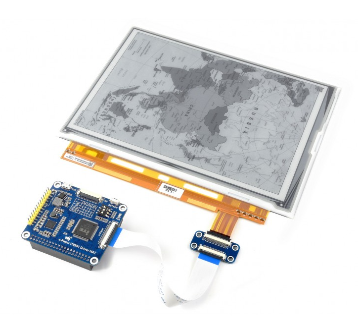

# Hardware

## Auswahl des Mikrocontrollers

## Auswahl der Displaytechnologie
Unsere Display auswahl hat sich letztlich auf die ePaper Technologie und Bistabile LCD Technologie beschränkt durch ihren vorteil der deutigen Stromeffiezenz. Zwischen diesen Beiden Technologien haben wir uns für ePaper entschieden, Der Vorteil, mit ePaper haben wir die möglichkeit noch mehr Strom zu sparen und durch das Papier artige Display ist besitzt es eine bessere Lesbarkeit als Bistabile LCD.  
  
ePaper besitzt weniger Farb möglichkeiten, dadurch entschieden wir uns 2 Displays für das Projekt zu testen, ein Display Ohne Farben aber dafür schnelle refresh times und Display mit Farben aber mit einer längeren refresh time.  
Das erste Display kann in Abbildung  sehen, Es kommt mit einer refresh rate von 0,5 Sekunden, besitzt dafür aber nur 8 mögliche Greyscales.
Das zweite Display besitzt 4 Farben, Weis, Schwarz, Gelb und Rot und kann mit in Abbildung  sehen. Dies kommt aber mit dem Nachteil von einer refresh time von 16 Sekunden.

Figure: Waveshare 7.3inch ePaper Display { #_fig_Display73}

{ width=70%, }

Figure: Waveshare 9.7inch ePaper Display { #_fig_Display97}

{ width=70% }

Die erwähnten geringen Stromverbrauch haben wir selber nochmal getestet und kann man im im Kapitel [7.9 Strommessung von Mikrocontroller und Display](Hardware.md#strommessung-von-mikrocontroller-und-display) genauer nachlesen.  
  
Ein kleiner Nachteil der Auswahl ist das verschiedene Displays verschiedene anforderungen haben. Die Displays beseitzten einen unterschiedlichen Spannungsverbrauch. Das 7.3 inch Display benutzt 3V und das größere 9.7 inch Display benutzt 5V.  
Dadurch haben wir uns entschieden einen schalter auf der Platine einzubauen der dieses Problem löst und zwischen diesen Spannungen wechselt, genaueres kann man im Kapitel [7.5 Schaltungsentwurf](Hardware.md##Schaltungsentwurf) nachlesen.

[7.5 Schaltungsentwurf](Hardware.md##Schaltungsentwurf)

## Zusammenbau der Akkupacks

## Auswahl der PCB-Komponenten

## Platinen Design

## Zusammenbau der PCBs

## Gehäuse

## Zusammenbau des Displaymoduls

## Strommessung von Mikrocontroller und Display

## ADC Messung