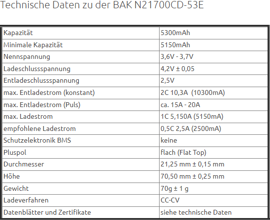
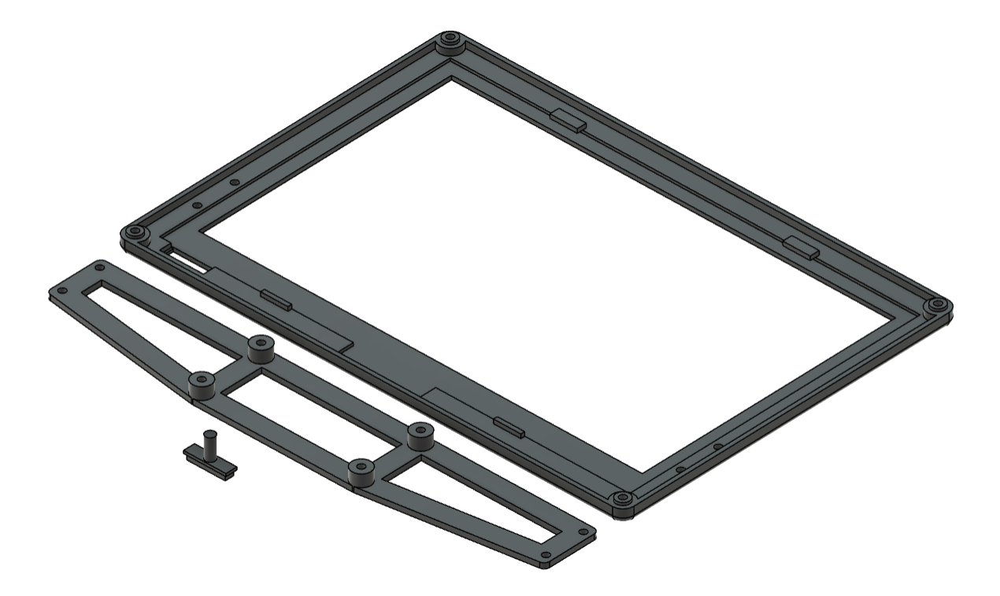

# Hardware

## Auswahl des Mikrocontrollers
- GPIO’s
- Stromverbrauch
- Vorteile (Charger, …)
- Bauform
- Speicher

## Auswahl der Displaytechnologie

## Auswahl der Akkukomponenten
#### Akku
Der ausgewählte Akku, aus verschiedenen Akku-Technologien, die in Kapitel 2 genannt waren, war der klassische Li-Ion-Akku, aus mehreren Gründen. Aufgrund der Anzahl und Position des Systems, die von Akku betrieben sein wurde, war der Sicherheitsaspekt ein entscheidender Faktor. Deswegen wurden die LiPo-Akkus nicht mehr betrachtet.  
Der Vergleich zwischen Li-Ion-Akkus und LiFePo~4~-Akkus hatte eindeutige Unterschiede geliefert. Die LiFePo~4~-Akkus repräsentieren die sicherste Variante, andererseits hatten die Li-Ion-Akkus eine höhere Nennspannung von 3,7V.  
Aus Sicherheitsblick betrachtet wurden die LiFePo~4~-Akkus ausgewählt. Die Nennspannung von 3,2V hat jedoch gegen die LiFePo~4~-Akkus gesprochen, da der ausgewählte Mikrocontroller, nämlich den XIAO ESP32-S3, Betriebsspannung zwischen 3,2V und 4,2V angefordert hat. Obwohl die LiFePo~4~-Akkus die Betriebsspannung liefern konnten, konnten sie das System nicht betreiben, da die genannte Betriebsspannung in Fall ohne schwere Last gemeint ist. Wegen dies wurden allerdings die Li-Ion-Akkus gewählt.  
Der nächste Schritt war, eine vernünftige Kapazität zu finden, sodass die Akkus das System lang genug betreiben konnten. Dazu hat man die Schätzungen mit Verbrauchmessungen unterstützt und ungefähr die benötigte Akku-Kapazität geschätzt. Eine Akkulaufzeit von einem Jahr war gewünscht und dementsprechend war die Große des Akkus gewählt, nämlich ~10000 mAh.  
Ein Akku mit so einer Kapazität war aber nicht einfach zu finden. Deswegen wurde das Akkupack aus zwei ~5000 mAh Akkus gebaut. Um von zwei ~5000 mAh auf die gewünschte Kapazität zu kommen, wurden die Akkus in parallel verbunden, da so die Kapazität sich verdoppelt; im Vergleich, wenn man die in Reihe anschließt, so wird die Spannung verdoppelt.  
Bei der Suche nach Akkus muss man einige Sachen beachten. Der Formfaktor der Akku, minimale Kapazität, ob der Akku schon ein eingebautes BMS hat und der Entladestrom.  
Es würde die BAK N21700CD-53E ausgewählt, die auf  zu sehen ist.

Figure: Li-Ion-Akku [[BK_09]](Quellenverzeichnis.md#bk_09) { #_fig_akku }

{ width=60% }

Aus der Tabelle der technischen Daten auf der  des betrachteten Akkus ist es klar zu sehen, dass alle benötigten Parameter erfüllt sind. Der Formfaktor ist aus der Durchmesser und Höhe (die ersten zwei Ziffern von Durchmesser und normalerweise erste drei Ziffern von Höhe → 21700).  

Figure: Technische Daten von BAK N21700CD-53E [[BK_10]](Quellenverzeichnis.md#bk_09) { #_fig_akku_tabelle }

{ width=60% }

#### BMS
Um den Akkupack sicher betreiben zu können, wurde ein BMS benötigt. Wie bereits in Kapitel 2 unter Akku-Technologien erwähnt, schützt ein BMS die Akkus vor Tiefentladung, Überladung, Kurzschluss und Überstrom.  

Beim genaueren Blick auf ein 1S-BMS, auf , wo 1S die Anzahl der Zellen in Serie repräsentiert, erkennt man ein IC und zwei NMOS-Transistoren. Die NMOS-Transistoren dienen als Schalter, die vom IC durch Gate-Spannung angesteuert werden.  

**Überladungsschutz**: Wenn die Ladespannung 4,2V überschreitet, sendet der IC ein Signal, das die Gate-Spannung eines NMOS-Transistors steuert, wodurch dieser den Stromkreis unterbricht.  

**Tiefentladungsschutz**: Bei Tiefentladung wird ein ähnlicher Mechanismus aktiviert, allerdings bei 2,5V. Der IC sendet ein Signal an den zweiten NMOS-Transistor, um den Stromfluss zu unterbrechen, sobald die Spannung einen kritischen Wert erreicht.  

**Überstromschutz**: Der IC überwacht den Stromfluss kontinuierlich. Wenn der Strom über den zulässigen Grenzwert steigt, schaltet der IC einen der NMOS-Transistoren ab, um den Stromfluss zu unterbrechen und die Batterie vor Schäden zu schützen.  

**Kurzschlussschutz**: Auch bei einem Kurzschluss, bei dem sehr hohe Ströme fließen, erkennt der IC diese Situation und unterbricht sofort den Stromfluss durch Abschalten der NMOS-Transistoren.  

Das BMS, das auf  dargestellt ist, liefert alle diese Features und wurde für den Aufbau von dem Akkupack ausgewählt.  

Figure: Li-Ion-Akku [[BK_11]](Quellenverzeichnis.md#bk_11) { #_fig_akku }

{ width=60% }

#### Ladegerät
Wie bereits in Kapitel 2 unter Akku-Technologien erwähnt, benötigen die Li-Ion-Akkus ein spezielles Ladegerät, nämlich ein Ladegerät, der in die Lage ist beim Laden der Akkus, erste 80% konstanter Strom zu liefern und danach 20% die Akkus mit konstanter Spannung zu laden. 
Man kann solche Ladegeräten ohen viele Schwierigkeiten finden, sind allerdings teuer. Bei der Suche nach einen muss man eine Sache beachten, nämlich den Zellenanzahl. Die ausgewählte Ladegerät ist auf die  zu sehen.

Figure: Ladegerät für Li-Ion-Akkus [[BK_12]](Quellenverzeichnis.md#bk_12) { #_fig_ladegeraet }

{ width=60% }

## Zusammenbau der Akkupacks
**Mario Wegmann**
//TODO
Warum Nickelband?
Grafiken Aufbau Akkuzellen
Quellen
Nickelband
Punktverschweißen

### Konzeptioneller Aufbau

Bei der Auswahl der Akkukomponenten wurde die Entscheidung getroffen mehere Lithium-Ionen Zellen zu verwenden. Da die Kapazität des Akkupackts vergrößert werden, die Batteriespannung jedoch weiterhin zwischen 2,5 V und 4,2 V liegen soll, werden die beiden Lithium-Ionen Zellen parallel mit einander verbunden. Dadurch verdoppelt sich die Kapazität, während die Spannung gleich bleibt. Zudem wird der gemeinsame Pluspol mit dem Plus des Battery Management System verbunden und ebenso mit dem Minuspolen verfahren. Zum verbinden von den Akkuzellen untereinander und mit dem BMS eignet sich ein Nickelband, welches auch als Hiluminband bekannt ist. Nickel hat die Eigenschaft sich gut verschweißen zu lassen. 

### Battery Management System anschließen
Als erstes sollte das BMS verdrahtet werden. In diesem Projekt wurde sich dafür entschieden, dass das Akkupack über einen Stecker mit dem Mainboard verbunden werden kann und somit modular ist. Somit wurde an den Ausgängen des BMS ein 2 Pin JST-X2 Stecker gelötet. Hierbei wurde sich im Team intern darauf geeinigt, das der Pluspol rechts ist, wenn von der Drahtseite auf den Stecker geschaut wird und die Nase des Steckers nach oben zeigt. An den Pads für die Batteriepole wurde das Nickelband ebenso verlötet. 

### Vorbereiten der Lithium-Ionen Zellen
Für einen sicheren Umgang mit Lithium-Ionen Zellen ist es wichtig mehere Dinge zu beachten, bevor mehere Zellen miteinander verbunden werden können. 
Bereits beim beschaffen von den Zellen sollte darauf geachtet werden das identische Modell und eine gleiche Charge zu verwenden. 
Zudem sollten Zellen, die verbunden werden sollen, möglichst gleich alt und auch gleich belastet werden oder im optimalfall komplett neu sein. 
Zuletzt sollte vor dem Verbinden darauf geachtet werden, dass die Zellen die gleiche Zellspannung aufweisen um einen schlagartigen Ladungswechsel beim verbinden vorzubeugen.

Nachdem die einzelnen Zellen vorbereitet waren, wurden diese in die Plastikhalter eingelegt. Diese Plastikabstandshalter ergeben zusammen mit den Zellen ein stabiles Gesamtsytem und halten die Zellen davor ab sich direkt zu berühren.  

### Punktschweißverfahren bei Lithium-Ionen Zellen
Lithium-Ionen Zellen sind wärmeempfindlich und daher ist Weichlöten kein geeignetes Verfahren um die Zellen mit dem Hiluminband zu verbinden, stattdessen eignet sich das Punktschweißverfahren. Hierbei wird das Nickelband an einem Pol einer Zelle gepresst und dann die zwei Elektroden des Punktschweißgerätes auf das Nickelband gedrückt. Durch die beiden Elektroden fließen 1.000 bis 3.000 Ampere bei 2 bis 5 Volt, dieser hohe Strom führt zu einem Schweißpunkt, welcher das Nickelband und den Pol fest verbindet, jedoch aufgrund der kurzen Dauer des Prozesses von circa 5 Millisekunden kaum eine Wärmebelastung für die Akkuzelle darstellt. Das Nickelband, welches bereits mit dem BMS verbunden ist, wurde um ein weiteres Nckelband orthogonal dazu erweitert. Dadurch ergibt sich eine Nickelverbindung in T-Form. An beiden offenen Enden wurde jeweils ein Batteriepol angeschlossen. Dies wurde für die andere Polseite wiederholt. 

### Isolieren des Akkupacks
Abschlißend wurde Kapton Klebeband verwendet um das Akkupack mit einer isolierenden Schicht zu umhüllen. Dadurch wird vermieden, dass unkontrolliert die Batteriepole mit anderen leitfähigen Materialen in berührung kommen und sämtlicher Strom über das BMS geleitet wird. Kapton Klebeband ist dabei ein sehr guter elektrischer und thermischer Isolator. 

## Auswahl der PCB-Komponenten

## Platinen Design

## Zusammenbau der PCBs

## Gehäuse
**Jannis Gröger**

### Anforderungen

Beim Entwurf des Gehäuse für das Low Power Raumdisplay sind die funktionalen Anforderungen einfach gehalten. Da das Gerät im Einsatz später stationär platziert ist, ist es weder mechanischen Stößen noch einer Art von Vibration zu schützen. Zudem wird es nicht in der Hand bedient, weshalb es auch keinen mechanischen Druck ausgesetzt ist. Daher ist nicht auf ein besonders robustes Material zu achten.

Da der Einsatzort hauptsächlich im Gebäudeinneren vorgesehen ist,  ist ein Schutz gegen jegliche Art von Wasser zu vernachlässigen. Da das Display als Bendienung zwei Benutzerknöpfe besitzt, muss das Gehäuse gegen Berühren mit Fingern geschätzt werden, also sollte der Schutz gegen Berührung mindestens der Schutzart zwei zugeordnet werden können. [[JG_02]](Quellenverzeichnis.md#jg_02)

Die Low Power Raumanzeige besitzt elektronische Komponenten, die keine großen Wärmemengen produzieren. Lediglich beim Laden der Akkupacks könnte ein kritische Wärmemenge entstehen, weswegen diese leicht aus dem Gehöuse entfernbar sein sollten, dass beim Laden genug Abwärme durch natürliche Konvektion gegeben ist.

Da die Informationsanzeige mit WLAN mit dem Gerät des Betreibers kommunziert, sollte das Gehäuse die Komponenten nicht zu sehr elektromagnetisch von außen abschirmen und auch elektromagnetische Felder nach außen hin zulassen, da ansonten die Kommunkation gestört werden und das Displaymodul nicht mehr seine volle Funktionsfähigkeit aufweisen kann.

### Design

Zum Entwickeln des 3D-Modells wird die CAD-Software "Autodesk Fusion" genutzt. Das Vorgehen hierbei besteht primär aus der Erstellung einer Skizze, aus der dann verschiedene Fläche extrudiert werden. Um komplexere Konstruktionen zu erlauben, wird dieses Vorgehen wiederholt, wobei die Skizzenfläche eine Oberfläche einer bereits vorhandenen Extrusion ist. Die beiden Gehäuse bestehen jeweils aus drei Teilen:

* Einer Front, in der das Display sitzt
* Einer Halterung für die Platinen des Displays, die an der Front angebracht wird
* einer Rückseite, in der an der Rückwand die Halterungen für Akkupack und selbst entworfener Platine befestigt sind.

Diese Teile werden jeweil mit Gewindeschrauben mit 2,5mm durchmesser verbunden. Die Rückseite kann konstruktionstechnisch nochmal in einen Quader für elektronische Bauteile und einer Schale für das Display unterteilt werden. Diese Teile sind jedoch fest an ihren Kanten verbunden (vgl ABB !!!!!!!!!!!!!!!!!!!!!!). Im folgenden werden die einzelnen Merkmale, die dem Gehäuse hinzugefügt werden, erläutert.

Um die einzelnen Komponenten im Inneren des Gehäuses zu fixieren, müssen für jede einzelne eine spezifische Halterung angefertigt werden. Die Akkupacks werden durch vier L-förmige Säulen, die jeweils eine Ecke der Packs umschließen, vor dem Hin und Herrutschen bewahrt. Das Herausfallen nach Vorne verhindert ein Steg, der mit zwei Schrauben über dem Akkupack angebracht wird. Die Platine wird durch zwei gegenüberliegende Nuten in der Unterseite des Gehäuses und einer konstruierten Wand im Gehäuse gehalten, indem sie seitlich in die Nuten eingeschoben wird. Hierbei wird an der Seite des Gehäuses eine Bohrung angebracht, um auch im montierten Zustand der Low Power Raumanzeige Zugang zum USB-C Anschluss des Mikrocontrollers zu haben.

Da das Displaymodul wie oben erwähnt nicht in der Hand gehalten wird sondern fest vor bspw einem Hörsaal einer Hochschule platziert werden soll, werden an der Rückwand des Gehäuses zwei Langloch-Einhängeöffnungen angebracht. Um das Display dann an der Wand aufzuhängen, müssen einfach zwei Schrauben in der Wand eingeschraubt werden. Diese werden in die Öffnungen eingefädelt, dann wird das Displaymodul nach unten geschoben und ist damit an der Wand fixiert. Damit das Displaymodul auch mobil eingesetzt werden kann, wie beispielsweise bei einem Messestand, wird die untere Fläche des Gehäuses angeschrägt, dass man das Display stabil auf einen Tisch stellen kann.

Wie bereits genannt, soll die Bedienung des Low Power Raumdisplays über einen Bentzerknopf gesteuert werden. Um die Benutzerfreundlichkeit zu gewährleisten, wird dieser an der Front des Displaymoduls angebracht, damit er leicht zugänglich und für alle sichtbar ist. Zusätzlich sollen die eingebauten "Boot"- und "Reset"-Knöpfe des ESP32 ebenso benutzbar bleiben, allerdings nur für den System-Administrator. Deshalb werden hierfür kleine Löcher an der Rückseite des Gehäuses angebracht, dass die Knöpfe ähnlich wie beim SIM Karten Slot eines Handys mit Hilfe eines schmalen Werkzeugs gedrückt werden können. Durch die Platzierung auf der Rückseite sind die Löcher zunächst für die Person, die vor dem Display steht, nicht sichtbar, sondern erst dann erreichbar, wenn das Displaymodul von der Wand genommen wird.

Die Halterungen für die Platinen der Beiden Epaper-Displays sind einfache Konstruktionen aus schmalen Stegen, die zylinderförmige Extrusionen besitzen, um die Platinen festzuschrauben. Hierbei unterscheiden sich die beiden Halterungen in ihren Dimensionen, da nicht nur die beiden Displays selbst, sondern auch die zugehörigen Platinen unterschiedliche Maße besitzen.

Die Front des Gehäuses besitzt einen rechteckigen Ausschnitt mit einer Falz nach innen, in die das Display dann gelegt wird. Um das Display vor hineinfallen ins Gehäuse zu schützen, wird einmal die Platinenhalterung direkt an der Rückseitige des Displays angebracht und zusätzlich noch kleine Überhänge konstruiert, die das Display von hinten stützen. Desweiteren ist ein rechteckiger Ausschnitt für den Benutzerknopf in der Front vorhanden.

Da im Laufe der Gehäuseentwicklung Protoypen designt und anschließend getestet werden, entstehen mehrere Entwürfe für die Umsetzung. Die folgenden drei Abbildungen [Abbildung 1](#fig_jg_02), [Abbildung 2](#fig_jg_03) und  [Abbildung 3](#fig_jg_04) zeigen die verschiedenen Versionen der Rückseite des 7.3-Zoll-Gehäuses und jeweils die Veränderungen zur vorherigen Version. Die Rückseite des 9.7-Zoll-Gehäuse wurde anschließend nach dem Vorbild des kleineren Gehäuses designt, wie man in [Abbildung 4](#fig_jg_05) sieht. Die beiden Fronten sind zusammen mit dem Platinenhalter und der Abdeckung des Benutzerknopfes schließlich in [Abbildung 5](#fig_jg_06) und [Abbildung 6](#fig_jg_07) zu sehen.

Figure: Die erste Version der 7.3-Zoll-Rückseite. {#Cfig_jg_02}

{width=70%}

Nach der ersten Version des Gehäuses wurde das Design nochmal grundlegend verändert und auch die Befestigung der Akkupacks überdacht. Wie in [Abbildung 1](#fig_jg_02) zu erkennen ist, wurde zunächst vorgesehen, die Akkupacks von außen zugänglich zu machen, um einen leichteren Austausch zu ermöglichen ohne das Gehäuse von der Wand nehmen zu müssen.

Figure: Die zweite Version der 7.3-Zoll-Rückseite. {#fig_jg_03}

{width=70%}

In der zweiten Version ist nun schon mehr das finale Design wiederzufinden. Das Gehäuse wurde an den Stellen, wo nicht die Elektronik im inneren behalten wird, auf einen minimale Dicke reduziert und die Akkupacks befinden sich nun im Inneren, sodass das Gehäuse geöffnet werden muss, um diese zu tauschen.

Figure: Die dritte und finale Version der 7.3-Zoll-Rückseite. {#fig_jg_04}

{width=70%}

In [Abbildung 3](#fig_jg_04) sieht man nun das endgültige Design des Gehäuses. Im Vergleich zur vorherigen Version wurden die Seiten abgeschrägt, um ein noch schmaleren Eindruck des Gehäuses zu erwecken. Zudem wurden die Aufhängelöcher noch versetzt, um den Schwerpunkt des Gehäuses besser auszugleichen.

Figure: Die Rückseite des Gehäuses für das 9.7-Zoll-Epaper-Display.{#fig_jg_05}

{width=70%}

Figure: Die Front des 7.3-Zoll-Gehäuses mit Platinenhalter und Knopfabdeckung. {#fig_jg_06}

{width=70%}

Figure: Die Front des 9.7-Zoll-Gehäuses mit Platinenhalter und Knopfabdeckung {#fig_jg_07}

Bei der Front des 9.7-Zoll-Gehäuses wurde an der unteren Kante noch eine extra Stützstruktur angebracht, um das Flachbandkabel des Displays kontrolliert zu biegen und ein Ab- oder Einreißen zu verhindern. Zudem deckt der Platinenhalter im Gegensatz zu dem des kleineren Gehäuses einen größeren Teil des Displays ab, da es hier die einzige Art der Unterstützung des Displays von hinten ist.

### Prototyping

Da es sich bei dem LoW Power Raumdisplay um eine Projektarbeit handelt und zunächst keine Serienproduktion vorgesehen ist, beschränkt sich die Entwicklung des Gehäuses auf den Entwurf zweier Prototypen, einmal mit einem 1.3-Zoll-Display und einmal mit einem 9.7-Zoll-Display. Hierbei wird das Rapid-Prototyping-Verfahren des Fused-Deposition-Modelling angewandt, da es neben geringen Kosten auch genug Stabilität für die genannten Anforderungen aufweist. Zudem ist es dem Projektteam möglich, direkt im eigenen Labor der Technischen Hochschule Augsburg dieses Verfahren anzuwenden. Es werden mehrere sogenannte FDM-Drucker zur Verfügung gestellt, ebenso wie die CAD-Software Inventor-Softwarepaket der Firma Autodesk. [[JG_04]](Quellenverzeichnis.md#jg_04)

Die verwendeten FDM-Drucker, im Folgenden auch 3D-Drucker genannt, beschränken sich auf die Modelle 2 Extended+, 3 und S5 der Marke UltiMaker. Diese Drucker verwenden Filamente aus Polyactiden, kurz PLA, oder Polyethylenterephtalat mit Glykolmodifikation, auch PETG genannt mit einem Durchmesser von 2,85mm2. Die Materialien unterscheiden sich nur leicht in ihren Eigenschaften, wobei PETG stabiler und haltbarer ist, PLA dagegen ist hitzebeständiger und biologisch abbaubar.[[JG_05]](Quellenverzeichnis.md#jg_05) Beide Materialien sind in ihrer Stabilität und Hitzebeständigkeit für den Zweck des Low Power Displays ausreichend.

Nachdem die Modelle der Gehäuse im CAD Programm entworfen wurden, werden sie als .stl Dateien in einen sogenannten Slicer exportiert. Ein Slicer übernimmt die Aufgabe des Slicings, wobei ein 3D-Modell in einen für 3D Drucker verständlichen Maschinencode Namens G-Code umgewandelt wird. Zusätzlich können verschiedene Einstellungen vorgenommen werden, die die Druckqualität beeinflussen, wie beispielsweise Druckgeschwindigkeit oder Schichtdicke. [[JG_06]](Quellenverzeichnis.md#jg_06)

Bei diesem Projekt wurde die Slicing Software Cura verwendet, welche ebenfalls von der Marke UltiMaker stammt. Als Schichthöhe werden Werte zwischen 0.1 und 0.2 mm bevorzugt. Bei der Schichtdicke gilt, je kleiner, desto besser ist die Oberflächengüte des Modells, allerdings wird dann auch mehr Zeit für den Druck benötigt.[[JG_06]](Quellenverzeichnis.md#jg_06)

Ein weiterer einstellbarer Wert der mit der Schichtdicke zusammenhängt, ist die Dicke des Bodens und der Decke. Hier wird festgelegt, wie viele Schichten flächendeckend gedruckt werden sollen, bevor die Füllung des Modells beginnt. Ein ähnlicher Wert ist die Wandstärke, wobei hier die Anzahl der vertikalen Schichten ausgewählt wird.[[JG_06]](Quellenverzeichnis.md#jg_06)

Bei der Füllung von Hohlräumen des Modells kann aus der Art und geometrischen Form der Füllung und der prozentualen Menge gewählt werden. Zudem kann noch die Art der Stützen bei Überhängen, sowie die Platzierung und der Winkel des Überhangs gewählt werden, der noch ohne Stütze gedruckt werden kann, bestimmt werden.[[JG_06]](Quellenverzeichnis.md#jg_06)

Um zu einen besseren Halt der Modells auf der Grundfläche des Drucker zu gewährleisten, gibt es verschieden Möglichkeiten zur Auswahl. Ein sogenannter Brim fügt beim Drucken den Außenkanten der Grundfläche eine einzelne Schicht bestimmter Breite hinzu, was die Verbindungsfläche zwischen Druck und Grundfläche erhöht. Ein Raft ist eine Art Polster zwischen dem gesamten Modell und der Druckplatte, was ein nachträgliches Verziehen des Modells durch Erkaltung des Materials verhindert. Eine letzte Variante ist ein Skirt, eine Linie auf der ersten Schicht um die Konturen der Grundfläche. Da diese nicht mit dem Modell verbunden ist, hat diese Variante keinen Einfluss auf Stabilität oder Verziehen des Drucks.[[JG_06]](Quellenverzeichnis.md#jg_06)

Zusätzlich zu den bisher genannten Einstellungen, können noch weitere Parameter für den Druck bestimmt werden, diese werden jedoch nicht genauer erläutert und es werden die gegebenen Standardwerte der SlicerSoftware genutzt. Die gewählten Werte der genannten Steuergrößen können der Tabelle  entnommen werden.

 

Table: Tabelle x.x: Parameterwerte für 3D Druck der Gehäuseprototypen. {#tab_jg_01}

| Parameter | Wert |
|:---------:|:--------:|
| Schichthöhe | 0.2 mm |
| Boden-/Deckenstärke | 1.2 mm | 
| Wandstärke | 0.8 mm |
| Füllung | Gyroid, 20% |
| Stützsturktur | Baum, überall, 60° |
| Verbdg Druckplatte | Skirt |

## Zusammenbau des Displaymoduls

## Strommessung von Mikrocontroller und Display
### Versuchsaufbau
**Mario Wegmann**

Der Prozess um ein Bild per WLAN zu empfangen, zu verarbeiten und es auf einem ePaper Display darzustellen ist sehr umfangreich und während den verschiedenen Phasen ist der Stromverbrauch sehr schwankend. Daher kann mit einer staatischen Strommessung kein aussagekräftiges Messergebnis produziert werden. Um den Strom dynamisch zu messen und dabei schnelle Änderungen sichtbar zu machen eignet sich daher ein Oszilloskop als Messinstrument. Da das Oszilloskop jedoch nur Spannungen messen kann muss hier der Umweg über einen Shunt-Widerstand gemacht werden. Der Shunt-Wiederstand wird dabei in Reihe zwischen der zu messenden Last und der Masse geschaltet, mit einem Tastkopf an beiden Enden des Shunt-Widerstands verbunden, kann nun der Spannungsabfall über den Shunt-Widerstand gemessen werden. Abschließend kann über das Ohm'sche Gesetz aus dem Widerstandswert und der Spannung der durchflossene Strom berechnet werden. Viele Oszilloskope bieten daher auch die Möglichkeit an, die Achsenbeschriftung auf mA Umzuschalten um Messergebnisse mit der korrekten Einheit festhalten zu können. Es muss jedoch beachtet werden, dass das Oszilloskope nicht automatisch das Ohm'sche Gesetz anwendet, da es keine Kenntniss über den Widerstandswert hat. Somit muss dies bei den Messergebnissen mit verrechnet werden, oder alternativ darauf geachtet werden, dass der Widerstandwert des Shunt-Widerstands 1 Ω so genau wie möglich erreicht. Des weiteren ist unbedingt darauf zu achten das der Shunt-Widerstand zwischen Last und Masse hängt, wenn es sich um eine netzbetriebene Schaltung handelt. Zwar wäre das Messergebnis theoretisch auch korrekt, jedoch würde durch die Erdung der Masse am Tastkopft ein Kurzschluss entstehen, wenn die Masse vom Tastkopft mit einer anderem Spannungspegel, als der Masse der Schaltung verbunden wird. Dieser Kurzschluss könnte das Oszilloskop beschädigen. 

In  erkennt man den Versuchsaufbau für die Messung. Als Spannungsquelle dient ein Labornetzteil. Vom Pluspol des Labornetzteils führt ein Draht zum V~cc~ Pin des ESP32. Von GND des ESP32 führ ein Draht zum 1 Ω Shunt Widerstand. An diesem ist auch der Tastkopf des Oszilloskopes angeschlossen. Nach dem Shunt Widerstand führ ein Draht zu einem Multimeter. Das Multimeter dient zur Kontrolle, ob die vom Oszilloskop ausgegebenen Werte plausibel sind. Abschließend ist die der zweite Kontakt vom Multimeter mit dem Minuspol des Labornetzteils verbunden. 

Figure: Der Versuchsaufbau mit Oszilloskop, Multimeter und Labornetzteil { #_fig_MW_01 }

{ width=80% }

### Messergebnisse
**Mario Wegmann**

In  kann man einen kompletten Refresh des 7,6 Zoll großen Displays erkennen. Hierbei wird auf dem ePaper Display zuerst weiß gestellt, anschließend wird nach einer Pause eine in der Firmware hard codierte Bitmap auf dem Display angezeigt. Zum Abschluss wird erneut ein weißes Bild dargestellt. In diesem Teilversuch wurde der Stromverbrauch vom WLAN noch nicht gemossen. 

Table: Der Stromverbrauch aufgeteilt in Zeitabschnitte beim 7,6" Display { #_tab_MW_02 }

| Bereich | Zustand	| Avg. Strom  [mA] |	Zeit [s] |
|-|-|-|-|
| 1.  | Bildschirminhalt leeren	| 66,13 |	1,032 |
| 2.  | Bildschirminhalt leeren	| 64.05 |	1,624 |
| 3.  | Bildschirminhalt leeren	| 74,64 |	2,608 |
| 4.  | Bildschirminhalt leeren	| 73,67 |	2,689 |
| 5.  | Bildschirminhalt leeren	| 66,06 |	3,675 |
| 6.  | Bildschirminhalt leeren	| 62,05 |	2,214 |
| 7.  | Delay	| 48,99 |	0,994 |
| 8.  | Bitmap darstellen	| 66,77 |	2,196 |
| 9.  | Bitmap darstellen	| 70,51 |	1,847 |
| 10. |  Bitmap darstellen	| 82,34 |	2,653 |
| 11. |  Bitmap darstellen	| 82,03 |	2,703 |
| 12. |  Bitmap darstellen	| 70,94 |	3,695 |
| 13. |  Bitmap darstellen	| 66,15 |	2,009 |
| 14. |  Delay	| 49,19 |	3,001 |
| 15. |  Bildschirminhalt leeren	| 67,69 |	2,021 |
| 16. |  Bildschirminhalt leeren	| 62,90 |	1,785 |
| 17. |  Bildschirminhalt leeren	| 73,83 |	2,728 |
| 18. |  Bildschirminhalt leeren	| 73,51 |	2,604 |
| 19. |  Bildschirminhalt leeren	| 65,99 |	3,646 |
| 20. |  Bildschirminhalt leeren	| 61,93 |	2,120 |
| 21. |  Delay	| 49,09 |	2,008 |
| 22. |  Deep-sleep	| 9,777 |	5,001 |

### Interpretation

## ADC Messung
