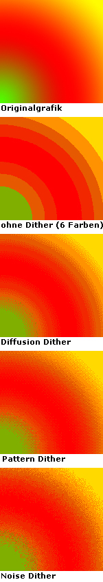

# Praktische und Theoretische Grundlagen
<!-- ENABLE_PDF_EXPORT=1 mkdocs serve -->

<!-- STASA -->
## Mikrocontroller 
Stasa Lukic  
  
Das Gehirn des Projektes ist ein Mikrocontroller, es gibte verschiedene arten von Mikrocontrollern die man vergleichen muss um einen für sich passenden Mikrocontroller zu finden. Im folgendem Unterkapitel werden die von uns ausgewählten Mikrocontroller genauer dargestellt, ihre Eigenschaften, nachteile und auch vorteile.  
  
Für das Projekt haben wir uns Prioritäten für den Mikrocontroller gesetzt. Als ersters sollte er genug Speicher haben sodas kein weiterer externer Speicher genutzt werden muss, dies würde unsere Kosten und gleichzeitig den Strombedarf senken da ein externes Speicher Modul Strom verbraucht und eine Latenz verursacht die längere arbeitszeiten bedeuten.  
WLan sollte intern auf dem Board verbaut seien da unser Mikrocontroller unter keiner so hohen Last arbeiten wird, das unsere Netzwerk Last auf einen sub Mikrocontroller verlagert werden müsste.  
Als letztes sollte der Mikrocontroller über einen deep sleep verfügen[[STA_06]](Quellenverzeichnis.md#STA_06).  
So würden wir am meisten Strom sparen da unserer Mikrocontroller nach beenden einer aufgabe (wie z.b. ein neues Bild darstellen) wahrscheinlich für längere Zeit keine Aufgaben hat oder bekommt. Der Mikrocontroller sollte eine Schnittstelle für SPI besitzen für eine mögliche schnelle datenübertragung mit dem Display.  
  
In  sind die Mikrocontroller mit ihren Eigenschaften aufgelistet. Es wurden von insgesamt 3 Marken recharchiert. Diese währen Espressif, STMicroelectronics und Raspberry Pi.
  
Die Mikrocontroller wurden nicht als SMD Chip gekauft sondern als development boards. Für Espressif recharchierten wir die XIAO ESP32 S3 und XIAO ESP32 C3 Boards von Seeed Studio und Die D1 Mini ESP8266 Boards von AZ-Delivery. Bei dem STM32 guckten wir uns den STM32WL55 an. Der RP2040 ist der RASP PI PICO von Raspberyy Pi.

Table: Eigenschaften der Mikrocontroller { #_tab_example2 }

| Eigenschaften | ESP32 S3 [[STA_01]](Quellenverzeichnis.md#STA_01) | ESP32 C3[[STA_02]](Quellenverzeichnis.md#STA_02) | ESP8266 [[STA_03]](Quellenverzeichnis.md#STA_03) |
| -                     | -                 | -                 | -             | 
| Prozessor             | Dual-core 240MHz | Single core 160MHz| Singlecore 160MHz|
| Speicher              | 8MB Flash   8MB PSRAM | 400KB SRAM 4MB Flash | 4MB Flash|
| Wifi                  | 2,4GHz WLAN       | 2,4GHz WLAN 802.11b/g/n| 2,4GHz WLAN 802.11n | 
| Spannung | 3,3V | 3,3V | 3,3V | 
| Idle Strom            | 22mA              | 24.4mA            | Maximum 500mA *| 
| Sleep Strom           | 14 μA             | 43μA              |               | 
| Schnittstellen | SPI, UART, IIC, IIS, 11xGPIO, 9xADC | SPI, IIC, UART, 11xGPIO, 9xADC | SPI, IIC, UART, 9xGPIO, ADC |
| Weitere   Eigneschaften | Reset Button Boot button Battery Charge Chip für 100mA Externe Antenne | Boot button Reset Button Battery Charge Chip für 100mA Externe Antenne | Reset button möglich Antenne in Platine verbaut | 

*Keine Angaben auser Maximum  
  
| Eigenschaften         | STM32 [[STA_04]](Quellenverzeichnis.md#STA_04) | RP2040 [[STA_05]](Quellenverzeichnis.md#STA_05) |
| -                     | -                                              | -                                               |
| Prozessor | Singlecore 48MHz| Dual-core 133MHz |
| Speicher |  256KB Flash 64KB RAM | 2MB Flash 256KB RAM |
| Wifi | 2,4GHz LoRa|     Keins        |
| Spannung | 5V | 5V |
| Idle Strom            | 15 mA          | 24mA               |
| Sleep Strom           | 360nA              | 1,3mA            |
| Schnittstellen | 2xSPI, 3xIIC, 2xUART, 43xGPIO | SPI, 2xIIC, 2xUART, 30xGPIO |
| Weitere   Eigneschaften |  |  

## Stromsparende Display Technologien
Stasa Lukic  
  
für dieses Projekt brauchen wir ein Display das so wenig Strom verbraucht wie möglich, damit unser Room display solange wie möglich mit einer Akku Ladung aushält. Wir fokussierten unsere Recherche auf ePaper, bistabile LCDs und OLED displays.  

### OLED
OLED Bildschirme haben eine sehr gute Bildqualität und einen weiten betrachtungswinkel. Anstatt Halbleiter werden in den LEDs  Organische Molekühle verwendet die Licht erzeugen. Diese Molekühle befinden sich zwischen ander Anode und einer Kathode. Fließt nun Strom wird blau und gelbes Licht erzeugt, mit Farbfiltern entstehen die Restlichen Farben. OLED Bildschirme können sehr helle Bilder zu erzeugen mit starkem Kontrast oder Farbstarke Bilder, dies verbraucht aber mehr Strom mit mehr Helligkeit, was für dieses Projekt ein Nachteil ist. Ein Vorteil ist das schwarze Pixel kein Strom verbrauchen gegenüber älteren Displays[[STA_09]](Quellenverzeichnis.md#STA_09).    
  
### Bistabile LCD
Bistabile LCD Displays haben den Vorteil das sie im gegensatz zu LCD keinen durchgehenden Stromverbrauch haben, Strom wird nur dann verbraucht wenn das Bild gewechselt wird. Dafür benutzt das Display kleine Kristalle die mit Hilfe von einem Stromfluss einen von zwei zuständen annehmen kann, der Kristall lässt entweder Licht durch oder reflektiert es zurück, womit ein ein Schwarz und Weiß Bildschirm bauen kann. Benutzt mann mehrer Ebenen kann man sogar verschiedene Farben darstellen. Wenn das Bild des Displays nur selten geändert wird, bedeutet es einen sehr niedrigen durchschnittlichen Strom verbrauch. Der Nachteil ist das das Aktuellisieren des Bildes 2 bis 3 Sekunden dauert[[STA_08]](Quellenverzeichnis.md#STA_08).  
  
### ePaper
ePaper hat ein ähnliches Konzept wie Bistabile LCD Displays, sie verbrauchen nur dann Strom wenn das Bild aktuellsiert wird. Hier werden geladene Farbpartikel in sehr kleinen Zellen eingesperrt. Je nach welche Ladung auf eine Zelle ausgeübt wird, werden manche Farbpartikel angezogen oder weggestoßen. Der Nachteil ist das die Aktuellsierung eines Bildes je nach ePaper Display technologie sehr lange dauern kann, das ist weil, wie man sich vorstellen kann man muss man einen Pixel mehrmals laden um wirklich alle Farbpartikel abzustoßen die man abstoßen will oder genau umgekehrt. Das resultiert in einer Aktuelliesierungs rate von bis zu 26 Sekunden oder Kürzer je nach Farbleistung. Ein weiter Nachteil ist das Farbpartikel nur Negativ oder Positiv geladen werden können, was in nur 2 Farben resultiert. Durch mehrere Ebenen kann das Display mehrere Farben annehmen, aber bei weitem nicht so viele wie beim Bistablem LCD. Der Vorteil ist das sie noch weniger Strom verbauchen beim aktuellsieren als die Bistablien LCDs[[STA_07]](Quellenverzeichnis.md#STA_07).

## Akku Technologien
<!-- STASA -->
## Funktechnologien
Stasa Lukic  
  
### LoRa
Low-Power-Wide-Area-Network-Technologie, auch genannt LoRa ist eine Stromsparende technologie um Daten über eine längere Distanz zu schicken. Dafür benutz LoRa die CSS-Modulationstechnik für eine Funkreichweite von mehreren Kilometern. Durch den niedriegen Stromverbrauch ist LoRa geeigent für hand held IoT Projekte, diese können Batterie betrieben werden für eine längere Zeit. Die Netzwerktopologie von LoRa ist Punkt-zu-Punkt oder Punkt-zu-Mehrpunkt-Netzwerke, oft in Kombination mit Gateways [[STA_12]](Quellenverzeichnis.md#STA_12).  
  
### WLan
WLan ist die weitverbreiteste Netzwerk technologie für den normalen Haushalt. Es erlaubt Geräte oder Clients über Radio frequenzen sich mit einem Acces points zuverbinden, diese nutzten oft Stern- oder Baumtopologien. Durch die Schnelle geschwindigkeit von 2,4GHz oder 5GHz wird jedoch die Reichweite gekürzt [[STA_10]](Quellenverzeichnis.md#STA_10).

### Zigbee
Zigbee wurde spezifisch dafür entwickelt, wenn man geringe Datenmengen verschicken will und einen geringen Stromverbrauch haben möchte.  Ihre geringe Reichweite ist kein problem, da Zigbee sehr schnell und zuverlässig ein mesh netzwerk aufbauen kann, das heist das Zigbee selbststädnig Netzwerkpfade baut und sogar bei einzelnden ausfällen selber einen neuen netzpfad findet [[STA_11]](Quellenverzeichnis.md#STA_11).  
  
### Bluetooth
Bluetooth ist ein 1990 entwickelte Punkt zu Punkt technologie die Ultra high frequency radio wellen nutzt, um über eine sehr kleine Reichweite Daten zu verschicken.

### Vergleiche der Funktechnologien

Bei der Reichweite hat LoRa die längste Reichweite mit biszu 15 Kilometern aber mit einer niedrigen datenübertragung von nur 0,3kpbs bis 50 kbps, abhängig der Reichweite. WLan hat eine Reichweite biszu 100m mit wänden und biszu 300m Ausserorts, hat dafür aber eine sehr schnelle datenübertragung, mit neueren technologien wie Wi-Fi 6 sind mehrere Gbps möglich. Zigbee hat die gleiche Reichweite wie ein WLan Netzwerk, hat aber dafür den vorteil sehr zuverlässige mesh Netzwerke aufzubauen. Wie schon erwähnt besitzt sie eine niedrige datenübertragung von biszu 250 kbps aber dafür ist sie sehr Leistungs effizeint. Bluetooth hat eine Reichweite von nur 10m, besitzt aber eine mittlere und zuverlässige datenübertragung von 2 Mbps bis 3 Mbps und macht sich dafür sehr nützlich für persönliche zwecke.
<!-- STASA -->
## Bildverarbeitung 
Stasa Lukic  
  
### Bitmaps

Bitmaps speichern Bildern in einem Format, sodass jeder Pixel einzelnd Farbwerte zugeschrieben bekommt. Umso mehr Bits man einem Pixel zuweist, umso genauer kann man die Farbe darstellen.  
Dies wird Color depth genannt, wird einem Pixel zum Beispiel nur 1 Bit zugewiesen, kann der Pixel entweder Die Farbe Schwarz (1) oder die Farbe Weis (0) anzeigen. Heutzutage werden Mehrere Formate genutzt, darunter sind die bekanntesten 8 Bit grey scale, RGB 565, 24 Bit RGB und 32 RGBA.  
8 Bit grey scale erlaubt es einem Pixel 256 Verschiedene graustufen anzunehmen.  
RGB 565 teilt jeweils Rot 5 Bits, Grün 6 Bits und 5 Bits für Blau für 65536 verschiedene Farb möglichkeiten, auch genannt High color.  
24 Bit RGB,auch genannt true color, lässt einen Pixel 16777216 verschiedene Farben annehmen, jedem RGB channel wert wird jeweils ein Byte zugewiesen [[STA_14]](Quellenverzeichnis.md#STA_14). Dies wird einmal genaur in  dargestellt. 

Figure: 24 Bit RGB Pixel { #_fig_pixel32bit }

{ width=100% }

32 Bit RGBA ergänzt noch einen alpha channel. Dieser lässt den Pixel weitere information zur Transparenz der Farbe wissen. Mit RGBA sind 4294967296 verschiedene Farben mit Transparenz möglich.  
  
Diese Informationen werden als Hexadezimahl Zahlen gespeichert, es gibt aber auch Indexed Bitmaps.
Indexed Bitmaps können einen Farbwert eine Zahl zuweisen, benutzt ein Bild zum Beispiel eine Color depth von 24 Bit aber insgesamt weniger als 256 Farben, Kann man jede Farbe eine Zahl zuweisen. Damit können wir das Bild anstatt mit 24 bit pro Pixel mit 8 Bit pro Pixel darstellen, behält aber die color depth von 24 Bit bei [[STA_15]](Quellenverzeichnis.md#STA_15). Ein beispiel kann man in  sehen.

Figure: Indexed Bitmap { #_fig_indexbmp }

{ width=100% }

### Dithering

Dithering kann dann verwendet werden Um color depth in einem Bild zu imitieren, wenn wenig Farben in einem Bild verwendet werden. Ein Beispiel, in einer Indexed Bitmap gibt es nur eine begrenzte zahl an Farben, dann kann dithering einen übergang zwischen 2 Farben erzeugen. Dadurch erscheint das Bild geschmeidiger oder als hätte es einen größere bit color depth.  
  
Dies geschieht durch verschiedene Algorithm, je nach welches verfahren von Dithering genutzt wird. Es gibt Diffusion Dither, Pattern Dither und Noise Dither. Jedes verfahren hat eine unterschiedliche vorangehensweise wie die Farben übergehen sollen. 

Figure: Verschiedene Dither verfahren [[STA_16]](Quellenverzeichnis.md#STA_16) { #_fig_dither }

{ width=50%, align=left }

### PNG dekodieren
PNG dateien sind Bilder die kompriemiert wurden und dabei keinen Verlust an Bildqualität haben. Die Bilder werden durch eine Substitutionskompressionsmethode und eine Entropiekodierung kompriemiert. Die Substitutionskompressionsmethode versucht wiederkehrende Muster im Bild zu erkennen und diese dann Abzusepeichern. Die Entropiekodierung Baut wahrscheihnlichkeits Werte für Farben im Bild auf, PNG kann dann die Farben beim entkompriemieren nach wahrscheinlichkeit zurück sortieren.  
  
Um die PNG zu dekodieren kann man die PNG datei auslesen lassen als Hex format. Die ersten 8 Hexzahlen sind immer die gleichen und signaliesieren das der folgende Abschnitt an Hexzahlen einer PNG angehören. Diese 8 Hexzahlen werden auch Magische Zahlen gennant, das währen die "89 50 4E 47 0D 0A 1A 0A" [[STA_17]](Quellenverzeichnis.md#STA_17).  
  
Beim Auslesen sind die Hexwerte natürlich noch kompriemiert, mithilfe von einer libary wie zLib kann man die Farbwerte für jeden Pixel der PNG datei auslesen lassen [[STA_18]](Quellenverzeichnis.md#STA_18).

## Energiemanagement

## Firmwarebibliotheken

## Webframeworks @Mario Wegmann
  