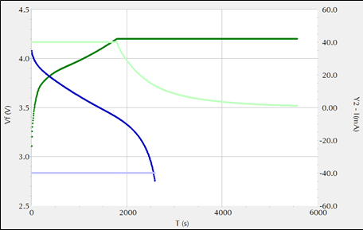
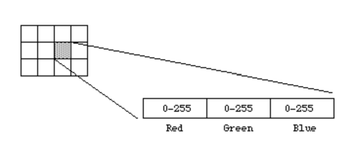
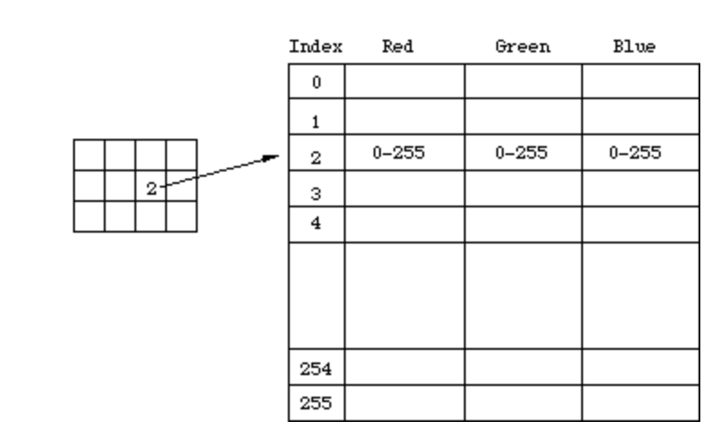
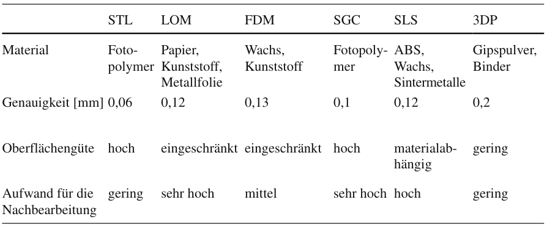

# Praktische und Theoretische Grundlagen
<!-- STASA -->
## Mikrocontroller @Stasa Lukic
Das Gehirn des Projektes ist ein Mikrocontroller, es gibte verschiedene arten von Mikrocontrollern die man vergleichen muss um einen für sich passenden Mikrocontroller zu finden. Im folgendem Unterkapitel werden die von uns ausgewählten Mikrocontroller genauer dargestellt, ihre Eigenschaften, nachteile und auch vorteile.  
  
Für das Projekt haben wir uns Prioritäten für den Mikrocontroller gesetzt. Als ersters sollte er genug Speicher haben sodas kein weiterer externer Speicher genutzt werden muss, dies würde unsere Kosten und gleichzeitig den Strombedarf senken da ein externes Speicher Modul Strom verbraucht und eine Latenz verursacht die längere arbeitszeiten bedeuten.  
WLan sollte intern auf dem Board verbaut seien da unser Mikrocontroller unter keiner so hohen Last arbeiten wird, das unsere Netzwerk Last auf einen sub Mikrocontroller verlagert werden müsste.  
Als letztes sollte der Mikrocontroller über einen deep sleep verfügen[[STA_06]](Quellenverzeichnis.md#STA_06).  
So würden wir am meisten Strom sparen da unserer Mikrocontroller nach beenden einer aufgabe (wie z.b. ein neues Bild darstellen) wahrscheinlich für längere Zeit keine Aufgaben hat oder bekommt. Der Mikrocontroller sollte eine Schnittstelle für SPI besitzen für eine mögliche schnelle datenübertragung mit dem Display.  
  
In  sind die Mikrocontroller mit ihren Eigenschaften aufgelistet. Es wurden von insgesamt 3 Marken recharchiert. Diese währen Espressif, STMicroelectronics und Raspberry Pi.
  
Die Mikrocontroller wurden nicht als SMD Chip gekauft sondern als development boards. Für Espressif recharchierten wir die XIAO ESP32 S3 und XIAO ESP32 C3 Boards von Seeed Studio und Die D1 Mini ESP8266 Boards von AZ-Delivery. Bei dem STM32 guckten wir uns den STM32WL55 an. Der RP2040 ist der RASP PI PICO von Raspberyy Pi.

Table: Eigenschaften der Mikrocontroller { #_tab_example2 }

| Eigenschaften         | ESP32 S3 [[STA_01]](Quellenverzeichnis.md#STA_01)          | ESP32 C3[[STA_02]](Quellenverzeichnis.md#STA_02)          | ESP8266 [[STA_03]](Quellenverzeichnis.md#STA_03)       | STM32 [[STA_04]](Quellenverzeichnis.md#STA_04)         | RP2040 [[STA_05]](Quellenverzeichnis.md#STA_05)        | 
| -                     | -                 | -                 | -             | -             | -             |
| Prozessor             | Dual-core 240MHz | Single core 160MHz| Singlecore 160MHz| Singlecore 48MHz| Dual-core 133MHz |
| Speicher              | 8MB Flash   8MB PSRAM | 400KB SRAM 4MB Flash | 4MB Flash| 256KB Flash 64KB RAM | 2MB Flash 256KB RAM |
| Wifi                  | 2,4GHz WLAN       | 2,4GHz WLAN 802.11b/g/n| 2,4GHz WLAN 802.11n | 2,4GHz LoRa|     Keins        |
| Spannung | 3,3V | 3,3V | 3,3V | 5V | 5V |
| Idle Strom            | 22mA              | 24.4mA            | Maximum 500mA *| 15 mA          | 24mA               |
| Sleep Strom           | 14 μA             | 43μA              |               | 360nA              | 1,3mA            |
| Schnittstellen | SPI, UART, IIC, IIS, 11xGPIO, 9xADC | SPI, IIC, UART, 11xGPIO, 9xADC | SPI, IIC, UART, 9xGPIO, ADC | 2xSPI, 3xIIC, 2xUART, 43xGPIO | SPI, 2xIIC, 2xUART, 30xGPIO |
| Weitere   Eigneschaften | Reset Button Boot button Battery Charge Chip für 100mA Externe Antenne | Boot button Reset Button Battery Charge Chip für 100mA Externe Antenne | Reset button möglich Antenne in Platine verbaut |  |  |

*Keine Angaben auser Maximum  
  

<!-- STASA -->
## Stromsparende Display Technologien @Stasa Lukic
für dieses Projekt brauchen wir ein Display das so wenig Strom verbraucht wie möglich, damit unser Room display solange wie möglich mit einer Akku Ladung aushält. Wir fokussierten unsere Recherche auf ePaper, bistabile LCDs und OLED displays.  

### OLED
OLED Bildschirme haben eine sehr gute Bildqualität und einen weiten betrachtungswinkel. Anstatt Halbleiter werden in den LEDs  Organische Molekühle verwendet die Licht erzeugen. Diese Molekühle befinden sich zwischen ander Anode und einer Kathode. Fließt nun Strom wird blau und gelbes Licht erzeugt, mit Farbfiltern entstehen die Restlichen Farben. OLED Bildschirme können sehr helle Bilder zu erzeugen mit starkem Kontrast oder Farbstarke Bilder, dies verbraucht aber mehr Strom mit mehr Helligkeit, was für dieses Projekt ein Nachteil ist. Ein Vorteil ist das schwarze Pixel kein Strom verbrauchen gegenüber älteren Displays[[STA_09]](Quellenverzeichnis.md#STA_09).    
  
### Bistabile LCD
Bistabile LCD Displays haben den Vorteil das sie im gegensatz zu LCD keinen durchgehenden Stromverbrauch haben, Strom wird nur dann verbraucht wenn das Bild gewechselt wird. Dafür benutzt das Display kleine Kristalle die mit Hilfe von einem Stromfluss einen von zwei zuständen annehmen kann, der Kristall lässt entweder Licht durch oder reflektiert es zurück, womit ein ein Schwarz und Weiß Bildschirm bauen kann. Benutzt mann mehrer Ebenen kann man sogar verschiedene Farben darstellen. Wenn das Bild des Displays nur selten geändert wird, bedeutet es einen sehr niedrigen durchschnittlichen Strom verbrauch. Der Nachteil ist das das Aktuellisieren des Bildes 2 bis 3 Sekunden dauert[[STA_08]](Quellenverzeichnis.md#STA_08).  
  
### ePaper
ePaper hat ein ähnliches Konzept wie Bistabile LCD Displays, sie verbrauchen nur dann Strom wenn das Bild aktuellsiert wird. Hier werden geladene Farbpartikel in sehr kleinen Zellen eingesperrt. Je nach welche Ladung auf eine Zelle ausgeübt wird, werden manche Farbpartikel angezogen oder weggestoßen. Der Nachteil ist das die Aktuellsierung eines Bildes je nach ePaper Display technologie sehr lange dauern kann, das ist weil, wie man sich vorstellen kann man muss man einen Pixel mehrmals laden um wirklich alle Farbpartikel abzustoßen die man abstoßen will oder genau umgekehrt. Das resultiert in einer Aktuelliesierungs rate von bis zu 26 Sekunden oder Kürzer je nach Farbleistung. Ein weiter Nachteil ist das Farbpartikel nur Negativ oder Positiv geladen werden können, was in nur 2 Farben resultiert. Durch mehrere Ebenen kann das Display mehrere Farben annehmen, aber bei weitem nicht so viele wie beim Bistablem LCD. Der Vorteil ist das sie noch weniger Strom verbauchen beim aktuellsieren als die Bistablien LCDs[[STA_07]](Quellenverzeichnis.md#STA_07).

## Akku-Technologien @Benjamin Klaric

### Vergleich und Auswahl von verschiedenen Akku-Technologien
Um das System möglichst autark zu machen, wurde es mit einen Akku betrieben. In Vorgang mit der Auswahl von passenden Akku-Technologien wurden die drei meistverbreiteten verglichen, nämlich die drei bedeutendsten Typen aus Lithium-Ionen-Akku Familie: klasiche Lithium-Ionen-Akkus, oft benutzten Lithium-Polymer-Akkus und die sicheren Lithium-Eisen-Phosphat-Akkus. Genauer gesagt sollte man die Vor- und Nachteile von jeweiligen Akku Typen genauer anschauen und dementsprechend eine Technologie auswählen. In den nächsten Abschnitt werden die drei genannten Technologien genauer angeschaut und die jeweiligen Vor- und Nachteile genannt.  

#### Lithium-Ionen-Akkus (Li-Ion)
Die meistverbreiteten Li-Ion-Akkus bieten relativ hohe Energiedichte, sind kostengünstig und langlebig. Die Li-Ion-Akkus kommen in verschiedenen Bauformen, wie z. B. 18650, 21700 usw. Dieser Art von Akkus besteht aus eine negative Elektrode, bzw. Kathode aus Grafit und einer positiven Elektrode bzw. Anode aus Lithiumcobaltoxid (LiCoO~2~), Lithiumnickeldioxid (LiNiO~2~) oder Lithiummanganatoxid (LiMn~2~O~4~). Diese Wahl von Chemie bietet eine gute Zyklenfestigkeit, was natürlich der Langlebigkeit entspricht. Im geladenen Lithium-Ionen-Akkus erzeugt ein elektrochemischer Prozess Spannung zwischen den Elektroden. Lithium-Ionen (Li+) bewegen sich dabei durch den Elektrolyten zwischen festen Übergangsmetall- und Grafitstrukturen der Elektroden, getrennt durch einen Separator. Das Funktionsprinzip von Li-Ion-Akkus bezieht sich dabei auf die Verschiebung von Lithium-Ionen. So wird die elektromotorische Kraft erzeugt. [[BK_01]](Quellenverzeichnis.md#bk_01)  
Mit einer Nennspannung von 3,7V und der Entladekurve, die stabil über einen Großteil der Entladung bei Nennspannung bleibt, was bei  zu sehen ist.

Figure: Lade- (grün) und Entladekurve(blau) von Li-Ion-Akkus [[BK_02]](Quellenverzeichnis.md#bk_02) { #_fig_li_ion_kurve }

{ width=60% }

Li-Ion-Akkus können aber nicht selber in Betrieb genommen werden, da die sich ohne eine Art von Überwachung tief entladen wurden oder beim Laden überladen geworden sind. Dazu werden Li-Ion-Akkus immer mit einem Batterie Management System benutzt, kurz BMS gesagt. Ein BMS kümmert sich darum, dass die Li-Ion-Akkus einen Cut-Off-Spannungspegel beim Laden und beim Entladen haben. Das BMS bietet auch Kurzschlussschutz und meistens eine Überstromerkennungsfunktionalität. (**vielleicht verweisen, dass man mehr später darüber erfahren wird**)
Li-Ion-Akkus, voll geladen, liegen bei ungefähr 4,25V und entladen sich bis 2,5V, wenn die an einen BMS angeschlossen sind.  
Ein Merkmal von Li-Ion-Akkus ist die Art von Laden, da die eine spezielle Ladetechnik brauchen, nämlich sogenannte 80% CC, 20% CV. Genauer gesagt, werden die Akkus die ersten 80% mit einem konstanten Strom geladen und die restlichen 20% mit einer konstanten Spannung. Dieses Verfahren ist bei  zu sehen, dargestellt mit hellgrün. Dafür wurde ein besonderes Ladegerät benötigt. Mit richtiger Nutzung von Ladeverfahren haben die Akkus keinen Memory-Effekt und dementsprechend haben auch sehr geringe Selbstentladung.  
Die Li-Ion-Akkus sind meistens ein bisschen teurer als die anderen Akku-Technologien und benötigen die genannten speziellen Ladegeräte.  

#### Lithium-Polymer-Akkus (LiPo)
Die LiPo-Akkus sind eine spezielle Bauform der klassischen Li-Ion-Akkus und nutzen daher die gleiche Zellchemie. Als eine der neuesten Akkutechnologien bieten sie eine der höchsten Energiedichten in Relation zum Gewicht. Sie behalten alle Vorteile der Li-Ion-Akkus, da sie Teil der Lithium-Ionen-Akku-Familie sind, und verwenden dasselbe Ladeverfahren wie klassische Li-Ion-Akkus. Oft sind sie mit einem eingebauten Batteriemanagementsystem (BMS) ausgestattet, was sie etwas teurer macht. Diese Akkus sind typischerweise in Mobiltelefonen zu finden.  
LiPo-Akkus verwenden flexible Kunststoffbeutel anstelle der zylindrischen Bauweise von Li-Ion-Akkus. Diese Flexibilität ermöglicht es, sie an die spezifischen Anforderungen des Gerätedesigns anzupassen und bietet eine größere Designfreiheit. Sie nutzen den verfügbaren Raum in elektronischen Geräten effizient aus.  
Ein Nachteil liegt jedoch in den Sicherheitsaspekten. LiPo-Akkus sind sehr empfindlich gegenüber Überhitzung, was in Rauch- und Gasentwicklung oder im Extremfall sogar zu Selbstentzündung führen kann. Dieses Risiko erhöht sich besonders bei unsachgemäßer Handhabung, übermäßiger Belastung oder mechanischer Beschädigung der Akkuzellen.

#### Lithium-Eisen-Phosphat-Akkus (LiFePO~4~)
Die LiFePO~4~-Akkus gehören zur Familie der Lithium-Ionen-Technologie, verzichten sich jedoch auf das Kathodenmaterial Lithiumcobaltdioxid (LiCoO~2~), das in klassischen Li-Ion-Akkus verwendet wird.  
Im Vergleich zu Li-Ionen-Akkus mit LiCoO2 bieten LiFePO4-Akkus eine höhere Sicherheit, da sie keine exothermen Reaktionen unter extremen Bedingungen zeigen, was das Risiko von Bränden und Explosionen erheblich verringert. Diese Akkus sind ideal für Anwendungen in Elektrofahrzeugen aufgrund ihrer höheren Entladestromkapazität, Nicht-Toxizität und längerer Lebensdauer im Vergleich zu Li-Ionen-Akkus mit LiCoO~2~. [[BK_03]](Quellenverzeichnis.md#bk_03)  
In Vergleich zu Li-Ion-Akkus, liegt der Nennspannung von LiFePo~4~-Akkus bei 3,3V und bleibt stabil über einen Großteil der Entladung bei Nennspannung, was auf  zu sehen ist.  

Figure: Lade- (grün) und Entladekurve (rot) von LiFePO~4~-Akkus [[BK_04]](Quellenverzeichnis.md#bk_04) { #_fig_lifepo4_kurve }

{ width=70% }

Wie Li-Ion-Akkus, benötigen die LiFePO~4~-Akkus auch eine Schutzschaltung in Form von BMS, allerdings besondere Art für LiFePO~4~-Akkus. Da die auch die Familie von Li-Ion-Akkus gehören, werden die auch über gleiches Ladeverfahren wie Li-Ion-Akkus geladen. Die Entladeschlussspannung von dieser Akkus lieght typischerweiße bei 2,0V und die Ladeschlussspannungen liegt in der Regel bei 3,6V. Die Werten sind aber von BMS abhängig. 
Die einzige Nachteil dieser Akku-technologie ist, dass im Vergleich zu den reinen Li-Ion-Akkus, die Nennspannung niedrieger liegt, bei 3,3V im Vergleich zu 3,7V.

<!-- STASA -->
## Funktechnologien @Stasa Lukic

### LoRa
Low-Power-Wide-Area-Network-Technologie, auch genannt LoRa ist eine Stromsparende technologie um Daten über eine längere Distanz zu schicken. Dafür benutz LoRa die CSS-Modulationstechnik für eine Funkreichweite von mehreren Kilometern. Durch den niedriegen Stromverbrauch ist LoRa geeigent für hand held IoT Projekte, diese können Batterie betrieben werden für eine längere Zeit. Die Netzwerktopologie von LoRa ist Punkt-zu-Punkt oder Punkt-zu-Mehrpunkt-Netzwerke, oft in Kombination mit Gateways [[STA_12]](Quellenverzeichnis.md#STA_12).  
  
### WLan
WLan ist die weitverbreiteste Netzwerk technologie für den normalen Haushalt. Es erlaubt Geräte oder Clients über Radio frequenzen sich mit einem Acces points zuverbinden, diese nutzten oft Stern- oder Baumtopologien. Durch die Schnelle geschwindigkeit von 2,4GHz oder 5GHz wird jedoch die Reichweite gekürzt [[STA_10]](Quellenverzeichnis.md#STA_10).

### Zigbee
Zigbee wurde spezifisch dafür entwickelt, wenn man geringe Datenmengen verschicken will und einen geringen Stromverbrauch haben möchte.  Ihre geringe Reichweite ist kein problem, da Zigbee sehr schnell und zuverlässig ein mesh netzwerk aufbauen kann, das heist das Zigbee selbststädnig Netzwerkpfade baut und sogar bei einzelnden ausfällen selber einen neuen netzpfad findet [[STA_11]](Quellenverzeichnis.md#STA_11).  
  
### Bluetooth
Bluetooth ist ein 1990 entwickelte Punkt zu Punkt technologie die Ultra high frequency radio wellen nutzt, um über eine sehr kleine Reichweite Daten zu verschicken. [[STA_13]](Quellenverzeichnis.md#STA_13).

### Vergleiche der Funktechnologien

Bei der Reichweite hat LoRa die längste Reichweite mit biszu 15 Kilometern aber mit einer niedrigen datenübertragung von nur 0,3kpbs bis 50 kbps, abhängig der Reichweite. WLan hat eine Reichweite biszu 100m mit wänden und biszu 300m Ausserorts, hat dafür aber eine sehr schnelle datenübertragung, mit neueren technologien wie Wi-Fi 6 sind mehrere Gbps möglich. Zigbee hat die gleiche Reichweite wie ein WLan Netzwerk, hat aber dafür den vorteil sehr zuverlässige mesh Netzwerke aufzubauen. Wie schon erwähnt besitzt sie eine niedrige datenübertragung von biszu 250 kbps aber dafür ist sie sehr Leistungs effizeint. Bluetooth hat eine Reichweite von nur 10m, besitzt aber eine mittlere und zuverlässige datenübertragung von 2 Mbps bis 3 Mbps und macht sich dafür sehr nützlich für persönliche zwecke.
<!-- STASA -->
## Bildverarbeitung 

### Bitmaps

Bitmaps speichern Bildern in einem Format, sodass jeder Pixel einzelnd Farbwerte zugeschrieben bekommt. Umso mehr Bits man einem Pixel zuweist, umso genauer kann man die Farbe darstellen.  
Dies wird Color depth genannt, wird einem Pixel zum Beispiel nur 1 Bit zugewiesen, kann der Pixel entweder Die Farbe Schwarz (1) oder die Farbe Weis (0) anzeigen. Heutzutage werden Mehrere Formate genutzt, darunter sind die bekanntesten 8 Bit grey scale, RGB 565, 24 Bit RGB und 32 RGBA.  
8 Bit grey scale erlaubt es einem Pixel 256 Verschiedene graustufen anzunehmen.  
RGB 565 teilt jeweils Rot 5 Bits, Grün 6 Bits und 5 Bits für Blau für 65536 verschiedene Farb möglichkeiten, auch genannt High color.  
24 Bit RGB,auch genannt true color, lässt einen Pixel 16777216 verschiedene Farben annehmen, jedem RGB channel wert wird jeweils ein Byte zugewiesen [[STA_14]](Quellenverzeichnis.md#STA_14). Dies wird einmal genaur in  dargestellt. 

Figure: 24 Bit RGB Pixel { #_fig_pixel32bit }

{ width=200% }

32 Bit RGBA ergänzt noch einen alpha channel. Dieser lässt den Pixel weitere information zur Transparenz der Farbe wissen. Mit RGBA sind 4294967296 verschiedene Farben mit Transparenz möglich.  
  
Diese Informationen werden als Hexadezimahl Zahlen gespeichert, es gibt aber auch Indexed Bitmaps.
Indexed Bitmaps können einen Farbwert eine Zahl zuweisen, benutzt ein Bild zum Beispiel eine Color depth von 24 Bit aber insgesamt weniger als 256 Farben, Kann man jede Farbe eine Zahl zuweisen. Damit können wir das Bild anstatt mit 24 bit pro Pixel mit 8 Bit pro Pixel darstellen, behält aber die color depth von 24 Bit bei [[STA_15]](Quellenverzeichnis.md#STA_15). Ein beispiel kann man in  sehen.

Figure: Indexed Bitmap { #_fig_indexbmp }

{ width=200% }

### Dithering

### Euclidean distance

### PNG dekodieren

## Energiemanagement
**Mario Wegmann**

Computer verbrauchen auch ohne aktive Aufgabe Strom. Ohne spzeielle Anweisungen an den Computer wird der Stromverbrauch nicht gedrosselt, wodurch Energie verschwendet wird. Bei PCs fallen hierbei ACPI Sleep States ein, ACPI steht dabei für Advanced Configuration and Power Interface und ist ein offener Industriestandard für die Energieverwaltung bei Computern [[MW_02]](Quellenverzeichnis.md#MW_02). Die sogenannten ACPI sleep states ermöglichen es dem Betriebssystem zu steuern, welche Komponenten gedrosselt oder gar komplett abgeschaltet werden, um den Stromverbrauch zu minimieren. Auch bei Mikrocontrollern gibt es mehere Mechamisem, womit der Stromverbrauch reduziert werden kann. Da ein geringer Stromverbrauch eines der wichtigsten Kriterien diese Projekts ist, werden hier beispielhaft die Sleep States eines ESP32 erläutert. 

### Einfaches Delay

Die einfachste Möglichkeit einen ESP32 Mikrocontroller keine konkrete Aufgabe zu geben, ist mit einem Delay. Die Funktion heißt in der Arduino IDE `Delay()` und lässt einen Parameter zu, welcher angiebt, wie viele Mikrosekunden der Mikrocontroller warten soll. In der ESP-IDF heißt die Funktion `vTaskDelay()`, hier kann auch ein Parameter für die Wartedauer übergeben werden. Der Parameter nimmt jedoch nicht Millisekunden, sondern Ticks an. Die Ticks sind abhängig von der Tick Frequenz, daher müssen die Millisekunden mit der Funktion `pdMSTOTICKS()` in Ticks umgewandelt werden. Während dem aktiven warten werden jedoch keine Komponenten aktiv abgeschaltet oder gedrosselt, lediglich der Prozessor läuft nicht auf Vollast. 

### Der Light-sleep Modus

Deutlich besser ist da schon der Light-sleep. Wird dieser Modus aktiviert, so werden die teilweise Clock-Signale der digitale Peripherie, der meisten Teile des RAMs und der CPUs ausgeschalten und die Versorgungsspannung reduziert, dieses Verfahren nennt sich Clock-Gating [[MW_03]](Quellenverzeichnis.md#MW_03). Dadurch kann der Stromverbrauch deutlich reduziert werden, wie hoch die Reduktion ist, wird im Kapitel [7.9 Strommessung von Mikrocontroller und Display](Hardware.md#strommessung-von-mikrocontroller-und-display) gemessen. Beim ESP32 gibt es nun verschiede Wakeup Sources um den Light-sleep wieder zu beenden. Unter anderem sind folgende Wakeup Sources möglich: 

* Timer
* Touchpad
* GPIO
* ULP Coprocessor (Ultra Low Power)
* UART

Nach einem Wakeup Event wird der State wiederhergestellt und der Mikrocontroller arbeitet an der Stelle weiter, wo er durch den Light-sleep aufgehört hat. [[MW_06]](Quellenverzeichnis.md#MW_06)

### Der Deep-sleep Modus

Noch mehr Stromeinsparung kann mit dem Deep-sleep realisiert werden. Dabei werden die oben genannten Komponenten nicht nur clock-gated, sondern komplett abgeschaltet, somit bleibt nur noch der RTC Controller und dessen Memory und der ULP Coprocessor aktiv. Viele der zuvor genannten Wakeup Sources können auch verwendet werden um den ESP32 aus dem Deep-sleep heraus aufzuwecken, ausnahmen sind hierbei jedoch die meisten GPIO Pins und UART. Des weiteren ist anzumerken, dass nach dem Aufwecken aus dem Deep-sleep der ESP32 kein State wiederhergestellt wird. Die Firmware fängt also von vorne an und auch Daten die während dem Deep-sleep nicht verloren gehen dürfen müssen separat in nicht-flüchtigen Speicher abgelegt werden. [[MW_06]](Quellenverzeichnis.md#MW_06)

## Firmwarebibliotheken

## Gehäuseentwicklung 
**Jannis Gröger**

Um das Gehäuse für ein elektronisches Gerät zu entwickeln, müssen zunächst die Anforderung festgelegt werden. Hierbei kann man in zwischen funktionalen und ästhtischen und ergonomischen Anforderungen unterscheiden. Grundsätzlich soll ein Gehäuse die Komponenten und die Elektronik nicht nur vor äußeren Einflüssen wie Staub, Schmutz oder mechanischen Stößen schützen, sondern trägt auch zur Wärmeableitung bei und spielt eine wichtige Rolle bei der Benutzung des Geräts. Im Folgenden werden die Grundlagen und die essentiellen Überlegungen bei der Entwicklung eines Gehäuses behandelt.

### Funktionale Anforderungen

Die Hauptfunktion eines Gehäuses ist der Schutz der einzelnen Bauteile, wobei hier auf verschiedene Faktoren zu achten ist. Zum einen muss das Gehäuse stabil genug sein, um die internen Komponenten vor mechanischen Einflüssen wie Stöße oder Druck zu schützen. Das Material muss dementsprechend passend ausgewählt werden, wobei auch die Geometrie des Gehäuses berücksichtigt werden muss. Häufig verwendete Materialien bei Elektrogeräten sind Kunststoffe oder Metalle wie bspw Aluminium. [[JG_01]](Quellenverzeichnis.md#jg_01)

Zudem ist das Gehäuse dazu da, die Elektronik darin vor so äußeren Einflüssen wie beispielsweise Staub oder Wasser zu bewahren. Bei der Frage, vor welchen sogenannten Umwelteinflüssen ein Gehäuse schützt, hilft die Einteilung in IP-Schutzklassen, wobei das IP für International Protection steht und die verschiedenen Klassen nach der DIN 60529 spezifiziert sind. Die Bezeichnung der Klassen besteht hierbei aus zwei Kennziffern nach der IP Abkürzung: Die erste Ziffer macht erkenntlich, gegen welche Arten von Berührung und Fremdkörpern das Gehäuse schützt, während die zweite Ziffer den Schutz gegen Wasser benennt. Eine Gehäuse mit IP68 Spezifikation ist beispielsweise vollständig gegen Staubeintritt und vor andauerndem Untertauchen geschützt. Eine solche Zertifizierung kann jedoch nur durch bestimmte Instititionen ausgestellt werden. [[JG_02]](Quellenverzeichnis.md#jg_02)

Ein weitere Funktion, der bei der Entwicklung des Gehäuses berücksichtigt werden muss, ist die Wärmeregulation, da die Elektronik sowohl vor Überhitzung, als auch vor zu starker Unterkühlung geschützt werden muss. Da elektronische Komponenten selbst Wärme erzeugen, spielt die Wärmeableitung eine größere Rolle, als der Schutz vor zu geringen Temperaturen. Diese kann durch Einsatz von Lüftern oder Kühlkörpern oder Einbau von Lüftungsschlitzen und die damit verbundene Konvektion bewerkstelligt werden. [[JG_02]](Quellenverzeichnis.md#jg_02)

Eine letzte funktionale Anforderung an das Gehäuse ist die elektromagnetische Verträglichkeit. Darunter versteht man, dass elektronische Geräte so aufgebaut sind, dass sie vor elektromagnetischer Störungen anderer Geräte geschützt sind und ihre eigenen elektromagnetischen Felder auf ein Minimum reduzieren, um selbst nicht andere Geräte zu stören. Dies kann durch die verwendung leitfähiger Materialien und speziellen Dichtungen erreicht werden. [[JG_02]](Quellenverzeichnis.md#jg_02)

### Ästhetische und ergonomische Anforderungen

Neben der Funktionalität stellen auch Ästhetik und Ergonomie gewisse Ansprüche an ein Gehäuse. Bei der Bedienung eines elektronischen Gerätes steht die Benutzerfreundlichkeit im Vordergrund, die bei tragbaren Geräten beispielsweise durch ein geringes Gewicht beeinflusst wird, wohingegen bei stationären Geräten eher auf Zugänglichkeit der Bedienelemente und Anschlüsse geachtet werden sollte. Des Weiteren beeinflusst das Design die Wahrnehmung und das Erscheinungsbild des Geräts, was maßgeblich zur Nutzung und Akzeptanz des Geräts beim Verbraucher beiträgt.  

### Auswahl des Materials und der Fertigungstechnik

Bei der Auswahl des Materials sind die oben genannten Aspekte von großer Bedeutung, da das verschiedene Materialen andere Eigenschaften besitzen und dementsprechend nicht jedes Material die gleichen Anforderungen erfüllt. Abhängig von der Materialauswahl ist im nöchsten Schritt dann die Auswahl der Fertigungstechnik, wobei hier zusätzlich auf die Anforderungen an die Geometrie des Gehäuses, die anzufertigende Stückzahl und der Material- sowie der Fertigungspreis geachtet werden muss.

### Design und Verfahren des Rapid Prototyping 

Sind Material und Fertigungstechnik gewählt, kann mit dem eigentlichen Design des Gehäuses begonnen werden. Heutzutage wird das Design häufig durch CAD-Software (computer-aided design Software) unterstützt, was Gehäuseentwicklern und -herstellern ermöglicht, ein präzises 3D-Modell des des gewünschten Produkts zu Erstellen. Durch Finite-Elemente-Modellierung, kurz FEM,  können Simulationen zum Testen der mechanischen oder thermischen Eigenschaften verwendet werden.[[JG_03]](Quellenverzeichnis.md#jg_03)

Nach dem Design folgt dann die Fertigung eines oder mehrerer Prototypen, die auf gewünschte Eigenschaften getestet werden, um eventuelle Schwachstellen auszumachen und Verbesserungen am Design vornehmen zu können. Hierbei werden immer häufiger Verfahren des Rapid Prototyping, im Folgenden auch RPT genannt, verwendet, was das "Erstellen von Prototypen aus einfach verarbeitbaren Materialien" [[JG_03]](Quellenverzeichnis.md#jg_03) bezeichnet. Hierbei wird das 3D-Modell aus der CAD-Software in ein "trianguliertes Oberflächenmodell überführt" [[JG_03]](Quellenverzeichnis.md#jg_03) und anschließend in einzelne Schichten mit einer festgelegten Dicke zerlegt. In unterschiedlichen Verfahren, von denen einige im Folgenden genannt werden, werden diese Schichten dann wieder zusammengefügt, wodurch ein Prototyp entsteht. [[JG_03]](Quellenverzeichnis.md#jg_03)

- Das Stereolithografie-Verfahren (STL-Verfahren) ist ein RPT-Verfahren, bei dem mit einem Laser in einem Bad aus "polymere[r] Flüssigkeit die Konturen der Scheiben des Modells schichtweise [...] nachgefahren [...] werden"[[JG_03]](Quellenverzeichnis.md#jg_03), wodurch ein räumliches Modell entsteht. 
- Beim Laminated Object Manufacturing Verfahren (LOM-Verfahren) dagegen, fährt der Laser die Konturen auf Papier nach, das die vorher festgelegte Dicke aufweist. Diese Papierschichten werden dann mittels eines "Schmelzkleber[s] aufeinander geklebt" [[JG_03]](Quellenverzeichnis.md#jg_03). Das entstehende Modell kann dann ähnlich "wie Holz nachbearbeitet werden" [[JG_03]](Quellenverzeichnis.md#jg_03).
- Das Fused Deposition Modelling-Verfahren (FDM-Verfahren) erstellt ein Prototyp, indem ein Kunststofffaden durch eine beheizbare Düse auf einer Plattform ausgelegt wird. Diese Plattform lässt sich dabei frei im Raum bewegen und der Durchmesser des Fadens entsricht dabei der vorher festgelegten Schichtdicke. [[JG_03]](Quellenverzeichnis.md#jg_03)
- Ein weiteres Verfahren ist das Solidier-Verfahren, auch Solid Ground Verfahren oder kurz SGC-Verfahren genannt. Das Modell entsteht hierbei aus mehreren dünnen Fotopolymerschichten, wovon jede einzelne "mit einer fotografischen Maskentechnik unter UV-Licht aushärtet" [[JG_03]](Quellenverzeichnis.md#jg_03). Um das fertige Modell herum wird ein Wachskörper gebildet, wodurch Überhänge nicht mit Stützen fixiert werden müssen. [[JG_03]](Quellenverzeichnis.md#jg_03)
- Auch das Selective Laser Sintering ist ein RPT-Verfahren, bei dem die einzelnen Schichten aus pulverförmigen Material mit einem Laser an gewollten Stellen geschmolzen wird. Durch schichtweises Herunterfahren der Fläche, worauf sich die unterste Pulverschicht befindet, liegt das fertige Modell dann in einem Pulverbett. [[JG_03]](Quellenverzeichnis.md#jg_03)
- Das 3D-Printing-Verfahren nutzt auch ein Schicht Pulver, wobei hier das Material mithilfe eines Binders verbunden wird. Auch hier wird das Modell an der obersten Schicht aufgebaut und der fertige Prototyp liegt in einem Pulverbett. [[JG_03]](Quellenverzeichnis.md#jg_03)

Die einzelnen RPT-Verfahren unterscheiden sich in den möglichen Materialien, der Genauigkeit der Modelle, der Qualität der Oberfläche und der verbundene Aufwand für die Nachbearbeitung. Diese Unterschiede sind der Abbildung  zu entnehmen.

Figure: Eigenschaften der verschiedenen Rapid-Prototyping-Verfahren [[JG_03]](Quellenverzeichnis.md#jg_03) { #_JG_01 }

{width=80%}

Nach dem Prototyping und ausführlichen Testen, kann das überzeugende Modell schließlich in Serienproduktion übergehen womit die Entwicklung des Gehäuses ebenfalls abgeschlossen ist.

## Webanwendungen
**Mario Wegmann**

Aufgrund den anforderungen und der komplexität von Websiten ist es nicht mehr praktikabel Inhalte komplett händisch in HTML, CSS und JavaScript zu erstellen. Zu groß und fehleranfällig ist die Wartung eines solchen manuel erstellten Konstrukts. Ein Beispiel hierfür wäre das erweiteren einer neuen Unterseite in der Menüleiste. Hier müsste jede andere Unterseite anegpasst werden, um die neue Unterseite von allen anderen Unterseiten aus zu erreichen. 

Stattdessen hat es sich etabliert für Websiten mit viel statischen Inhalt sogenannte Static Site Generators zu nutzen. Hierbei liegt der Fokus nur noch auf die Erstellung des eigentlichen Inhalts über eine simple Textdatei. Nach Fertigstellung des Inhalts erzeugt der Generator dann das restliche Gerüst der Website, so werden die Unterseiten generiert, das Navigationsmenü erstellt, Bilder optimiert und das Layout anhand des angegebenen Themes angewendet. 

Neben Websiten mit statischen Inhalten gibt es auch Websiten, dessen Inhalt dynamisch erstellt wird. In Social Media ist die Anzahl an Inhalten so enorm, das es nicht praktikabel wäre allen Personen die gleiche Timeline anzuzeigen. Stattdessenn wird pro Benutzer eine auf Ihn spezialisierte Timeline beim Aufruf generiert. 

Zuletzt gibt es auch Anwendungen die über den Webbrowser laufen und somit keine lokale Installation benötigen, ein Beispiel wäre hierfür die NextCloud, womit sich Dateien abspeichern, erstellen, ordnen und teilen lassen. Dank vieler Erweiterungen 

Die letzen beiden genannten Kategorien erfordern viele Komponenten die zusammenarbeiten müssen um den Benutzer eine performante und benutzerfreundliche Erfahrung zu ermöglichen. Daher haben sich mehr und mehr verschiedene Technologien im Web entwickelt, die mit unterschiedlsichen Herangehensweisen versuchen die Anfoderungen zu erfüllen. 

### Webtechnologien
**Mario Wegmann**

Moderne Webbrowser haben sich auf die drei Programmiersprachen HTML, CSS und JavaScript geeinigt um Websiten darzustellen.

**HyperText Markup Language (HTML)** 

HTML definiert die Struktur und den Inhalt einer Webseite durch die Verwendung von Tags HTML bildet das Gerüst einer Webseite, indem es Text, Bilder, Links, Videos und andere Elemente einbindet und organisiert.

**Cascading Style Sheets (CSS)**

CSS ist eine Stylesheet-Sprache, die verwendet wird, um das Aussehen und Layout von HTML-Dokumenten zu gestalten. Mit CSS können Entwickler die visuellen Aspekte von HTML-Elementen steuern. CSS ermöglicht eine Trennung von Struktur und Design, was die Wartung und Anpassung von Webseiten erleichtert.

**JavaScript**

JavaScript ist eine Programmiersprache, welche im Browser ausgeführt werden kann und somit für interaktivität auf der Clientseite sorgt. JavaScript nutz die Technik der DOM Manipulation um den Inhalt des geladene HTMLs nachträglich zu modifizieren. Das Document Object Model (DOM) beschreibt den Aufbau der einzelnen HTML Elemente als Baumstruktur, diese Elemente können mit JavaScript gelesen, hinzugefügt, verändert und gelöscht werden. TypeScript ist eine Erweiterung von JavaScript und erweitert die Sprache um statische Typen, damit können Fehler im Programmcode früher erkannt´ und die Codequalität verbessert werden. 

**React**

React ist eine JavaScript-Bibliothek zur Erstellung von Benutzeroberflächen. Sie verwendet eine komponentenbasierte Architektur, die es Entwicklern ermöglicht, wiederverwendbare UI-Komponenten zu erstellen und den Status von Anwendungen effizient zu verwalten. React nutzt einen virtuellen DOM zur Optimierung von Updates und zur Verbesserung der Performance. Neben React sind Vue, Angular und Svelte weitere bekannte Frontent-Bibliotheken. 

**PostgreSQL**

PostgreSQL ist ein relationale Datenbankmanagementsystem (RDBMS). Ein RDBMS ist eine Software, die zur Verwaltung von Datenbanken verwendet wird, die auf dem relationalen Modell basieren. In diesem Modell werden Daten in Tabellen organisiert, die aus Zeilen und Spalten bestehen. Jede Tabelle repräsentiert eine Entität, und die Beziehungen zwischen den Tabellen werden durch Primär- und Fremdschlüssel definiert. PostgreSQL ist bekannt für seine Erweiterbarkeit, Standardkonformität und fortgeschrittene Features wie komplexe Abfragen und Transaktionen. MySQL ist ein weiteres bekanntes und verbreitetes RDBMS. 

**Structured Query Language (SQL)**

SQL ist eine standardisierte Programmiersprache, die zur Verwaltung und Manipulation von Daten in relationalen Datenbanken verwendet wird. Mit SQL können Benutzer Datenbanken erstellen, ändern, abfragen und verwalten. 

**Webserver**

Es gibt verschiedene Möglichkeiten wie HTML, CSS und JavaScript bei einer Anfragen an den Webserver generiert werden können. Der Code kann komplett statisch auf dem Webserver abgelegt sein, oder auch dynamisch bei der Anfrage generiert werden. Prinzipiell lässt sich für den letzeren Fall fast jede Programmiersprache verwenden, beliebt sind jedoch PHP, Python, Ruby, C# und JavaScript (Node.JS) [[MW_04]](Quellenverzeichnis.md#MW_04).

Für die Umsetzung werden häufig Frameworks genutzt, ähnlich wie bei Static Site Generators, unterstützen Frameworks bei der realisierung von Websiten, indem es wiederkehrende Aufgaben vereinfacht und die Wiederverwendung von Code fördert. Durch die Abstraktion und Strukturierung von Code sowie die Objektorientierung der Daten wird die Entwicklungszeit verkürzt und die Wartbarkeit großer Anwendungen erheblich verbessert. NextCloud verwendet beispielsweise das PHP Framework Symfony [[MW_05]](Quellenverzeichnis.md#MW_05)
