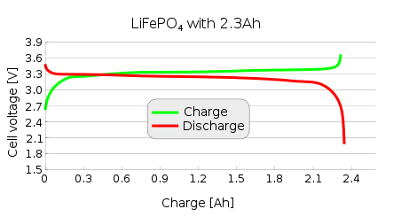

# Praktische und Theoretische Grundlagen

## Recherchierte Technologien (nur vergleiche / kapitel 5 auswahl argumentieren)

## Mikrocontroller

## Stromsparende Display Technologien

## Akku-Technologien @Benjamin Klaric

### Vergleich und Auswahl von verschiedenen Akku-Technologien
Um das System möglichst autark zu machen, wurde es mit einen Akku betrieben. In Vorgang mit der Auswahl von passenden Akku-Technologien wurden die drei meistverbreiteten verglichen, nämlich die drei bedeutendsten Typen aus Lithium-Ionen-Akku Familie: klasiche Lithium-Ionen-Akkus, oft benutzten Lithium-Polymer-Akkus und die sicheren Lithium-Eisen-Phosphat-Akkus. Genauer gesagt sollte man die Vor- und Nachteile von jeweiligen Akku Typen genauer anschauen und dementsprechend eine Technologie auswählen. In den nächsten Abschnitt werden die drei genannten Technologien genauer angeschaut und die jeweiligen Vor- und Nachteile genannt.  

#### Lithium-Ionen-Akkus (Li-Ion)
Die meistverbreiteten Li-Ion-Akkus bieten relativ hohe Energiedichte, sind kostengünstig und langlebig. Die Li-Ion-Akkus kommen in verschiedenen Bauformen, wie z. B. 18650, 21700 usw. Dieser Art von Akkus besteht aus eine negative Elektrode, bzw. Kathode aus Grafit und einer positiven Elektrode bzw. Anode aus Lithiumcobaltoxid (LiCoO~2~), Lithiumnickeldioxid (LiNiO~2~) oder Lithiummanganatoxid (LiMn~2~O~4~). Diese Wahl von Chemie bietet eine gute Zyklenfestigkeit, was natürlich der Langlebigkeit entspricht. Im geladenen Lithium-Ionen-Akkus erzeugt ein elektrochemischer Prozess Spannung zwischen den Elektroden. Lithium-Ionen (Li+) bewegen sich dabei durch den Elektrolyten zwischen festen Übergangsmetall- und Grafitstrukturen der Elektroden, getrennt durch einen Separator. Das Funktionsprinzip von Li-Ion-Akkus bezieht sich dabei auf die Verschiebung von Lithium-Ionen. So wird die elektromotorische Kraft erzeugt. [[BK_01]](Quellenverzeichnis.md#bk_01)  
Mit einer Nennspannung von 3,7V und der Entladekurve, die stabil über einen Großteil der Entladung bei Nennspannung bleibt, was bei  zu sehen ist.

Figure: Lade- (grün) und Entladekurve(blau) von Li-Ion-Akkus [[BK_02]](Quellenverzeichnis.md#bk_02) { #_fig_li_ion_kurve }

{ width=60% }

Li-Ion-Akkus können aber nicht selber in Betrieb genommen werden, da die sich ohne eine Art von Überwachung tief entladen wurden oder beim Laden überladen geworden sind. Dazu werden Li-Ion-Akkus immer mit einem Batterie Management System benutzt, kurz BMS gesagt. Ein BMS kümmert sich darum, dass die Li-Ion-Akkus einen Cut-Off-Spannungspegel beim Laden und beim Entladen haben. Das BMS bietet auch Kurzschlussschutz und meistens eine Überstromerkennungsfunktionalität. (**vielleicht verweisen, dass man mehr später darüber erfahren wird**)
Li-Ion-Akkus, voll geladen, liegen bei ungefähr 4,25V und entladen sich bis 2,5V, wenn die an einen BMS angeschlossen sind.  
Ein Merkmal von Li-Ion-Akkus ist die Art von Laden, da die eine spezielle Ladetechnik brauchen, nämlich sogenannte 80% CC, 20% CV. Genauer gesagt, werden die Akkus die ersten 80% mit einem konstanten Strom geladen und die restlichen 20% mit einer konstanten Spannung. Dieses Verfahren ist bei  zu sehen, dargestellt mit hellgrün. Dafür wurde ein besonderes Ladegerät benötigt. Mit richtiger Nutzung von Ladeverfahren haben die Akkus keinen Memory-Effekt und dementsprechend haben auch sehr geringe Selbstentladung.  
Die Li-Ion-Akkus sind meistens ein bisschen teurer als die anderen Akku-Technologien und benötigen die genannten speziellen Ladegeräte.  

#### Lithium-Polymer-Akkus (LiPo)
Die LiPo-Akkus sind eine spezielle Bauform der klassischen Li-Ion-Akkus und nutzen daher die gleiche Zellchemie. Als eine der neuesten Akkutechnologien bieten sie eine der höchsten Energiedichten in Relation zum Gewicht. Sie behalten alle Vorteile der Li-Ion-Akkus, da sie Teil der Lithium-Ionen-Akku-Familie sind, und verwenden dasselbe Ladeverfahren wie klassische Li-Ion-Akkus. Oft sind sie mit einem eingebauten Batteriemanagementsystem (BMS) ausgestattet, was sie etwas teurer macht. Diese Akkus sind typischerweise in Mobiltelefonen zu finden.  
LiPo-Akkus verwenden flexible Kunststoffbeutel anstelle der zylindrischen Bauweise von Li-Ion-Akkus. Diese Flexibilität ermöglicht es, sie an die spezifischen Anforderungen des Gerätedesigns anzupassen und bietet eine größere Designfreiheit. Sie nutzen den verfügbaren Raum in elektronischen Geräten effizient aus.  
Ein Nachteil liegt jedoch in den Sicherheitsaspekten. LiPo-Akkus sind sehr empfindlich gegenüber Überhitzung, was in Rauch- und Gasentwicklung oder im Extremfall sogar zu Selbstentzündung führen kann. Dieses Risiko erhöht sich besonders bei unsachgemäßer Handhabung, übermäßiger Belastung oder mechanischer Beschädigung der Akkuzellen.

#### Lithium-Eisen-Phosphat-Akkus (LiFePO~4~)
Die LiFePO~4~-Akkus gehören zur Familie der Lithium-Ionen-Technologie, verzichten sich jedoch auf das Kathodenmaterial Lithiumcobaltdioxid (LiCoO~2~), das in klassischen Li-Ion-Akkus verwendet wird.  
Im Vergleich zu Li-Ionen-Akkus mit LiCoO2 bieten LiFePO4-Akkus eine höhere Sicherheit, da sie keine exothermen Reaktionen unter extremen Bedingungen zeigen, was das Risiko von Bränden und Explosionen erheblich verringert. Diese Akkus sind ideal für Anwendungen in Elektrofahrzeugen aufgrund ihrer höheren Entladestromkapazität, Nicht-Toxizität und längerer Lebensdauer im Vergleich zu Li-Ionen-Akkus mit LiCoO~2~. [[BK_03]](Quellenverzeichnis.md#bk_03)  
In Vergleich zu Li-Ion-Akkus, liegt der Nennspannung von LiFePo~4~-Akkus bei 3,3V und bleibt stabil über einen Großteil der Entladung bei Nennspannung, was auf  zu sehen ist.  

Figure: Lade- (grün) und Entladekurve (rot) von LiFePO~4~-Akkus [[BK_04]](Quellenverzeichnis.md#bk_04) { #_fig_lifepo4_kurve }

{ width=70% }

Wie Li-Ion-Akkus, benötigen die LiFePO~4~-Akkus auch eine Schutzschaltung in Form von BMS, allerdings besondere Art für LiFePO~4~-Akkus. Da die auch die Familie von Li-Ion-Akkus gehören, werden die auch über gleiches Ladeverfahren wie Li-Ion-Akkus geladen. Die Entladeschlussspannung von dieser Akkus lieght typischerweiße bei 2,0V und die Ladeschlussspannungen liegt in der Regel bei 3,6V. Die Werten sind aber von BMS abhängig. 
Die einzige Nachteil dieser Akku-technologie ist, dass im Vergleich zu den reinen Li-Ion-Akkus, die Nennspannung niedrieger liegt, bei 3,3V im Vergleich zu 3,7V.

## Funktechnologien

## Bildverarbeitung 

## Energiemanagement
**Mario Wegmann**

Computer verbrauchen auch ohne aktive Aufgabe Strom. Ohne spzeielle Anweisungen an den Computer wird der Stromverbrauch nicht gedrosselt, wodurch Energie verschwendet wird. Bei PCs fallen hierbei ACPI Sleep States ein, ACPI steht dabei für Advanced Configuration and Power Interface und ist ein offener Industriestandard für die Energieverwaltung bei Computern [[MW_02]](Quellenverzeichnis.md#MW_02). Die sogenannten ACPI sleep states ermöglichen es dem Betriebssystem zu steuern, welche Komponenten gedrosselt oder gar komplett abgeschaltet werden, um den Stromverbrauch zu minimieren. Auch bei Mikrocontrollern gibt es mehere Mechamisem, womit der Stromverbrauch reduziert werden kann. Da ein geringer Stromverbrauch eines der wichtigsten Kriterien diese Projekts ist, werden hier beispielhaft die Sleep States eines ESP32 erläutert. 

### Einfaches Delay

Die einfachste Möglichkeit einen ESP32 Mikrocontroller keine konkrete Aufgabe zu geben, ist mit einem Delay. Die Funktion heißt in der Arduino IDE `Delay()` und lässt einen Parameter zu, welcher angiebt, wie viele Mikrosekunden der Mikrocontroller warten soll. In der ESP-IDF heißt die Funktion `vTaskDelay()`, hier kann auch ein Parameter für die Wartedauer übergeben werden. Der Parameter nimmt jedoch nicht Millisekunden, sondern Ticks an. Die Ticks sind abhängig von der Tick Frequenz, daher müssen die Millisekunden mit der Funktion `pdMSTOTICKS()` in Ticks umgewandelt werden. Während dem aktiven warten werden jedoch keine Komponenten aktiv abgeschaltet oder gedrosselt, lediglich der Prozessor läuft nicht auf Vollast. 

### Der Light-sleep Modus

Deutlich besser ist da schon der Light-sleep. Wird dieser Modus aktiviert, so werden die teilweise Clock-Signale der digitale Peripherie, der meisten Teile des RAMs und der CPUs ausgeschalten und die Versorgungsspannung reduziert, dieses Verfahren nennt sich Clock-Gating [[MW_03]](Quellenverzeichnis.md#MW_03). Dadurch kann der Stromverbrauch deutlich reduziert werden, wie hoch die Reduktion ist, wird im Kapitel [7.9 Strommessung von Mikrocontroller und Display](Hardware.md#strommessung-von-mikrocontroller-und-display) gemessen. Beim ESP32 gibt es nun verschiede Wakeup Sources um den Light-sleep wieder zu beenden. Unter anderem sind folgende Wakeup Sources möglich: 

* Timer
* Touchpad
* GPIO
* ULP Coprocessor (Ultra Low Power)
* UART

Nach einem Wakeup Event wird der State wiederhergestellt und der Mikrocontroller arbeitet an der Stelle weiter, wo er durch den Light-sleep aufgehört hat. [[MW_06]](Quellenverzeichnis.md#MW_06)

### Der Deep-sleep Modus

Noch mehr Stromeinsparung kann mit dem Deep-sleep realisiert werden. Dabei werden die oben genannten Komponenten nicht nur clock-gated, sondern komplett abgeschaltet, somit bleibt nur noch der RTC Controller und dessen Memory und der ULP Coprocessor aktiv. Viele der zuvor genannten Wakeup Sources können auch verwendet werden um den ESP32 aus dem Deep-sleep heraus aufzuwecken, ausnahmen sind hierbei jedoch die meisten GPIO Pins und UART. Des weiteren ist anzumerken, dass nach dem Aufwecken aus dem Deep-sleep der ESP32 kein State wiederhergestellt wird. Die Firmware fängt also von vorne an und auch Daten die während dem Deep-sleep nicht verloren gehen dürfen müssen separat in nicht-flüchtigen Speicher abgelegt werden. [[MW_06]](Quellenverzeichnis.md#MW_06)

## Firmwarebibliotheken

## Webanwendungen
**Mario Wegmann**

Aufgrund den anforderungen und der komplexität von Websiten ist es nicht mehr praktikabel Inhalte komplett händisch in HTML, CSS und JavaScript zu erstellen. Zu groß und fehleranfällig ist die Wartung eines solchen manuel erstellten Konstrukts. Ein Beispiel hierfür wäre das erweiteren einer neuen Unterseite in der Menüleiste. Hier müsste jede andere Unterseite anegpasst werden, um die neue Unterseite von allen anderen Unterseiten aus zu erreichen. 

Stattdessen hat es sich etabliert für Websiten mit viel statischen Inhalt sogenannte Static Site Generators zu nutzen. Hierbei liegt der Fokus nur noch auf die Erstellung des eigentlichen Inhalts über eine simple Textdatei. Nach Fertigstellung des Inhalts erzeugt der Generator dann das restliche Gerüst der Website, so werden die Unterseiten generiert, das Navigationsmenü erstellt, Bilder optimiert und das Layout anhand des angegebenen Themes angewendet. 

Neben Websiten mit statischen Inhalten gibt es auch Websiten, dessen Inhalt dynamisch erstellt wird. In Social Media ist die Anzahl an Inhalten so enorm, das es nicht praktikabel wäre allen Personen die gleiche Timeline anzuzeigen. Stattdessenn wird pro Benutzer eine auf Ihn spezialisierte Timeline beim Aufruf generiert. 

Zuletzt gibt es auch Anwendungen die über den Webbrowser laufen und somit keine lokale Installation benötigen, ein Beispiel wäre hierfür die NextCloud, womit sich Dateien abspeichern, erstellen, ordnen und teilen lassen. Dank vieler Erweiterungen 

Die letzen beiden genannten Kategorien erfordern viele Komponenten die zusammenarbeiten müssen um den Benutzer eine performante und benutzerfreundliche Erfahrung zu ermöglichen. Daher haben sich mehr und mehr verschiedene Technologien im Web entwickelt, die mit unterschiedlsichen Herangehensweisen versuchen die Anfoderungen zu erfüllen. 

### Webtechnologien
**Mario Wegmann**

Moderne Webbrowser haben sich auf die drei Programmiersprachen HTML, CSS und JavaScript geeinigt um Websiten darzustellen.

**HyperText Markup Language (HTML)** 

HTML definiert die Struktur und den Inhalt einer Webseite durch die Verwendung von Tags HTML bildet das Gerüst einer Webseite, indem es Text, Bilder, Links, Videos und andere Elemente einbindet und organisiert.

**Cascading Style Sheets (CSS)**

CSS ist eine Stylesheet-Sprache, die verwendet wird, um das Aussehen und Layout von HTML-Dokumenten zu gestalten. Mit CSS können Entwickler die visuellen Aspekte von HTML-Elementen steuern. CSS ermöglicht eine Trennung von Struktur und Design, was die Wartung und Anpassung von Webseiten erleichtert.

**JavaScript**

JavaScript ist eine Programmiersprache, welche im Browser ausgeführt werden kann und somit für interaktivität auf der Clientseite sorgt. JavaScript nutz die Technik der DOM Manipulation um den Inhalt des geladene HTMLs nachträglich zu modifizieren. Das Document Object Model (DOM) beschreibt den Aufbau der einzelnen HTML Elemente als Baumstruktur, diese Elemente können mit JavaScript gelesen, hinzugefügt, verändert und gelöscht werden. TypeScript ist eine Erweiterung von JavaScript und erweitert die Sprache um statische Typen, damit können Fehler im Programmcode früher erkannt´ und die Codequalität verbessert werden. 

**React**

React ist eine JavaScript-Bibliothek zur Erstellung von Benutzeroberflächen. Sie verwendet eine komponentenbasierte Architektur, die es Entwicklern ermöglicht, wiederverwendbare UI-Komponenten zu erstellen und den Status von Anwendungen effizient zu verwalten. React nutzt einen virtuellen DOM zur Optimierung von Updates und zur Verbesserung der Performance. Neben React sind Vue, Angular und Svelte weitere bekannte Frontent-Bibliotheken. 

**PostgreSQL**

PostgreSQL ist ein relationale Datenbankmanagementsystem (RDBMS). Ein RDBMS ist eine Software, die zur Verwaltung von Datenbanken verwendet wird, die auf dem relationalen Modell basieren. In diesem Modell werden Daten in Tabellen organisiert, die aus Zeilen und Spalten bestehen. Jede Tabelle repräsentiert eine Entität, und die Beziehungen zwischen den Tabellen werden durch Primär- und Fremdschlüssel definiert. PostgreSQL ist bekannt für seine Erweiterbarkeit, Standardkonformität und fortgeschrittene Features wie komplexe Abfragen und Transaktionen. MySQL ist ein weiteres bekanntes und verbreitetes RDBMS. 

**Structured Query Language (SQL)**

SQL ist eine standardisierte Programmiersprache, die zur Verwaltung und Manipulation von Daten in relationalen Datenbanken verwendet wird. Mit SQL können Benutzer Datenbanken erstellen, ändern, abfragen und verwalten. 

**Webserver**

Es gibt verschiedene Möglichkeiten wie HTML, CSS und JavaScript bei einer Anfragen an den Webserver generiert werden können. Der Code kann komplett statisch auf dem Webserver abgelegt sein, oder auch dynamisch bei der Anfrage generiert werden. Prinzipiell lässt sich für den letzeren Fall fast jede Programmiersprache verwenden, beliebt sind jedoch PHP, Python, Ruby, C# und JavaScript (Node.JS) [[MW_04]](Quellenverzeichnis.md#MW_04).

Für die Umsetzung werden häufig Frameworks genutzt, ähnlich wie bei Static Site Generators, unterstützen Frameworks bei der realisierung von Websiten, indem es wiederkehrende Aufgaben vereinfacht und die Wiederverwendung von Code fördert. Durch die Abstraktion und Strukturierung von Code sowie die Objektorientierung der Daten wird die Entwicklungszeit verkürzt und die Wartbarkeit großer Anwendungen erheblich verbessert. NextCloud verwendet beispielsweise das PHP Framework Symfony [[MW_05]](Quellenverzeichnis.md#MW_05)
