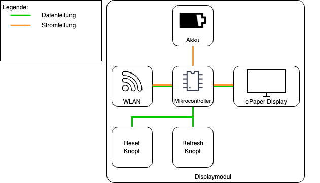
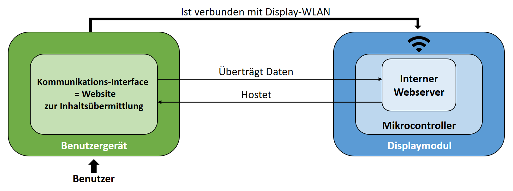
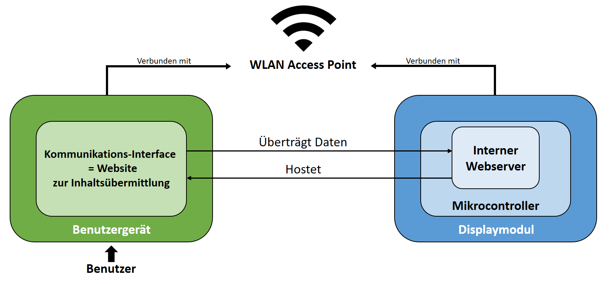
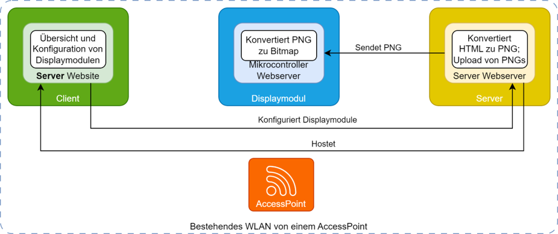

# Systemkonzept
**Julia Reuter**

## Grundaufbau der Hardware

Figure: Abbildung 5.1 Visualisierung des Grundkonzepts des Systems  { #_abb_5_1 }

{ width=100% }

Wie in [Abbildung 5.1](#_abb_5_1) veranschaulicht, besteht das Low-Power Display Modul aus:

- Einem Akku, der die Stromversorgung des gesamten Systems gewährleistet
- Einem Mikrocontroller, der die zentrale Steuereinheit bildet und die anzuzeigenden Informationen über WLAN empfängt, entsprechend aufbereitet und weitergibt
- Einem E-Paper Display, das über eine geeignete Schnittstelle die Daten von dem Mikrocontroller erhält und im Anschluss direkt anzeigen kann

Angebracht sind zudem zwei Knöpfe, die Benutzerinteraktionen ermöglichen. Zum Beispiel kann das System nach einem Fehler neu gestartet, oder sogar wieder auf Werkseinstellungen zurückgesetzt werden. Auch das angezeigte Bild kann einfach per Knopfdruck geändert werden. 

Verbaut werden die einzelnen Komponenten in einem kompakten 3D-gedruckten Gehäuse, welches sich einfach und ohne externe Kabel montieren lässt.

## Allgemeine Software-Funktionen

Die gesamte Ansteuerung des Systems erfolgt über einen Mikrocontroller der sich um das Empfangen und Senden von Daten, die Displayansteuerung und das Powermanagement kümmert. 
Durch ihn wird es dem Benutzer ermöglicht, über eine einfache und intuitive Schnittstelle, das Display mit Inhalten zu versorgen. So können ohne viel Aufwand Bilddateien auf einer Benutzerwebsite hochgeladen und mit nur mit einem Klick über eine WLAN-Verbindung an das Modul geschickt werden. Auch die Displayverwaltung und diverse Einstellungen werden über diese Art von Interface bequem gesteuert.

Allgemein kann das System in drei verschiedenen Modi betrieben werden: "Standalone-" (vgl. Abb. 5.3.1), "Netzwerk-" (vgl. Abb. 5.3.2) und "Server-Modus" (vgl. Abb. 5.3.3).
Im Standalone-Modus kann das Display am flexibelsten eingesetzt werden, da keinerlei Grundaustattung am Montageort nötig ist. Der im System integrierte Mikrocontroller öffnet einen WLAN Access-Point, sodass sich ein Client-Gerät, wie beispielsweise das eigene Handy, mit der Raumanzeige verbindet. Der Benutzer kanndarufhin direkt über sein Gerät den gewünschten Inhalt an das Display übermitteln. Dieser Modus erweitert das Low-Power Raumdisplay zu einer völlig autarken Anzeigetechnologie. 

Im Netzwerkmodus ist das Konzept ähnlich, mit dem Unterschied, dass sich sowohl das Displaymodul als auch das Client-Gerät im gleichen WLAN, wie zum Beispiel dem eigenen Heimnetzwerk, befinden und kommunizieren.

## Die drei Betriebsmodi der Raumanzeige im Vergleich

### Standalone-Modus

Figure: Abbildung 5.3.1: Standalone-Modus { #_abb_5.3.1 }

{ width=90% }

### Netzwerk-Modus

Figure: Abbildung 5.3.2: Netzwerk-Modus { #_abb_5.3.2 }

{ width=90% }

### Server-Modus

Figure: Abbildung 5.3.3: Server-Modus { #_abb_5.3.3 }

{ width=90% }

# Übersicht der erfüllten Anforderungen
Folgende Anforderungen des Kunden wurden erfüllt:
## Funktionale Anforderungen (vgl. Lastenheft Abschnitt 3.1.)
### Zwingend erforderlich
- Displaymodul besteht aus E-Paper Display, Mikrocontroller, Akku und Gehäuse
- Über eine generische Schnittstelle können E-Paper Displays der Marke Waveshare, die über SPI kommunizieren, angesteuert werden
- Die Bildvorlagen können im PNG und im HTML Format über eine Benutzerwebsite an das Display übermittelt werden
- Mikrocontroller führt regelmäßige Selbstprüfungen durch, um Softwareabstürze zu erkennen und setzt sich bei Bedarf automatisch zurück
- 3 Betriebsmodi: Server, Netzwerk und Standalone
- Über Serverwebsite können mehrere Displaymodule zentral gesteuert und in eigenes WLAN eingebunden werden; alle verbundenen Displays und deren aktueller Zustand, Batteriestatus und zugeordneter Informationsgruppen werden angezeigt 
- Über einen eingebauten Reset-Knopf kann das Displaymodul auf Werkseinstellungen zurückgesetzt werden
- Über einen eingebauten Refresh-Knopf kann manuell das angezeigte Bild verändert werden

### Nicht zwingend erfolderlich
- Neben schwarz und weiß besitzt das Displaymodul auch eine Farbunterstützung für rot und gelb
- Es wurde eine generische Schnittstelle zur Unterstützung von Parallel Port Displays entwickelt
- Die Hardware wurde auf einem selbstdesigntem PCB verbaut

## Nicht funktionale Anforderungen (vgl. Lastenheft Abschnitt 3.2.)
- Der Energieverbauch wurde soweit optimiert, dass die geschätze Akkulaufzeit ein Jahr beträgt
- Das Display wurde samt Akku und Platine in einem kompakten und stabilen 3D-Druck Gehäuse verbaut
- Mit vier Schrauben kann die Rückseite des Gehäuses entfernt und somit der Akku leicht getauscht werden
- Über zwei Löcher kann das Modul an der Wand befestigt und zusätzlich über einen eingbauten Fuß auf z.B. einem Tisch aufgestellt werden
- Es wurden 9 gut gepflegte Bibliotheken verwendet (PNGdec, PsychicHttp, ArduinoJson, Arduino, ESP-IDF, Next.js, Prisma ORM, node-html-to-image, html2canvas), um die externe Abhängigkeit so gering wie möglich zu halten 
- Alle verbauten Komponenten sind CE konform

