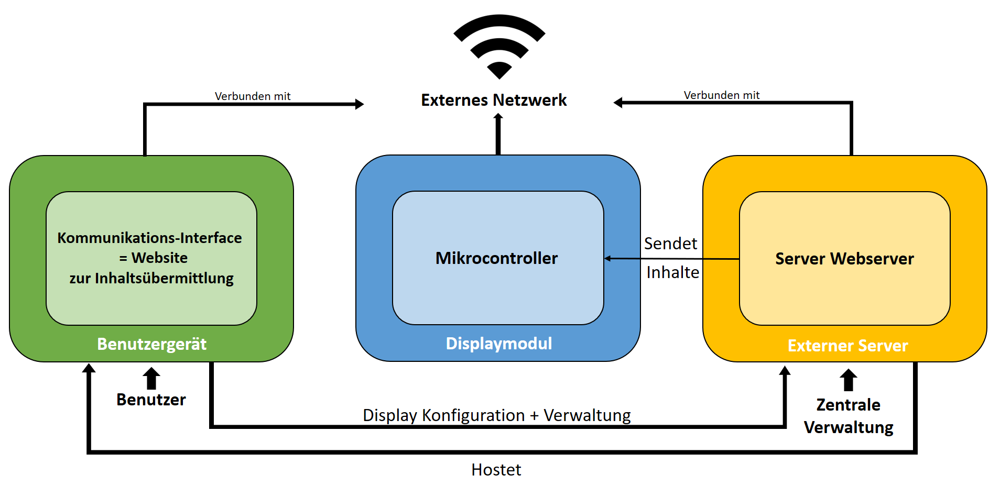

# Systemkonzept
Basierend auf den Rechercheergebnissen aus Kapitel 3 hat das Team folgendes Systemkonzept für die Low-Power Raumanzeige entwickelt.

## 1. Grundaufbau der Hardware

Figure: Visualisierung des Grundkonzepts des Systems { #_fig_konzept }

{ width=100% }

Wie in  veranschaulicht, besteht das Low-Power Display Modul aus:

- Einem Akku, der die Stromversorgung des gesamten Systems gewährleistet
- Einem Mikrocontroller, der die zentrale Steuereinheit bildet und die anzuzeigenden Informationen über WLAN empfängt, entsprechend aufbereitet und weitergibt
- Einem E-Paper Display, das über eine geeignete Schnittstelle die Daten vom Mikrocontroller erhält und im Anschluss direkt anzeigen kann

Angedacht sind zudem zwei Knöpfe, die Benutzerinteraktionen ermöglichen. Zum Beispiel kann das System nach einem Fehler neu gestartet, oder sogar wieder auf Werkseinstellungen zurückgesetzt werden. Auch das angezeigte Bild könnte einfach per Knopfdruck geändert werden. 

Verbaut werden die einzelnen Komponenten in einem kompakten 3D-gedruckten Gehäuse, welches sich einfach und ohne externe Kabel montieren lässt.

## 2. Allgemeine Software-Funktionen

Da die gesamte Ansteuerung des Systems über einen Mikrocontroller erfolgt, muss dieser entsprechend programmiert werden. Er bildet die zentrale Steuereinheit, die sich mit entsprechender Firmware um das Empfangen und Senden von Daten, die Displayansteuerung und das Powermanagement kümmert. 
Durch ihn soll es dem Benutzer ermöglicht werden, über eine einfache und intuitive Schnittstelle, wie beispielsweise eine Website, das Display mit Inhalten zu versorgen. So können ohne viel Aufwand, Bilddateien auf der Website hochladen und mit nur einem Klick über eine WLAN-Verbindung an das Modul geschickt werden. Auch die Displayverwaltung und diverse Einstellungen werden über diese Art von Interface bequem gesteuert.

## 3. Potentielle Einsatzgebiete der Low-Power Raumanzeige

In der Projektdefinition ist die Hochschule als konkreter Kunde genannt, weshalb der Fokus vor allem auf diesen spezifischen Anwendungsfall gerichtet ist. Hier besteht die Hauptidee darin, die Raumverfügbarkeit in Echtzeit anzuzeigen und über das Stattfinden von Veranstaltungen, Vorlesungen und Seminaren zu informieren. 

Dies bedeutet, dass Studenten schnell und unkompliziert herausfinden können, welche Räume gerade frei sind, um ungestört zu lernen oder Gruppenarbeiten durchzuführen. Dozenten können sicherstellen, dass ihre geplanten Veranstaltungen in den vorgesehenen Räumen stattfinden und bei Bedarf kurzfristige Änderungen kommunizieren. Auch das Verwaltungspersonal profitiert von einer effizienten Raumverwaltung, die durch das Anzeigen zusätzlicher Informationen, wie beispielsweise das Melden defekter Beamer, die Wartung der Räumlichkeiten verbessert.

Um ein solches Netz an Displays an der Hochschule reibungslos betreiben zu können, ist, noch Vorbild der Konkurrenz (vgl. Kapitel 3), die zentrale Verwaltung über eine Serverkomponente sinnvoll. Es bietet sich hierbei an, je nach Standort bzw. Raum IDs zu vergeben, sodass auch spontane Raumbuchungen korrekt zugeordnet werden können. Über eine Schnittstelle zu gängigen Kalendersystemen wie ICS oder WebUntis wird nicht nur über die Raumverfügbarkeit informiert, sondern auch der gesamte Tagesstundenplan der jeweiligen Hörsäle ist sofort ersichtlich.

Das Einsatzgebiet der Low-Power Raumanzeige ist jedoch nicht nur auf den Hochschulbereich beschränkt. Vor allem für den mobilen Einsatz oder für Privatpersonen ist das Einrichten und Verwalten eines Servers unpraktisch und zeitaufwändig. Deshalb ist das System so flexibel und generisch gehalten, dass es die Bedürfnisse unterschiedlicher Benutzergruppen erfüllt. 

So kann es auch von kleineren Firmen zur effizienten Verwaltung von einzelnen Besprechungsräumen oder Shared-Desk-Systemen eingesetzt werden. Auch auf Messeständen oder in Tagungsräumen ist eine universelle Low-Power Anzeige denkbar. In diesen Anwendungsfällen ist häufig keine geeignete Infrastruktur vorhanden, um ein komplexes System zu integrieren.
Deshalb ist es möglich, das Display nicht nur in einem "Server-Modus" zu betreiben, sondern auch in den zwei weiteren Betriebsmodis "Standalone" und "Netzwerk".

Im Standalone-Modus kann das Display am flexibelsten eingesetzt werden, da keinerlei Infrastruktur am Montageort nötig ist. Der im System integrierte Mikrocontroller öffnet einen WLAN Access-Point, sodass sich ein Client-Gerät, wie beispielsweise das eigene Handy, mit der Raumanzeige verbindet und der Benutzer direkt über sein Gerät den gewünschten Inhalt an das Display übermittelt. Dieser Modus erweitert das Low Power Raumdisplay zu einer völlig autarken Anzeige. 

Im Netzwerkmodus ist das Konzept ähnlich, mit dem Unterschied, dass sich sowohl das Displaymodul als auch das Client-Gerät im gleichen WLAN, wie zum Beispiel dem eigenen Heimnetzwerk, befinden und kommunizieren.

## 4. Die 3 Betriebsmodi der Raumanzeige im Vergleich

### **Standalone**

{ width=90% }

| Modus       | Vorteile                                                                                          | Nachteile                                                                                          |
|-------------|---------------------------------------------------------------------------------------------------|----------------------------------------------------------------------------------------------------|
| Standalone  | - Keine zusätzliche Infrastruktur erforderlich                                                    | - Eingeschränkte Funktionalität im Vergleich zu anderen Modi                                       |
|             | - Einfache Einrichtung und Nutzung                                                                | - Begrenzte Reichweite, Benutzer muss vor Ort sein                                                                |
|             | - Hohe Flexibilität, da es an jedem Ort eingesetzt werden kann                                     | - Keine zentrale Verwaltung oder automatisierte Darstellung möglich                           |
|             | - Ideal für mobile Einsätze und Privatpersonen                                                    |                                                                                                    |

### **Netzwerk**

{ width=90% }

| Modus       | Vorteile                                                                                          | Nachteile                                                                                          |
|-------------|---------------------------------------------------------------------------------------------------|----------------------------------------------------------------------------------------------------|
| Netzwerk    | - Nutzung bestehender WLAN-Infrastruktur                                                          | - Erfordert ein funktionierendes WLAN-Netzwerk                                                     |
|             | - Mehrere Geräten innerhalb des gleichen Netzwerks können mit dem Display kommunizieren                      | - Abhängigkeit von bestehendem Netzwerk                                                            |
|             | - Benutzer muss nicht vor Ort sein                                         | - IP-Adresse des Moduls muss bekannt sein, um sich zu verbinden                            |

### **Server**

{ width=90% }

| Modus       | Vorteile                                                                                          | Nachteile                                                                                          |
|-------------|---------------------------------------------------------------------------------------------------|----------------------------------------------------------------------------------------------------|
| Server      | - Zentrale Verwaltung und Steuerung vieler Geräte                                                 | - Etwas höherer Einrichtungs- und Wartungsaufwand                                                          |
|             | - Möglichkeit zur Integration mit Kalender- und Verwaltungssystemen                               | - Erfordert Server-Hardware und weitere IT-Ressourcen                                           |
|             | - Geeignet für große Organisationen und Institutionen                                             | - Abhängigkeit von der Serververfügbarkeit und Netzwerkinfrastruktur                                |
|             | - Ermöglicht komplexe Funktionen wie automatische Updates, Synchronisation und umfangreiche Datenanalyse | 