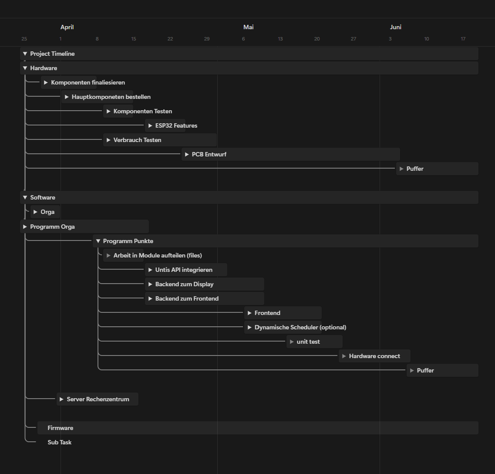

# Teamorganisation

## Kommunikation und Organisation 
  
  **Stasa Lukic**
  
  
  
### Einleitung
Für das Projekt wurden verschiedenste Programme genutzt um eine gute Kommunikation und Organisation innerhalb der Teammitglieder zu halten. Für eine effektive und effieziente Kommunikation und Organisation wurden für jeden bereich ein Programm verwendet die folgend angesprochen werden.  

### Notion

Für Notizen, Protokolle, Timelines und Dokumentierungen benutzen wir Notion. Dieses Programm erlaubt es uns schnell und einfach verschiedenste sachen aufzuschreiben, egal ob es sich um eine Tabelle, Aufgaben, Timeline oder anderes handelt.  
Der Vorteil von Notion ist das Man ein Workspace erschafft das man sich wie ein großes Dokument vorstellen kann, aber mehrere Leute können gleichzeitig auf dieses Dokument zugreifen. Dies nutzen wir um eine Timeline mit wichtigen Terminen oder ein gantt chart für das Projekt aufzubauen, wo wir sehen können, wie wir im Zeitplan stehen, sind wir einem arbeitspunkt der Zeit voraus oder zuspät. Updates können wir uns aufschreiben um uns gegenseitig den stand der dinge zukommuniezieren ohne auf eine Antwort warten zu müssen. 

### Nextcloud

Nextcloud ist die Hochschule eigene kostenlose Cloud, Diese nutzten wir um Wichtige Dokumete zu sichern und für später einfach zugänglich zumachen.

### Zoom, Discord und Whatsapp

Zoom, Discord und Whatsapp waren unsere Programme für eine direkte kommunikation.  
Über Whatsapp kann man schnell ein Projektmitglied etwas fragen, Termine vereinbaren oder anderes.  
Zoom und Discord wurden für wöchentlichen Meetings genutzt aber auch für längere arbeitssessions. Der Vorteil hierbei liegt das man von verschiedensten Orten eine Direkte Kommunikation aufbauen kann und so gleichzeitig miteinander weiter Arbeiten kann.

### Github

Um unseren Programmcode miteinander zuteilen, nutzen wir Github. Github lässt mehrere Personen an einem Programmcode schreiben mithilfe von sehr einfachen und Schlauen verfahren.  Gedownloadede Projekte von Github können direkt bearbeitet werden. Branches lassen mehrere Personen an einem Projekt arbeiten. Wir nutzen einen Dev Branch von Main wo wir persönliche feature Branches gemerged haben, sobald sie geschrieben und getestet wurden. Sobald das jedes feature fertig ist und alles auf dem Dev branch gemerged ist, kann das man den Dev Branch auf Main mergen und hat somit einen fertigen Code.  

Commits sind codeupdates die man auf die Github "Cloud" hochlädt. Sie erlauben die möglichkeit ältere Commits anzusehen und mit dem neu geschrieben Code zu vergleichen, dies hat den Vorteil das wenn ein Fehler im Code nicht gefunden werden kann man auch den Stand des älteren commits wieder zuverwenden.  
  
Issues erleichtert die Organisation von Fehler im Code. Github besitzt ein System das es flexibel erlaubt sogenannte Issues zu eröffnen. Diese Issues werden dann genutzt um Arbeitspackete zu verfolgen, Probleme anzusprechen oder Feedback zu erhalten.

### MkDocs

Für unsere technische Abgabe nurtzen wir MkDocs in Verbindung mit Github. MkDocs ist ein benutzterfreundliches Programm das mithilfe von Markdown gut Strukturierte Dokumentationen erstellt. Die MkDocs Dokumentation kann einfach konfiguriert werden indem man in der konfigurations datei mkdocs.yml gewollte einstellungen reinschreibt. In dieser Datei können auch plugins hinzugefügt werden, einer Dieser plugins ist "with-pdf", die es uns erlaubt aus der Dokumentation eine PDF zu expoterien.

## Rollenaufteilung 
  
  **Stasa Lukic**
  

  
Unsere Teammitglieder wurden jeweils in Teams Aufgeteilt, in disen Teams haben sie die zugehörgien Aufgaben dann bearbeitet. Wir haben von Unseren 7 Mitgliedern (später 6) 2 Personen ins Software Team eingetragen, 2 Personen ins Hardware Team und 3 Personen ins Firmware Team. Jedes Team hat auch einen Teamleader ausgewählt, diese Person kann in Meeting Updates geben und fürs Team sprechen. Die sorgt für eine sehr effieziente und Organisierte kommunikation zwischen den Teams.  
  
Teamleader können diese Rolle auch nutzen um klare ziele zu setzten. Rollenaufteilung innerhalb der Teams macht auch dann sinn um Stärken einzelnder Teammitglieder, in einem Themenbereich zu nutzen. So erhält man nicht nur bessere resultate, die Person selsbst kann ihr Stärken nocheinmal feinschleifen.  
Arbeitspackete können fair auf ein Team verteilt werden um eine unfaire Arbeits aufteilung  zu verhindern.

## Zeitplan
  
  **Stasa Lukic**
  

Zeitpläne können über verschiedene Arten erstellt werden, es gibt die Gantt-Diagramme, Pfad-diagramme, Meilenstein Ziele und weiteres.  
Wir haben uns für die Für die Gantt-Diagramme entschieden. Gantt-Diagramme erstellen Balken auf einer Timeline mit einem Start und Enddatum. Diese Balkan können Aufgaben zugewiesen bekommen oder sub Aufgaben / Balken.  
Zur Organisationen müssen die Balken klar gekennzeichnet werden und einem Plan folgen, sie müssen aufeinander aufbauen.
Dies können wir in der Abbildung 5.3.1 sehen.

Figure: Abbildung 5.3.1: Timeline Beispiel Projekt 

{ width=100% }

Diese Timeline kennzeichnet klare ziele und visualisiert den Plan von Projekt anfang zu ende. Natürlich ist es schwer genau zusagen wie lange eine Aufgabe daurn wird zu erledigen, Probleme können auch nicht vorraus gesagt werden, dadurch bauen wir am ende einen Zeitpuffer ein. Dauert eine Aufgabe länger als Angegeben können wir diese Zeit vom Puffer "klauen". Durch die visualisierung und Struktur können Projektmitglieder ihre Zeit besser einplanen und haben eigenverantwortung diese deadlines zu erreichen, dadurch haben wir einen durchgehenden fortschritt am Projekt.

