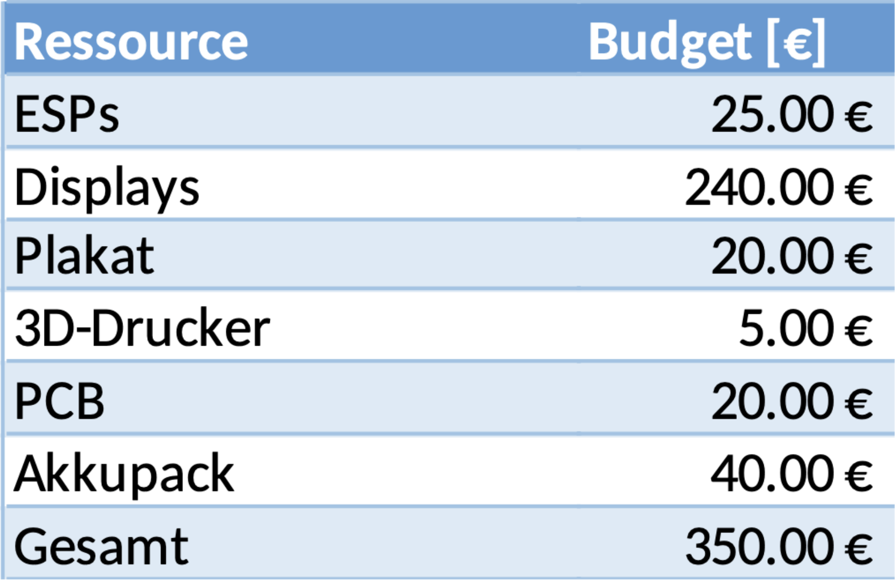
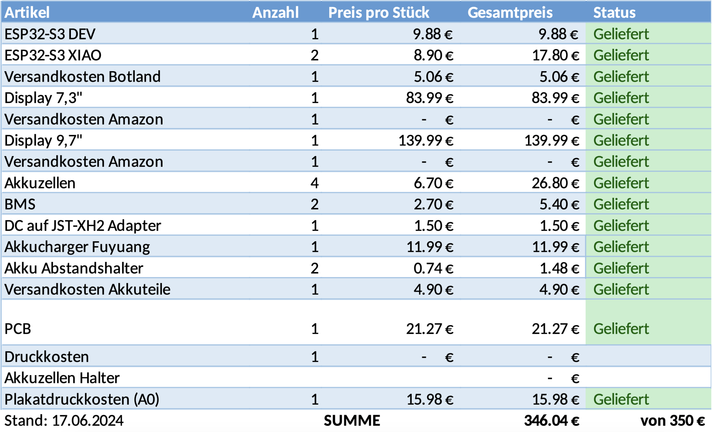
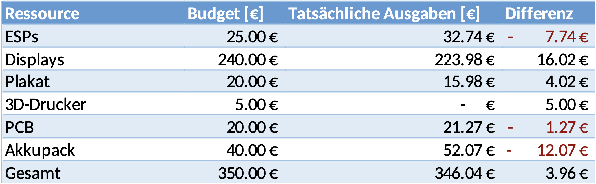

# Teamorganisation

## Kommunikation  
**Benjamin Klaric**

### Einleitung  

Die Zwischenkommunikation unter Teammitgliedern in dem Projekt ist sehr wichtig und wird auch so bei diesem Projekt gestaltet. Dafür werden viele Programme benutzt, um die Kommunikation zwischen den Teammitgliedern und die Kommunikation mit den Kunden effektiv und effizient zu halten. Die verwendeten Programme werden in folgenden Unterkapiteln erwähnt und ausführlicher erklärt.  

### Notion  

Für Notizen, das Erstellen von Protokollen und die Erstellung einer Zeitleiste wurde Notion verwendet. Dieses Programm wurde aufgrund seiner Flexibilität und Zugänglichkeit ausgewählt. Dank dieser großen Flexibilität erlaubt Notion das Einbinden verschiedener Plugins, wie Gantt-Diagramme und viele andere. Zudem wird in Notion der Text mit einer Kombination von Schreibformaten formatiert. Man kann in Notion mit Markdown-Syntax schreiben oder die verschiedenen Befehle von Notion verwenden. Dies bietet viele Möglichkeiten, schnell unterschiedliche Elemente zu erstellen, wie Tabellen, Code-Blöcke usw.  
Die Tatsache, dass dieses Programm sowohl unter verschiedenen Betriebssystemen läuft, als auch über einen Browser erreichbar ist, macht es besonders attraktiv.  
Der Vorteil von Notion besteht darin, dass man einen Arbeitsbereich erschaffen kann, auf den mehrere Personen gleichzeitig zugreifen und dort arbeiten können, ohne dass es zu irgendwelchen Merge-Konflikten kommt. Notion wird hauptsächlich verwendet, um schnell Notizen zu erstellen, beispielsweise um Messversuche zu beschreiben oder Protokolle zu führen. Außerdem wurde eine Zeitleiste erstellt, um die Aufgaben über die Zeit zu verteilen.  

### Nextcloud

Nextcloud ist die Hochschule eigene kostenlose Cloud; diese wurde genutzt, um wichtige Dokumente zu sichern und für später einfach zugänglich zu machen. Dort wurde auch gleichzeitig auf Dokumenten gearbeitet, da man auch Dokumente, wie Spreadsheets, erstellen kann.  

### Zoom, Discord und Whatsapp

Zoom, Discord und WhatsApp sind die Programme, die man für direkte Kommunikation genutzt hat.  
Über WhatsApp wurden schnell Nachrichten zwischen Teammitgliedern ausgetauscht, wie Fragen, Termine vereinbaren oder Ähnliches.  
Zoom und Discord wurden für wöchentliche Meetings genutzt, aber auch für längere Arbeitssessions. Zoom war grundsätzlich für wöchentliche Meetings mit der Kunde benutzt und Discord für online oder hybride Arbeit zwischen Teammitgliedern, aber auch für Teammeetings.  

### Github  

Um den Programmcode in der Cloud zu speichern und zugänglich zu machen, wurde GitHub verwendet. Auf GitHub kann man ein Repository erstellen, in dem verschiedene Branches angelegt werden können, sodass mehrere Teammitglieder am gleichen Code arbeiten können, ohne sich gegenseitig mit Merge-Konflikten und Ähnlichem zu stören.  
Mithilfe von Commits ist es möglich, eine Versionskontrolle des Programmcodes zu haben, wobei die älteren Commits aller Branches auf dem Server erreichbar sind. Diese können einfach mit dem aktuellen Stand des Branches verglichen werden, um mögliche Fehler, die in der Weiterarbeit auftreten, zu identifizieren.  
Die Issues erleichtern die Organisation von Fehlern, indem sie Probleme mit dem Code markieren und für alle sichtbar machen.  

### MkDocs  

Um die technische Dokumentation zu erstellen, wurden MkDocs in Verbindung mit GitHub und Docker verwendet. Der Grund dafür ist, dass man Versionskontrolle hat und nicht alle Plugins auf dem eigenen Rechner installieren muss, da alles innerhalb eines Docker-Containers läuft. Die Dokumentation wird mithilfe von Markdown strukturiert, und es wird eine Webseite erstellt, auf der die Dokumentation zugänglich ist.  
Ein Vorteil von MkDocs ist, dass man das Programm mithilfe der Datei mkdocs.yml sehr einfach anpassen und gewünschte Erweiterungen schnell hinzufügen kann. Damit lässt sich die Formatierung der Dokumentation personalisieren. Zum Beispiel erlaubt das Plugin *with-pdf*, die Dokumentation von der Webseite als PDF zu exportieren.  

## Organisation  

## Rollenaufteilung  

Unsere Teammitglieder wurden jeweils in Teams aufgeteilt, in diesen Teams haben sie die zugehörigen Aufgaben dann bearbeitet. Wir haben von unseren 7 Mitgliedern (später 6) 2 Personen ins Softwareteam eingetragen, 2 Personen ins Hardwareteam und 3 Personen ins Firmwareteam. Jedes Team hat auch einen Teamleader ausgewählt, diese Person kann in Meeting Updates geben und fürs Team sprechen. Die sorgt für eine sehr effiziente und organisierte Kommunikation zwischen den Teams.  
  
Teamleader können diese Rolle auch nutzen, um klare Ziele zu setzen. Rollenaufteilung innerhalb der Teams macht auch dann Sinn, um Stärken einzelner Teammitglieder, in einem Themenbereich zu nutzen. So erhält man nicht nur bessere Resultate, die Person selbst kann ihre Stärken noch einmal feinschleifen.  
Arbeitspackete können fair auf ein Team verteilt werden, um eine unfaire Arbeitsaufteilung zu verhindern.

## Zeitplan

Zeitpläne können über verschiedene Arten erstellt werden, es gibt die Gantt-Diagramme, Pfad-Diagramme, Meilensteinziele und weiteres.  
Wir haben uns für die Gantt-Diagramme entschieden. Gantt-Diagramme erstellen Balken auf einer Timeline mit einem Start- und Enddatum. Diese Balkan können Aufgaben zugewiesen bekommen oder sub Aufgaben / Balken.  
Zur Organisationen müssen die Balken klar gekennzeichnet werden und einem Plan folgen, sie müssen aufeinander aufbauen.
Dies können wir in der [Abbildung 4.1](#_abb_4_1) sehen.

Figure: Abbildung 4.1: Timeline Beispiel Projekt { #_abb_4_1 }

{ width=100% }

Diese Timeline kennzeichnet klare Ziele und visualisiert den Plan von Projektanfang zu Ende. Natürlich ist es schwer genau zusagen, wie lange eine Aufgabe dauern wird zu erledigen, Probleme können auch nicht vorausgesagt werden, dadurch bauen wir am Ende einen Zeitpuffer ein. Dauert eine Aufgabe länger als angegeben, können wir diese Zeit vom Puffer "klauen". Durch die Visualisierung und Struktur können Projektmitglieder ihre Zeit besser einplanen und haben Eigenverantwortung, diese Deadlines zu erreichen, dadurch haben wir einen durchgehenden Fortschritt am Projekt.

## Budgetplan  
**Benjamin Klaric**  

Das Budget wurde anfangs des Projekts fest vorgegeben, wobei pro Teammitglied 50€ vergeben werden. Mit sieben Mitgliedern wurde für das Projekt 350€ vorgerechnet. Das Budget muss dann sinnvoll zwischen Bereichen verteilt sein.  
Da bei dem Projekt einzige Kosten in dem Hardwarebereich vorkommen, da für das Projekt nur Open-Source-Software verwendet wird, wurde nur für diesen Bereich die Budgetverteilung geplant. Am Anfang des Projekts wurden ungefähr die Kosten geschätzt und die Entwicklung von Kosten, also ob man für bestimmte Ressourcen genau den geplanten Budgetteil verwendet hat oder mehr, bzw. weniger, wurde gefolgt.  
Die Budgetplanung am Anfang des Projekts ist auf [Abbildung 4.2](#_abb_4_2) zu sehen.  

Figure: Abbildung 4.2: Geschätzte Budgetverteilung am Anfang des Projekts { #_abb_4_2 }

{ width=80% }

Dort ist zu sehen, dass für manche, bzw. fast alle Ausgaben schon eine Ressource oder Grund von diesen Kosten angegeben steht. Natürlich sind das nur die geschätzten Kosten, allerdings sollte man die geschätzten Kosten im Blick haben.  
Im Laufe des Projekts wurden jedoch manche Kosten überschritten und manche unterschritten. Dazu werden alle Kosten in eine andere Tabelle eingetragen, wo jedes Teammitglied einen Überblick hatte, sodass die Situation mit Überschreitung des Budgets nicht passieren würde. Die Tabelle ist auf [Abbildung 4.3](#_abb_4_3) dargestellt.  

Figure: Abbildung 4.3: Tabelle zum Eintragen der Kosten { #_abb_4_3 }

{ width=80% }

In der Tabelle wurde auch der Status der Ressourcen verfolgt mit einem Status, wobei momentan alle auf *geliefert* stehen, wurden aber als *nicht bestellt*, *bestellt* und *geliefert* gekennzeichnet.  

Am Ende des Projekts hat man natürlich einen klaren Überblick von allen Kosten und kann davon einen Vergleich ausziehen. In Bezug auf [Abbildung 4.2](#_abb_4_2) wurden die tatsächlichen Kosten mit den geschätzten verglichen und dabei die Differenz dargestellt. Das ist auf [Abbildung 4.4](#_abb_4_4) zu sehen.  

igure: Abbildung 4.4: Ganze Budgetverteilung am Ende des Projekts { #_abb_4_4 }

{ width=80% }

Man kann deutlich erkennen, dass für einige Ressourcen weniger Budget bereitgestellt wurde, während für andere mehr. Dadurch ist man letztlich knapp unter dem Gesamtbudget geblieben, und die Budgetplanung hat sich als eine gute Entscheidung festgestellt.  

## Ressourcenplanung  

Aufgrund der folgenden zeitlichen Aufteilung der Arbeitspakete (vgl. Abb. 4.6.1), sah die Belastung der einzelnen Teammitglieder während des Projektes wie folgt aus (vgl. Abb. 4.6.2).

Figure: Abbildung 4.6.1: Zeitliche Aufteilung der Arbeitspakete { #_abb_4.6.1 }

{ width=80% }

Figure: Abbildung 4.6.2: Belastungsdiagramm der einzelnen Teammitglieder { #_abb_4.6.2 }

{ width=90% }

## Software  
**Mario Wegmann**

Neben den zuvor genannten organisatorischen Techniken nutzen wir für das Projekt auch verschiedene spezielle Programme, welche uns in dem Umgang als Team unterstützen. 

### Echtzeit-Kommunikation

Zum direkten Austausch in der Gruppe oder mit einzelnen Gruppenmitgliedern nutzen wir WhatsApp, Discord und Zoom. In dem Messenger WhatsApp ist es möglich, schnell mit Personen oder der gesamten Gruppe zu kommunizieren und somit Rückfragen oder Absprachen auf kurzen Wegen zu klären. Dank der Unterteilung in Channels und Threads können in dem Gruppenchat-Tool Discord größere und längere Diskussionen über einzelne Themen abgehalten werden. Auch können über Discord Videoanrufe abgehalten werden, wodurch Arbeiten im Team komplett remote oder hybrid einfach möglich sind. Zuletzt wird für Online-Absprachen mit dem Kunden Zoom verwendet, da der Kunde dieses Tool bereits verwendet und es somit als Vorgabe angegeben hat. 

### Notizen

Um schnelle Notizen zu erstellen und diese auch gemeinsam parallel zu verfassen, wird das Tool Notion verwendet. In Notion kann ein Workspace eingerichtet und Mitglieder dort eingeladen werden. In diesem Workspace können schnell neue Seiten erstellt werden, welche alle Mitglieder live gemeinsam bearbeiten können. Auch können in einer Seite einfach Links und Anhänge hinzugefügt und Personen im Text erwähnt werden. Durch diese flexible und schnelle Arbeitsweise eignet sich Notion, um Zwischenergebnisse, Erkenntnisse und Protokolle festzuhalten.  

### Codeverwaltung

Der Sourcecode des Projekts wird mit der Versionsverwaltung Git verwaltet. Git bietet Unterstützung, um als Team an einer Codebase zu arbeiten. So werden Zwischenstände von Code, sogenannte Commits, konsequent getrackt und es kann nachträglich zu älteren Ständen zurückgewechselt werden. Auch kann der Code in Branches aufgeteilt werden, wodurch neue experimentelle Funktionen erstellt und getestet werden können und anschließend ins System gemerged oder verworfen werden können, ohne dass das restliche Team auf einen funktionierenden Stand des Codes verzichten muss. Im Rahmen dieser Projektarbeit wurde sich hierbei an die Richtlinien von Git Flow gehalten, welche eine Branch-Strategie vorgeben. Als Ort für die Git-Repositorys wurde GitHub ausgewählt. Zwar bietet die Technische Hochschule Augsburg auch eigene GitLab Instanzen, jedoch können nur Mitarbeiter und Studierende der THA darauf zugreifen. Da ein Kriterium des Projektes auch die Veröffentlichung des Sourcecodes ist, wurde daher der frei zugängliche Anbieter GitHub gewählt.   

### Dateiverwaltung

Größere Dateien, wie Präsentationen, Videos und Bilder, werden in der Nextcloud abgespeichert. Die Technische Hochschule Augsburg bietet bereits eine Nextcloud Instanz für alle Mitarbeiter und Studierende an, somit bietet sich die Cloudspeicher-Lösung als ideales Werkzeug zum gemeinsamen Arbeiten an großen Dateien an. 

### Dokumentation

Um die Technische Dokumentation zu verfassen, wurde die Software MKDocs mit dem Material Theme ausgewählt. Das Dokumentationstool MKDocs nimmt in Markdown verfasste Dateien entgegen und erstellt daraus automatisch Websites. Zusätzlich können mit dem with-pdf Plugin auch PDFs als Exportformat gewählt werden. Durch die Verwendung der Markdown-Syntax wird der Autor gezwungen, eine genormte Formatierung einzuhalten und es wird sichergestellt, dass beispielsweise Überschriften über das komplette Dokument hinweg einheitlich dargestellt werden. Die Autoren können sich somit mehr mit dem Inhalt auseinandersetzen und müssen sich keine Gedanken über das Layout machen. 