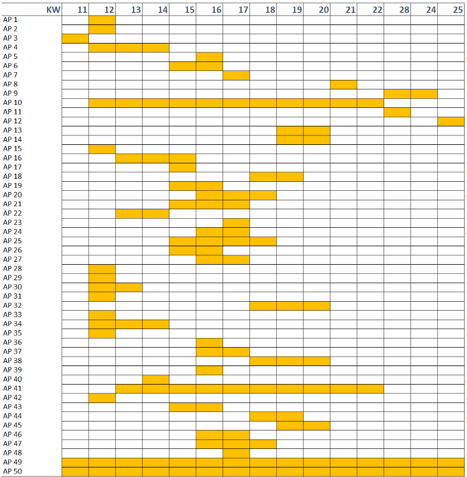
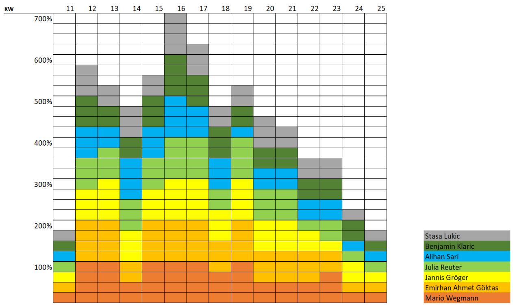

# Teamorganisation

## Kommunikation  

### Einleitung
Für das Projekt wurden verschiedenste Programme genutzt, um eine gute Kommunikation und Organisation innerhalb der Teammitglieder zu halten. Für eine effektive und effiziente Kommunikation und Organisation wurde für jeden Bereich ein Programm verwendet, die folgend angesprochen wird.  

## Organisation  

## Rollenaufteilung  

Unsere Teammitglieder wurden jeweils in Teams aufgeteilt, in diesen Teams haben sie die zugehörigen Aufgaben dann bearbeitet. Wir haben von unseren 7 Mitgliedern (später 6) 2 Personen ins Softwareteam eingetragen, 2 Personen ins Hardwareteam und 3 Personen ins Firmwareteam. Jedes Team hat auch einen Teamleader ausgewählt, diese Person kann in Meeting Updates geben und fürs Team sprechen. Die sorgt für eine sehr effiziente und organisierte Kommunikation zwischen den Teams.  
  
Teamleader können diese Rolle auch nutzen, um klare Ziele zu setzen. Rollenaufteilung innerhalb der Teams macht auch dann Sinn, um Stärken einzelner Teammitglieder, in einem Themenbereich zu nutzen. So erhält man nicht nur bessere Resultate, die Person selbst kann ihre Stärken noch einmal feinschleifen.  
Arbeitspackete können fair auf ein Team verteilt werden, um eine unfaire Arbeitsaufteilung zu verhindern.

## Zeitplan

Zeitpläne können über verschiedene Arten erstellt werden, es gibt die Gantt-Diagramme, Pfad-Diagramme, Meilensteinziele und weiteres.  
Wir haben uns für die Gantt-Diagramme entschieden. Gantt-Diagramme erstellen Balken auf einer Timeline mit einem Start- und Enddatum. Diese Balkan können Aufgaben zugewiesen bekommen oder sub Aufgaben / Balken.  
Zur Organisationen müssen die Balken klar gekennzeichnet werden und einem Plan folgen, sie müssen aufeinander aufbauen.
Dies können wir in der [Abbildung 4.1](#_abb_4_1) sehen.

Figure: Abbildung 4.1: Timeline Beispiel Projekt { #_abb_4_1 }

{ width=100% }

Diese Timeline kennzeichnet klare Ziele und visualisiert den Plan von Projektanfang zu Ende. Natürlich ist es schwer genau zusagen, wie lange eine Aufgabe dauern wird zu erledigen, Probleme können auch nicht vorausgesagt werden, dadurch bauen wir am Ende einen Zeitpuffer ein. Dauert eine Aufgabe länger als angegeben, können wir diese Zeit vom Puffer "klauen". Durch die Visualisierung und Struktur können Projektmitglieder ihre Zeit besser einplanen und haben Eigenverantwortung, diese Deadlines zu erreichen, dadurch haben wir einen durchgehenden Fortschritt am Projekt.

## Budgetplan  

## Ressourcenplanung  

Aufgrund der folgenden zeitlichen Aufteilung der Arbeitspakete (vgl. Abb. 4.6.1), sah die Belastung der einzelnen Teammitglieder während des Projektes wie folgt aus (vgl. Abb. 4.6.2).

Figure: Abbildung 4.6.1: Zeitliche Aufteilung der Arbeitspakete { #_abb_4.6.1 }

{ width=80% }

Figure: Abbildung 4.6.2: Belastungsdiagramm der einzelnen Teammitglieder { #_abb_4.6.2 }

{ width=90% }

## Software  
**Mario Wegmann**

Neben den zuvor genannten organisatorischen Techniken nutzen wir für das Projekt auch verschiedene spezielle Programme, welche uns in dem Umgang als Team unterstützen. 

### Echtzeit-Kommunikation

Zum direkten Austausch in der Gruppe oder mit einzelnen Gruppenmitgliedern nutzen wir WhatsApp, Discord und Zoom. In dem Messenger WhatsApp ist es möglich, schnell mit Personen oder der gesamten Gruppe zu kommunizieren und somit Rückfragen oder Absprachen auf kurzen Wegen zu klären. Dank der Unterteilung in Channels und Threads können in dem Gruppenchat-Tool Discord größere und längere Diskussionen über einzelne Themen abgehalten werden. Auch können über Discord Videoanrufe abgehalten werden, wodurch Arbeiten im Team komplett remote oder hybrid einfach möglich sind. Zuletzt wird für Online-Absprachen mit dem Kunden Zoom verwendet, da der Kunde dieses Tool bereits verwendet und es somit als Vorgabe angegeben hat. 

### Notizen

Um schnelle Notizen zu erstellen und diese auch gemeinsam parallel zu verfassen, wird das Tool Notion verwendet. In Notion kann ein Workspace eingerichtet und Mitglieder dort eingeladen werden. In diesem Workspace können schnell neue Seiten erstellt werden, welche alle Mitglieder live gemeinsam bearbeiten können. Auch können in einer Seite einfach Links und Anhänge hinzugefügt und Personen im Text erwähnt werden. Durch diese flexible und schnelle Arbeitsweise eignet sich Notion, um Zwischenergebnisse, Erkenntnisse und Protokolle festzuhalten.  

### Codeverwaltung

Der Sourcecode des Projekts wird mit der Versionsverwaltung Git verwaltet. Git bietet Unterstützung, um als Team an einer Codebase zu arbeiten. So werden Zwischenstände von Code, sogenannte Commits, konsequent getrackt und es kann nachträglich zu älteren Ständen zurückgewechselt werden. Auch kann der Code in Branches aufgeteilt werden, wodurch neue experimentelle Funktionen erstellt und getestet werden können und anschließend ins System gemerged oder verworfen werden können, ohne dass das restliche Team auf einen funktionierenden Stand des Codes verzichten muss. Im Rahmen dieser Projektarbeit wurde sich hierbei an die Richtlinien von Git Flow gehalten, welche eine Branch-Strategie vorgeben. Als Ort für die Git-Repositorys wurde GitHub ausgewählt. Zwar bietet die Technische Hochschule Augsburg auch eigene GitLab Instanzen, jedoch können nur Mitarbeiter und Studierende der THA darauf zugreifen. Da ein Kriterium des Projektes auch die Veröffentlichung des Sourcecodes ist, wurde daher der frei zugängliche Anbieter GitHub gewählt.   

### Dateiverwaltung

Größere Dateien, wie Präsentationen, Videos und Bilder, werden in der Nextcloud abgespeichert. Die Technische Hochschule Augsburg bietet bereits eine Nextcloud Instanz für alle Mitarbeiter und Studierende an, somit bietet sich die Cloudspeicher-Lösung als ideales Werkzeug zum gemeinsamen Arbeiten an großen Dateien an. 

### Dokumentation

Um die Technische Dokumentation zu verfassen, wurde die Software MKDocs mit dem Material Theme ausgewählt. Das Dokumentationstool MKDocs nimmt in Markdown verfasste Dateien entgegen und erstellt daraus automatisch Websites. Zusätzlich können mit dem with-pdf Plugin auch PDFs als Exportformat gewählt werden. Durch die Verwendung der Markdown-Syntax wird der Autor gezwungen, eine genormte Formatierung einzuhalten und es wird sichergestellt, dass beispielsweise Überschriften über das komplette Dokument hinweg einheitlich dargestellt werden. Die Autoren können sich somit mehr mit dem Inhalt auseinandersetzen und müssen sich keine Gedanken über das Layout machen. 