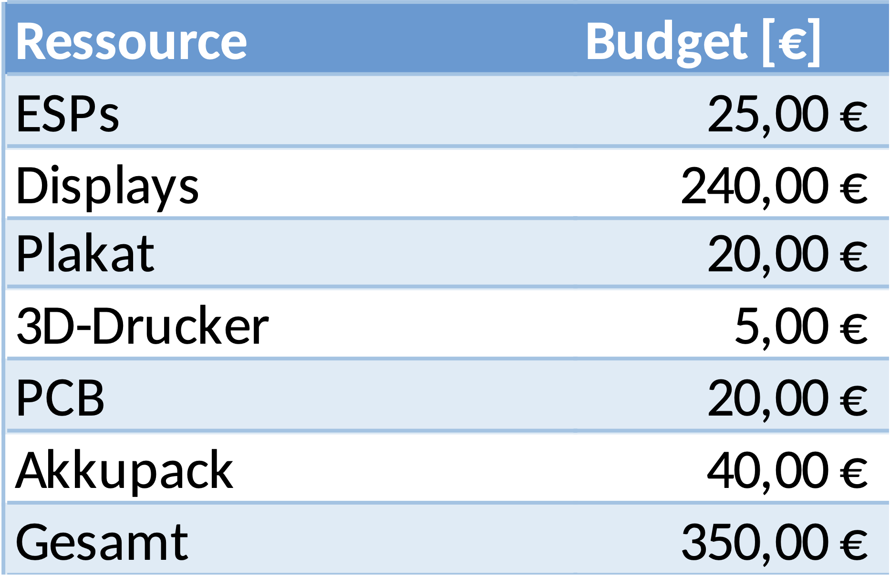
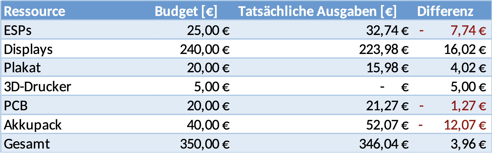

# Teamorganisation

## Kommunikation  
**Benjamin Klaric**  

Die Zwischenkommunikation unter Teammitgliedern in dem Projekt und mit der Kunde ist sehr wichtig und wird auch so bei diesem Projekt gestaltet. Dafür werden viele Methoden und dazu auch Programme benutzt, um die Kommunikation zwischen den Teammitgliedern und die Kommunikation mit der Kunde effektiv und effizient zu halten.  

### Interne Kommunikation  

Die Kommunikation zwischen Teammitgliedern wurde als ein wichtiger Punkt genommen und dementsprechend geschätzt.  
Es wurden wöchentliche Treffen gestaltet, sowohl online als auch vor Ort, aber auch hybrid. Der Zweck der wöchentlichen Treffen liegt darin, dass jedes Teammitglied eine Chance hat, den jetzigen Stand zu erwähnen, was momentan gut läuft und wo die aktuellen Probleme liegen, zu erwähnen und die Gedanken mit anderen Teammitgliedern gegenseitig auszutauschen. Meistens wurden so neue Ideen oder Lösungsvorschläge herausgefunden.  
Genauso bieten die wöchentlichen Treffen eine Möglichkeit, den gesamten Stand des Projekts zu sehen und dazu die problematischen bzw. unproblematischen Bereiche zu entdecken, wo man den anderen Teammitgliedern helfen soll.  

### Externe Kommunikation  

Neben der internen Kommunikation wurde auch die wöchentliche Besprechung mit dem Kunden hochgehalten.  
Diese Meetings sind wichtig, um die neuen Ideen für den Kunden darzustellen oder sich gegenseitig Fragen auszutauschen, um einen besseren Einblick in die Bedürfnisse des Kunden zu erhalten.  
Der Zweck dieser Meetings wurde sich auch in möglichen Änderungen der angefragten Wünsche von der Kundenseite geäußert. Es ist möglich, dass sich die Anfragen des Kunden ändern und es besteht auch die Möglichkeit, durch diese Meetings, die neuen Anfragen oder Anregungen zeitgleich anzunehmen.  

## Organisation  
**Ahmet Emirhan Göktas**

Das Projekt begann mit der Entgegennahme und Analyse des Lastenhefts vom Kunden. Daraus wurde ein detailliertes Pflichtenheft formuliert, welches als zentrale Grundlage für die weitere Projektplanung dient. In Zusammenarbeit mit dem Kunden wurden spezifische Kriterien festgelegt und abgestimmt, um die Anforderungen und Erwartungen präzise zu erfüllen.

Im Anschluss daran wurden umfassende Planungen in den Bereichen Zeit, Kapazität und Budget durchgeführt. Diese Planungen sind entscheidend für eine strukturierte und effiziente Umsetzung des Projekts:

**Zeitplanung:** Sicherstellung der termingerechten Erreichung aller Meilensteine, wobei alle Projektphasen und -schritte zeitlich koordiniert und in einem detaillierten Zeitplan festgehalten wurden.

**Kapazitätsplanung:** Effiziente Nutzung der Ressourcen, um Engpässe zu vermeiden.

**Budgetplanung:** Verwaltung der finanziellen Mittel innerhalb der festgelegten Grenzen.

Die nachfolgenden Kapiteln geben eine detaillierte Darstellung der einzelnen Aspekte unserer Planung und Umsetzung.

## Rollenaufteilung  
**Mario Wegmann**

Innerhalb des Projektteams, welches aus sechs Personen besteht, wurden zusätzlich Unterteams erstellt, welche jeweils einen Schwerpunkt zugewiesen bekommen. Für diese Projektarbeit haben sich die drei Schwerpunkte Hardware, Firmware und Websoftware ergeben. In der [Tabelle 4.1](#_tab_4_1) ist eine passende IMV-Matrix einsehbar. 

Table: Tabelle 4.1: Die IMV-Matrix der Projektarbeit: I: Informierend, M: Mitarbeitend, V: Verantwortlich { #_tab_4_1 }

|Name|Hardware|Firmware|Websoftware|
|-|-|-|-|
|Benjamin Klarić|V|||
|Ahmet Emirhan Göktas||V|M|
|Jannis Gröger||M||
|Julia Reuter||M|M|
|Mario Wegmann|M|M|V|
|Staša Lukić|M|M||

Durch das Aufteilen in Unterteams wird eine effizientere Arbeitsweise ermöglicht. Zum einen können sich Mitglieder bei der Recherche ganz auf die Ihnen zugewiesenen Schwerpunkte konzentrieren. Und zum anderen müssen viele Entscheidungen nicht im kompletten Team abgestimmt werden. Dabei ist es wichtig, dass sich die Teams untereinander regelmäßig austauschen. In diesen wiederkehrenden Meetings werden dann der Stand und die Kenntnisse ausgetauscht, sowie sichergestellt, dass die Schnittstellen und Ziele der Einzelbereiche weiterhin deckungsgleich sind. 

## Arbeitspakete
**Alihan Sari**

Im Rahmen unseres Projekts wurde eine umfassende Planung durchgeführt, die sowohl die Aufteilung der Arbeitspakete, als auch die Erstellung eines detaillierten Zeitplans umfasst.

### Zusammenfassung der Arbeitspakete

Für die strukturierte Planung und Umsetzung des Projekts wurden die Arbeitspakete in zwei Hauptkategorien unterteilt: **Hardware** und **Software**. Jede dieser Hauptkategorien wurde in spezifische Untergruppen unterteilt, die jeweils unterschiedliche Aspekte des Projekts abdecken. Die Struktur und Zielsetzung der Arbeitspakete wurden grob unten aufgelistet. Aufgrund des Umfangs der Arbeitspakete, ist die Liste in der separaten Datei Arbeitspakete.xlsx ausgelagert worden. :

| Hauptkategorie | Unterkategorie | Beschreibung der Aufgaben                                                                 | Beispiele für Aufgaben                                      |
|----------------|----------------|----------------------------------------------------------------------------------------------|----------------------------------------------------------------|
| **Hardware**   | **Mikrocontroller**  | Auswahl des Mikrocontrollers, Ermittlung von Möglichkeiten für externen Speicher            | Auswahl des Mikrocontrollers, Evaluierung von Speichermöglichkeiten |
|                | **Display**         | Auswahl eines E-Paper Displays, Untersuchung der Kommunikationsprotokolle und Stromverbrauch | Auswahl des Displays, Protokollanalyse, Stromverbrauch messen   |
|                | **Akku**            | Festlegung des Akkutyps, Kapazitätsbestimmung, Implementierung eines BMS und Akku-Packs       | Auswahl des Akkus, Kapazitätsberechnung, Entwicklung eines Akku-Packs |
| **Software**   | **Firmware**        | Entwicklung der Firmware zur Kommunikation zwischen Server und Display, Erstellen eines Displaytreibers | Implementierung der Kommunikationsprotokolle, Firmware-Entwicklung |
|                | **Webapp**          | Entwicklung der Webapp, unterteilt in Backend (Datenbankschema) und Frontend (Benutzeroberfläche) | Backend: Datenbankdesign, Frontend: Gestaltung der Benutzeroberfläche |
|                | **Backend**         | Erstellung des Datenbankschemas für die Webapp                                                | Design des Datenbankschemas für die Webanwendung               |
|                | **Frontend**        | Gestaltung der Benutzeroberfläche für Servermodus und andere Modi                           | Erstellung des Interfaces für verschiedene Betriebsmodi         |

**Zielsetzung und Aufbau der Arbeitspakete:**

Die Arbeitspakete wurden unter Berücksichtigung der Projektziele und der erforderlichen Komponenten in **Hardware** und **Software** gegliedert. Die **Hardware**-Komponenten umfassen die Auswahl und Integration der physischen Bestandteile des Systems, während die **Software**-Komponenten die Entwicklung der Anwendungen und Systemsoftware umfassen.

- **Hardware:**
  - **Mikrocontroller:** Auswahl eines geeigneten Mikrocontrollers und Definition der externen Speicheroptionen, um die Hardware-Grundlage zu schaffen.
  - **Display:** Auswahl eines E-Paper Displays sowie Analyse von Kommunikationsprotokollen und Stromverbrauch, um die Anzeigeeinheit zu gestalten.
  - **Akku:** Festlegung des richtigen Akkus, Bestimmung der Kapazität, Implementierung eines Batteriemanagementsystems (BMS) und Zusammenstellung eines Akku-Packs, um die Energieversorgung zu sichern.

- **Software:**
  - **Firmware:** Entwicklung der Firmware zur Sicherstellung der Kommunikation zwischen dem Server und dem Display sowie die Vernetzung der Firmware-Komponenten.
  - **Webapp:** Unterteilung in Backend für Datenbankmanagement und Frontend für die Benutzeroberfläche, um die Benutzerinteraktion und Datenverarbeitung zu ermöglichen.

## Zeitplanung

### Gantt-Diagramm

Das **Gantt-Diagramm** ist das primäres Werkzeug zur zeitlichen Planung und Überwachung des Projektfortschritts. Es stellt die Aufgaben auf einer Zeitachse dar und zeigt die geplanten Start- und Endtermine sowie Meilensteine im Projektverlauf.

**Wichtige Funktionen des Gantt-Diagramms:**

- **Zeitliche Visualisierung:** Das Gantt-Diagramm zeigte die zeitliche Abfolge der Aufgaben, einschließlich der Start- und Endtermine sowie der Dauer jeder Aufgabe.
- **Fortschrittsverfolgung:** Es ermöglichte die Verfolgung des Fortschritts und die Anpassung des Zeitplans bei Abweichungen.
- **Meilensteine:** Wichtige Meilensteine wurden hervorgehoben, um den Projektfortschritt zu messen und sicherzustellen, dass die Ziele termingerecht erreicht werden.

Das Gantt-Diagramm zeigt die Zeitplanung für die einzelnen Arbeitspakete sowie deren Abhängigkeiten und Meilensteine.

### Netzplan

Der **Netzplan** wurde verwendet, um die Abhängigkeiten zwischen den Aufgaben zu visualisieren und den kritischen Pfad zu identifizieren. Er half uns dabei, die logischen Beziehungen zwischen den Aufgaben zu verstehen und die Projektstruktur zu optimieren.

**Wichtige Funktionen des Netzplans:**

- **Abhängigkeitsanalyse:** Der Netzplan visualisierte, welche Aufgaben voneinander abhängen und in welcher Reihenfolge sie durchgeführt werden müssen.
- **Kritischer Pfad:** Durch den Netzplan konnten wir den kritischen Pfad bestimmen, der die Gesamtdauer des Projekts beeinflusst und somit die Aufgaben identifizieren, die für den rechtzeitigen Abschluss des Projekts entscheidend sind.
- **Risikomanagement:** Der Netzplan ermöglichte es uns, potenzielle Risiken und Engpässe frühzeitig zu erkennen und entsprechende Maßnahmen zu planen.

Der Netzplan zeigt die Abfolge und Abhängigkeiten der Aufgaben im Projekt und hilft dabei, den kritischen Pfad zu identifizieren.

Aufgrund der Größe der Pläne, sind das GANTT-Diagramm und der Netzplan in GANNT.pdf und Netzplan.pdf ausgelagert worden.

Die strukturierte Definition der Arbeitspakete und die präzise Planung des Zeitplans waren entscheidend für den Erfolg des Projekts. Durch die Unterteilung in Hardware- und Software-Komponenten konnten wir die verschiedenen Projektbereiche gezielt angehen. Die Verwendung des Gantt-Diagramms ermöglichte eine detaillierte zeitliche Planung und Fortschrittsüberwachung, während der Netzplan dazu diente, die Aufgabenabfolgen zu verstehen und den kritischen Pfad zu identifizieren.

Die detaillierten Arbeitspakete und der vollständige Zeitplan sind in den angehängten PDF-Dokumenten zu finden, die eine vertiefte Einsicht in die Projektplanung und -durchführung bieten.

## Budgetplan  
**Benjamin Klaric**  

Das Budget wurde anfangs des Projekts fest vorgegeben, wobei pro Teammitglied 50€ vergeben werden. Mit sieben Mitgliedern wurde für das Projekt 350€ vorgerechnet. Das Budget muss dann sinnvoll zwischen Bereichen verteilt sein.  
Da bei dem Projekt einzige Kosten in dem Hardwarebereich vorkommen, da für das Projekt nur Open-Source-Software verwendet wird, wurde nur für diesen Bereich die Budgetverteilung geplant. Am Anfang des Projekts wurden ungefähr die Kosten geschätzt und die Entwicklung von Kosten, also ob man für bestimmte Ressourcen genau den geplanten Budgetteil verwendet hat oder mehr, bzw. weniger, wurde gefolgt.  
Die Budgetplanung am Anfang des Projekts ist auf [Abbildung 4.1](#_abb_4_1) zu sehen.  

Figure: Abbildung 4.1: Geschätzte Budgetverteilung am Anfang des Projekts { #_abb_4_1 }

{ width=40% }

Dort ist zu sehen, dass für manche, bzw. fast alle Ausgaben schon eine Ressource oder Grund von diesen Kosten angegeben steht. Natürlich sind das nur die geschätzten Kosten, allerdings sollte man die geschätzten Kosten im Blick haben.  
Im Laufe des Projekts wurden jedoch manche Kosten überschritten und manche unterschritten. Dazu werden alle Kosten in eine andere Tabelle eingetragen, wo jedes Teammitglied einen Überblick hatte, sodass die Situation mit Überschreitung des Budgets nicht passieren würde. Die Tabelle ist auf [Abbildung 4.2](#_abb_4_2) dargestellt.  

Figure: Abbildung 4.2: Tabelle zum Eintragen der Kosten { #_abb_4_2 }

{ width=60% }

In der Tabelle wurde auch der Status der Ressourcen verfolgt mit einem Status, wobei momentan alle auf *geliefert* stehen, wurden aber als *nicht bestellt*, *bestellt* und *geliefert* gekennzeichnet.  

Am Ende des Projekts hat man natürlich einen klaren Überblick von allen Kosten und kann davon einen Vergleich ausziehen. In Bezug auf [Abbildung 4.1](#_abb_4_1) wurden die tatsächlichen Kosten mit den geschätzten verglichen und dabei die Differenz dargestellt. Das ist auf [Abbildung 4.3](#_abb_4_3) zu sehen.  

Figure: Abbildung 4.3: Ganze Budgetverteilung am Ende des Projekts { #_abb_4_3 }

{ width=60% }

Man kann deutlich erkennen, dass für einige Ressourcen weniger Budget bereitgestellt wurde, während für andere mehr. Dadurch ist man letztlich knapp unter dem Gesamtbudget geblieben, und die Budgetplanung hat sich als eine gute Entscheidung festgestellt.  

## Ressourcenplanung  

Aufgrund der folgenden zeitlichen Aufteilung der Arbeitspakete (vgl. Abb. 4.6.1), sah die Belastung der einzelnen Teammitglieder während des Projektes wie folgt aus (vgl. Abb. 4.6.2).

Figure: Abbildung 4.6.1: Zeitliche Aufteilung der Arbeitspakete { #_abb_4.6.1 }

{ width=80% }

Um eine Übersicht der bevorstehenden Belastung des Teams zu erhalten, wurden in Abb. 4.6.1 alle Arbeitspakete pro Kalenderwoche aufgeführt. Sichtbar wird hier unter anderem auch die Dauer der einzelnen Pakete, sodass im Notfall auch ein Kapazitätsmangel durch Schwerpunktsetzung ausgeglichen werden kann. Besonders in Kalenderwoche 12, 16 und 17 war dies der Fall.

Figure: Abbildung 4.6.2: Belastungsdiagramm der einzelnen Teammitglieder { #_abb_4.6.2 }

{ width=90% }

Das Belastungsdiagramm aus Abb. 4.6.2 zeigt die tatsächliche prozentuale Auslastung aller Teammitglieder pro Kalenderwoche. Das Ziel der Projektleitung war hier alle Mitglieder möglichst gleichmäßig auszulasten. Dies ist weitestgehend gelungen, wobei in KW 16 19 Arbeitspakete gleichzeitig bearbeitet werden mussten, sodass hier eine maximale Arbeitslast entstand. 

Allgemein lässt jedoch sich sagen, dass das Team als Ressource effizient genutzt wurde, ohne die vorhanden Kapazitätem zu überschreiten.

## Software  
**Mario Wegmann**

Neben den zuvor genannten organisatorischen Techniken nutzen wir für das Projekt auch verschiedene spezielle Programme, welche uns in dem Umgang als Team unterstützen. 

### Echtzeit-Kommunikation

Zum direkten Austausch in der Gruppe oder mit einzelnen Gruppenmitgliedern nutzen wir WhatsApp, Discord und Zoom. In dem Messenger WhatsApp ist es möglich, schnell mit Personen oder der gesamten Gruppe zu kommunizieren und somit Rückfragen oder Absprachen auf kurzen Wegen zu klären. Dank der Unterteilung in Channels und Threads können in dem Gruppenchat-Tool Discord größere und längere Diskussionen über einzelne Themen abgehalten werden. Auch können über Discord Videoanrufe abgehalten werden, wodurch Arbeiten im Team komplett remote oder hybrid einfach möglich sind. Zuletzt wird für Online-Absprachen mit dem Kunden Zoom verwendet, da der Kunde dieses Tool bereits verwendet und es somit als Vorgabe angegeben hat. 

### Notizen

Um schnelle und flexible Notizen zu erstellen und diese auch gemeinsam parallel zu verfassen, wird das Tool Notion verwendet. In Notion können Arbeitsbereiche eingerichtet und Mitglieder dort eingeladen werden. In diesen Arbeitsbereichen können schnell neue Seiten erstellt werden, welche alle Mitglieder live gemeinsam bearbeiten können. Auch können in einer Seite einfach Links und Anhänge hinzugefügt und Personen im Text erwähnt werden. Durch diese flexible und schnelle Arbeitsweise eignet sich Notion, um Zwischenergebnisse, Erkenntnisse und Protokolle festzuhalten.  

### Codeverwaltung

Der Sourcecode des Projekts wird mit der Versionsverwaltung Git verwaltet. Git bietet Unterstützung, um als Team an einer Codebase zu arbeiten. So werden Zwischenstände von Code, sogenannte Commits, konsequent getrackt und es kann nachträglich zu älteren Ständen zurückgewechselt werden. Auch kann der Code in Branches aufgeteilt werden, wodurch neue experimentelle Funktionen erstellt und getestet werden können und anschließend ins System gemerged oder verworfen werden können, ohne dass das restliche Team auf einen funktionierenden Stand des Codes verzichten muss. Im Rahmen dieser Projektarbeit wurde sich hierbei an die Richtlinien von Git Flow gehalten, welche eine Branch-Strategie vorgeben. Zudem können mit Issues Fehler im Sourcecode erkenntlich gemacht, und deren Behebung koordiniert werden. Als Ort für die Git-Repositorys wurde GitHub ausgewählt. Zwar bietet die Technische Hochschule Augsburg auch eigene GitLab Instanzen, jedoch können nur Mitarbeiter und Studierende der THA darauf zugreifen. Da ein Kriterium des Projektes auch die Veröffentlichung des Sourcecodes ist, wurde daher der frei zugängliche Anbieter GitHub gewählt. 

### Dateiverwaltung

Größere Dateien, wie Präsentationen, Videos und Bilder, werden in der Nextcloud abgespeichert. Die Technische Hochschule Augsburg bietet bereits eine Nextcloud Instanz für alle Mitarbeiter und Studierende an, somit bietet sich die Cloudspeicher-Lösung als ideales Werkzeug zum gemeinsamen Arbeiten an großen Dateien an. 

### Dokumentation

Um die technische Dokumentation zu verfassen, wurde die Software MKDocs mit dem Material Theme ausgewählt. Das Dokumentationstool MKDocs nimmt in Markdown verfasste Dateien entgegen und erstellt daraus automatisch Websites. Zusätzlich können mit dem with-pdf Plugin auch PDFs als Exportformat gewählt werden. Durch die Verwendung der Markdown-Syntax wird der Autor gezwungen, eine genormte Formatierung einzuhalten und es wird sichergestellt, dass beispielsweise Überschriften über das komplette Dokument hinweg einheitlich dargestellt werden. Die Autoren können sich somit mehr mit dem Inhalt auseinandersetzen und müssen sich keine Gedanken über das Layout machen. Zudem wurden die MkDocs Umgebung in Docker Devcontainer realisiert, somit musste die Umgebung nicht händisch auf den Computern der Autoren installiert werden, sondern alle konnten auf der gleichen virtuellen Umgebung arbeiten. 