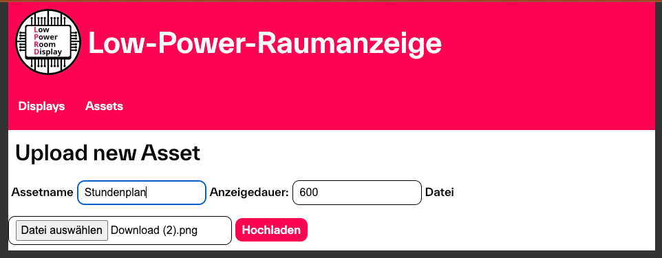

# Webentwicklung
 
## Framework und Library Auswahl
**Julia Reuter**

Die Interaktion zwischen Benutzer und Raumanzeige soll so einfach und unkompliziert wie möglich gehalten werden und dennoch genügend Funktionalitäten unterstützen.
Sie erfolgt deshalb über eine selbsterstellte Webseite, die mithilfe von HTML5, CSS sowie JavaScript designt wurde und über den ESP32-Webserver gehostet wird. 
Als externe Bibliothek verwendet die Benutzerwebseite nur die Javascript Library html2canvas, um äußere Abhängigkeiten so weit wie möglich zu vermeiden.
Mit über 182.000 Downloads und 45 Releases (zuletzt am 22.01.2022) [[JR_19]](Quellenverzeichnis.md#jr_19), wurde sich aufgrund der Popularität und der guten Pflege bewusst für diese Bibliothek entschieden. Der Javascript-Code kann heruntergeladen werden, sodass er lokal auf dem ESP32 gespeichert und eingebunden wird.

### Beschreibung der html2canvas Bibliothek
**Julia Reuter**

Die JavaScript Library html2canvas ermöglicht es, "Screenshots" von Webseiten oder Teilen davon direkt im Browser des Benutzers zu erstellen. Im Gegensatz zu herkömmlichen Screenshots, die das tatsächliche Aussehen der Webseite pixelgenau erfassen, basiert html2canvas auf dem DOM (Document Object Model). 
Das Document Object Model ist eine plattform- und sprachunabhängige Schnittstelle, die HTML- und XML-Dokumente als strukturierte Baumdarstellungen repräsentiert. In einem DOM-Baum ist jedes Element, Attribut und Stück Text in einem Dokument als ein "Node" (Knoten) dargestellt und kann über unter anderem auch über eine vergebene ID einzeln angesprochen werden. Diese Knoten sind durch Beziehungen wie Eltern-Kind und Geschwisterknoten miteinander verbunden, wodurch eine hierarchische Struktur entsteht [[JR_12]](Quellenverzeichnis.md#jr_12).

Auf Grundlage der im DOM verfügbaren Informationen erstellt die Html2Canvas-Bibliothek eine Repräsentation der Webseite.
Hierfür durchläuft  der Scrip die DOM-Struktur und sammelt Informationen über alle vorhandenen Elemente. Diese Informationen nutzt es, um eine visuelle Darstellung der Seite zu generieren. Dabei werden diverse Eigenschaften der HTML-Elemente und CSS-Stile berücksichtigt, um die Struktur und das Erscheinungsbild der Webseite so genau wie möglich nachzubilden [[JR_11]](Quellenverzeichnis.md#jr_11).

Um einen Screenshot eines spezifischen Teils einer Webseite zu erstellen, kann ein bestimmtes div-Element übergeben werden. Der Script durchläuft dann nur den Teil der DOM-Struktur, der mit dieser spezifischen ID verbunden ist. Dies ermöglicht es, präzise und gezielt nur bestimmte Abschnitte einer Webseite zu erfassen und darzustellen, anstatt die gesamte Seite zu berücksichtigen.

#### Einschränkungen von html2canvas

html2canvas unterstützt eine Vielzahl von CSS-Stilen und kann beispielsweise background-color, border-radius, font-family und text-shadow korrekt rendern. Allerdings werden komplexere Eigenschaften wie filter, mix-blend-mode oder zoom nicht unterstützt. 

Der wesentlichste Punkt bei der Verwendung von html2canvas ist jedoch die Behandlung von Bildern und anderen Medieninhalten. Bilder müssen unter derselben Herkunft (Same-Origin Policy) wie die Webseite liegen, damit die Bibliothek darauf zugreifen und sie korrekt darstellen kann. 
Die Same-Origin Policy ist ein Sicherheitskonzept, das in Webbrowsern implementiert ist, um zu verhindern, dass Skripte von einem Ursprung auf Inhalte eines anderen Ursprungs zugreifen. Ein Ursprung wird durch das Protokoll, den Host und den Port definiert. Diese Richtlinie soll verhindern, dass bösartige Skripte auf sensible Daten zugreifen können, die von einer anderen Webseite stammen [[JR_13]](Quellenverzeichnis.md#jr_13)

Da html2canvas auf Informationen aus dem DOM angewiesen ist, kann es Dateien aller Art, die von einem anderen Ursprung stammen, nicht direkt rendern. Dies führt dazu, dass eingebundene Bilder im erzeugten Screenshot fehlen oder unvollständig dargestellt werden [[JR_11]](Quellenverzeichnis.md#jr_11).

Um trotzdem Abbildungen im html2canvas Screenshot darzustellen, besteht die Möglichkeit, diese in Base64 kodiert direkt in das HTML-Dokument einzubetten. Diese Kodierung ermöglicht es, das Bild als Zeichenkette darzustellen, die vom Browser unabhängig von der ursprünglichen Quelle verarbeitet werden kann. Dies umgeht die Same-Origin-Beschränkungen, führt jedoch zu einer erhöhten Datenmenge (33-37% Overhead im Vergleich zu der Originaldatei) und entsprechend längeren Ladezeiten [[JR_14]](Quellenverzeichnis.md#jr_14)

#### Browserkompatibilität

Die Bibliothek ist mit den meisten modernen Browsern kompatibel, einschließlich Firefox (ab Version 3.5), Google Chrome, Opera (ab Version 12), Internet Explorer (ab Version 9), Edge und Safari (ab Version 6) [[JR_11]](Quellenverzeichnis.md#jr_11).

### Beschreibung der node-html-to-image
**Mario Wegmann**

Die node-html-to-image Bibliothek baut auf dem selben Prinzip, wie die html2canvas Bibliothek auf. Diese benötigt jedoch keinen bestehnden Browser mit GUI Oberfläche, sondern nutzt die headless-Variante von Chromium, um aus dem HTML ein Screenshot zu erstellen. [[MW_11]](Quellenverzeichnis.md#MW_11)

## Benutzerwebseite
**Julia Reuter**

### Aufbau und Funktionalitäten
Die Webseite zur Steuerung der Anzeigeinhalte unterstützt folgende zwei Funktionalitäten: PNG-Upload und HTML-Design

#### PNG-Upload

Nutzer können per Knopfdruck ein PNG-Bild auswählen und hochladen, sodass es im Anschluss direkt auf dem verbundenen Display angezeigt wird. Wichtig zu beachten ist hierbei, dass das PNG exakt auf die Pixeldimensionen des Displays abgestimmt ist, da es sonst nicht auf dem Display dargestellt werden kann.
Um unnötigen Ressourcenverbrauch durch Senden fehlerhafter Dateien zu vermeiden, wird vor dem Upload überprüft, ob es sich bei der hochgeladenen Datei um ein PNG handelt und ob die Breite und Höhe, der des angeschlossenen Displays entspricht.
Falls die Abmessungen nicht stimmen, oder ein anderes Dateiformat ausgewählt wurde, wird der Upload abgelehnt und der Nutzer erhält eine entsprechende Fehlermeldung. Erst wenn die Bildgröße korrekt ist, wird die Datei per HTTP POST (vgl. Kapitel) an den Server gesendet, wo es anschließend weiter verarbeitet wird.

#### HTML-Design

Ein weitere Möglichkeit, das Display mit Inhalten zu versorgen, ist mithilfe von HTML und CSS ein Design zu erstellen und hochzuladen. 
Der Benutzer kann in ein Textfeld HTML-Code eingeben und sich in Echtzeit eine Vorschau anzeigen lassen. Hierfür rendert die Webseite den Code bei jeder Eingabe in das Textfeld, sodass das Programmieren durch diese Art von Liveübertragung der Designfortschritt stets ersichtlich ist. Natürlich kann der Code auch außerhalb in einer Entwicklungsumgebeung wie VS-Code geschrieben und anschließend in das vorhandene Textfeld kopiert werden. 
Damit nach Fertigstellung des Designs der HTML-Code an den Server gesendet werden kann, muss das HTML-Design zunächst in ein PNG konvertiert werden.
Diese Konvertierung erfolgt per Knopfdruck durch die in Kapitel 9.1.1 beschriebene Bibliothek html2canvas. Nachdem der erfolgreichen Umwandlung wird auch dieses PNG auf die korrekten Dimensionen überprüft und an den Server übermittelt. Es liegt hier also am Benutzer, sein Design im korrekten Pixelformat zu erzeugen.

Zusätzlich stehen dem Benutzer vordefinierte HTML-Vorlagen zur Auswahl, um den gesamten Prozess etwas zu verkürzen. Für bestimmte Anwendungsfälle wie bespielsweise ein Pausenschild vor der Bürotüre oder eine Stundenplananzeige vor dem Hörsal wurde ein Layout erstellt,dessen Inhalt über ein zusätzliches Textfeld personalisiert werden kann. Natürlich kann das Design auch direkt über den jweiligen HTML-Code angepasst werden, was dem Nutzer noch zusätzliche Felxibilität bietet. 
Hintergrund dieses Vorlagen-Konzeptes ist, wenn mehrere Displays beispielsweise als Raumanzeigen vor Hörsälen eingesetzt werden, könnten ICS-Kalenderdaten aus WebUntis automatisiert in ein bestehendes Layout integriert werden. Dieser Schritt erspart viel Zeit und ist spätestens bei der Verwaltung von vielen Modulen im Server-Modus essentiell. 

#### Settings Page
Neben den verschiedenen Design-Upload Varianten, bietet die Benutzerwebseite noch eine Einstellungsseite mit einigen Konfigurationsmöglichkeiten. 

1. Betriebsmodus
2. Verbundenes Display-Modul
3. WiFi-Konfiguration
4. Serielles Konsolen Log-Level
5. HTTP Authentifikation
6. HTTPS Setting
7. Server URL

**Betriebsmodus**
Hier kann der Nutzer den Betriebsmodus der Anzeige (Standalone, Netzwerk, Server) über ein Dropdown-Menü ändern. Der Defaultmodus ist der Standalone, in dem sich das System auch befindet, wenn es auf Werkseinstellungen zurückgesetzt wurde.

**Display-Modul**
Alle zur Verfügung stehenden Display-Module sind hier aufgelistet und können ausgewählt werden. Per Default gibt es momentan nur das Waveshare 7.3" 4 color und 9.7" 2 color Modul, wobei dies natürlich nach Belieben erweitert werden kann.

**WiFi-Konfiguration**
Um die Low-Power Anzeige im Netzwerkmodus zu betreiben können hier die WLAN-Zugangsdaten (SSID und Passwort) eingegeben werden. Nach der Datenübertragung an den Server versucht sich das Modul beim nächsten Neustart mit den entsprechenden WLAN zu verbinden.

**Serielles Konsolen Log-Level**
Diese Einstellung ist hauptächlich als Debugging-Maßnahme oder für Entwickler hilfreich. 
In der Browserkonsole wird die detaillierte Verfolgung von Ereignissen und Fehlern ermöglicht, die während der Laufzeit der Anwendung auftreten. 
Durch die Anpassung des Log-Levels (s. Tabelle 9.2.1) kann die Tiefe und Art der Protokollierung bestimmt werden, um die Menge und Art der Informationen, die das System auf der seriellen Konsole ausgibt zu steuern.
So können spezifische Probleme zu diagnostiziert, oder das allgemeine Systemverhalten zu überwacht werden [[JR_16]](Quellenverzeichnis.md#jr_16).

*Tabelle 9.2.1 Übersicht über die verscheidenen Log-Levels [[JR_17]](Quellenverzeichnis.md#jr_17)*

| Level    | Beschreibung                                                                                          | Verwendung                                                                                     |
|----------|-------------------------------------------------------------------------------------------------------|------------------------------------------------------------------------------------------------|
| Fatal    | Kritische Fehler, die dazu führen, dass das System nicht mehr weiterarbeiten kann.                     | Wird verwendet, um schwerwiegende Probleme zu identifizieren, die sofortige Aufmerksamkeit erfordern. |
| Error    | Schwerwiegende Fehler, die das System zwar nicht vollständig stoppen, aber zu signifikanten Problemen führen. | Ideal zur Erkennung und Behebung von Fehlern, die die Funktionalität beeinträchtigen.          |
| Warning  | Warnungen über potenzielle Probleme, die zu Fehlern führen könnten.                                    | Hilfreich, um mögliche zukünftige Probleme zu erkennen und frühzeitig zu beheben.              |
| Info     | Allgemeine Informationen über den Systembetrieb.                                                      | Nützlich für ein allgemeines Verständnis des Systemverhaltens und zur Überwachung des normalen Betriebs. |
| Debug    | Detaillierte Debugging-Informationen, die bei der Fehlersuche helfen.                                  | Wird hauptsächlich von Entwicklern genutzt, um tiefergehende Probleme zu diagnostizieren und den Code zu debuggen. |
| Trace    | Sehr detaillierte Protokolle, die fast alle Aktivitäten des Systems aufzeichnen.                      | Wird verwendet, um tiefgreifende Einblicke in die Systemoperationen zu erhalten und komplexe Probleme zu analysieren. |

**HTTP-Authentifikation**
Wenn das System konfiguriert werden soll, nachdem es sich in den Werkseinstellungen befand, muss der Benutzer mit Zugangsdaten anmelden, um auf die Webseite zugreifen zu können. Diese Zugangsdaten können hier geändert werden.

**HTTPS Settings**
Die HTTPS-Einstellungen erlauben es dem Nutzer, HTTPS-Verschlüsselung der Webseite zu aktivieren und eine externe Zertifikatsdatei hochzuladen. Diese kann einfach und kostenfrei über beispielsweise den Dienst Let's Encrypt erstellt werden [[JR_18]](Quellenverzeichnis.md#jr_18). 

Nachdem alle gewünschten Einstellungen ausgewählt und gespeichert wurden, werden sie per HTTP POST an den Server gesendet, sodass die Änderungen nach einem Neustart des Systems in Kraft treten. 

### Maßnahmen zur Steigerung der Benutzerfreundlichkeit
Allgemein ist die Konfiguration des Displays sehr stark modulabhängig. Um trotzdem ausreichend Benutzerfreundlichkeit zu garantieren, werden beim Starten der Webseite gewisse Funktionen aufgerufen, um die Attribute des verbundenen Displays abzufragen. Die Serverkommunikation erfolgt kommunizieren mit dem Server über asynchrone HTTP-Anfragen, um die notwendigen Informationen zu erhalten und die Benutzeroberfläche entsprechend anzupassen.

So werden beim Aufrufen der Webseite die Dimensionen des verbundenen Display-Moduls abgefragt und auf der Uploadseite angezeigt.
Zusätzlich wird der Benutzer auf der Settings-Page über den eingestellten Display-Modus und die allgemeine Modulart informiert.

Kann keine Verbindung zum Server aufgebaut werden, oder ist der Bildupload fehlgeschlagen, so wird der Benutzer informiert.

## Linux Webanwendung 
**Mario Wegmann**

### Verwendete Technologien

Wie im Kapitel [3.9.1 Webtechnologien](PraktischeUTheoretischeGrund.md#webtechnologien) bereits erläutert, ist es für die Entwicklung einer komplexeren Webanwendung sehr sinnvoll, ein Webframework einzusetzen. 
Hierbei gibt es eine große Auswahl an möglichen Frameworks und auch serverseitigen Programmiersprachen. Da JavaScript bereits im Standalonemodus, wie auch im Netzwerk-Modus, verwendet wird, um die Interaktion mit dem Displaymodul zu realisieren, ist es naheliegend, auch auf dem Server JavaScript zu nutzen. Diese Entscheidung ermöglichte eine einheitliche Codebasis sowohl im Frontend als auch im Backend, was die Entwicklung effizienter und die Wartung der Anwendung einfacher macht und zuletzt auch das Erlernen neuer Programmiersprachen auf eine reduziert. Zudem wurde die Möglichkeit genutzt, TypeScript anstatt JavaScript zu verwenden, um die Vorteile zu nutzen, welche ebenso bereits im Kapitel [3.9.1 Webtechnologien](PraktischeUTheoretischeGrund.md#webtechnologien) erwähnt wurden. 

Für das Frontend wurde React ausgewählt. Durch React lassen sich Komponenten realisieren, welche modular wiederverwendet werden können. Dadurch wird es vermieden, doppelten Code zu verfassen und Änderungen an einer Komponente werden global in der gesamten Webanwendung widergespiegelt. 

Als Webframework wurde Next.js ausgewählt, da es React unter anderem um serverseitiges Rendering erweitert. Darüber hinaus bietet Next.js eine nahtlose Integration von API-Routen und Middleware, was die Entwicklung von Full-Stack-Anwendungen erleichtert. 

Für das Speichern der Daten wurde PostgreSQL als Datenbank ausgewählt. Hierbei wird Prisma ORM als Zwischenschicht eingesetzt, damit die Modelle der relationanlen Datenbank als Objekte mit statischen Typen generiert werden. 

Für den Webserver wurden Linux und teilweise Docker verwendet. Das quelloffene Linux ist bekannt für seine Stabilität, Sicherheit und Performance, was es zu einer idealen Wahl für den Einsatz als Webserver macht. Docker ergänzt diese Vorteile durch die Bereitstellung einer containerisierten Umgebung, die eine konsistente und isolierte Ausführung von Anwendungen ermöglicht. Dies erleichtert die Skalierung und Verwaltung der Anwendung erheblich und sorgt dafür, dass sie in unterschiedlichen Umgebungen gleichbleibend funktioniert. Docker-Container bieten zudem eine einfache Möglichkeit, Abhängigkeiten zu verwalten und die Bereitstellung von Updates zu automatisieren. 

Die Kombination dieser Technologien ermöglicht effizient eine benutzerfreundliche, performante und wartbare Webanwendung zu entwickeln. 

Wie die Einzelkomponenten zusammenspielen, ist in  ersichtlich.

Figure: Der Techstack der Webanwendung { #_fig_MW_techstack }

{ width=60% }

Der Code wurde größtenteils in VSCode verfasst und mit der Versionskontrolle git auf GitHub verwaltet. 

### Aufbau der Webanwendung

**Datenbankstruktur**

In der PostgreSQL Datenbank gibt es zwei Tabellen, die erste Tabelle enthält alle Displaymodule, der Aufbau einer Displaymodul-Entität ist in  erkennbar. Hierbei wird als Primary Key die MAC-Adresse verwendet, da diese bei der Produktion vom Hersteller eindeutig vergeben wird, eignet sich diese sehr gut als Primary Key. Des Weiteren werden ein frei definierbarer Anzeigename, die Auflösung des verbauten ePaper Displays, der Zeitpunkt, wann sich das Displaymodul das letzte Mal mit dem Server verbunden hat und das aktuell festgelegte Asset hinterlegt. 
In  ist die Asset-Entität aufgelistet, diese besteht aus einer zufällig generierten cuid für den Primary Key, einer Typenangabe, ob statisch oder dynamisch, einem frei definierbaren Anzeigename, der Dateipfad auf dem Server Dateisystem, dem HTML Code für das Erstellen des Assets, sofern es über HTML generiert wird und die Anzeigedauer. Die PNGs werden lokal auf dem Dateisystem des Servers abgelegt, somit kann die Datenbank einerseits schlank bleiben und der Webserver kann die PNGs einfach ausliefern. 

Die meisten Eigenschaften wurden als optional deklariert, damit die Entitäten auch schon erstellt werden können, auch wenn noch nicht alle Eigenschaften bekannt sind. 

Table: Die Display-Entität { #_tab_MW_Display }

| Key | Type | Eigenschaft |
|-|-|-|
|  mac_adr          | String | MAC-Adresse, Primary Key |
|  friendly_name    | String | Anzeigename, Optional |
|  width            | Int | Breite des Displays |
|  height           | Int | Höhe des Displays |
|  last_seen        | DateTime | Zuletzt gesehen, Optional | 
|  currentAsset     | String | Aktuell anzuzeigendes Asset, Optional |
|  currentAssetType | String | Typ des aktuell anzuzeigenden Assets, Optional |

Table: Die Asset-Entität { #_tab_MW_Asset }

| Key | Type | Eigenschaft |
|-|-|-|
|  id               | String  | Primary Key, cuid Algorithumus |
|  type             | Type | Art des Assets, Optional, Kann "STATIC" oder "DYNAMIC" sein |
|  friendly_name    | String | Anzeigename, Optional |
|  file_path        | String | Pfad auf dem Dateisystem des Servers, Optional |
|  html             | String | HTML Code zum generieren des PNGs, Optional |
|  valid_for        | Int | Anzeigedauer des Assets, Optional |

**Backend**

Für eine standardisierte Verwendung der Daten wurde eine REST-API-Schnittstelle umgesetzt. So können mit GET-Anfragen Daten angefragt, mit PUT-Anfragen Daten bearbeitet und mit DELETE-Anfragen Daten auch gelöscht werden. Sowohl das Frontend als auch die Displaymodule verwenden diese REST-API. 

Eine vollständige Übersicht der möglichen REST-API-Aufrufe ist in Tabelle  ersichtlich. Platzhalter in eckigen Klammern werden dabei dynamisch in der Anfrage berücksichtigt. 

Table: Die Unterstützen REST-API Aufrufe der Webanwendung { #_tab_MW_03 }

| URL | Methode | Body | Rückgabe | Zweck |
|-|-|-|-|-|
| api/v1/assets | GET | - | JSON | Gibt alle vorhandenen Assets in JSON zurück. | 
| api/v1/assets | PUT | HTML Form | JSON | Erstellt ein neues Asset. Falls im HTML Form ein Key `html` enthalten ist, wird der Inhalt als HTML interpretiert und ein PNG davon erzeugt und lokal abgespeichert. Falls im HTML Form eine PNG-Datei enthalten ist, so wird diese lokal abgespeichert. | 
| api/v1/assets/[ID] | GET | - | JSON | Gibt das Asset mit der übergebenen ID als JSON zurück. |
| api/v1/assets/[ID] | PUT | HTML Form | HTTP Status | Aktualisiert die Daten des Assets mit der passenden ID, falls HTML mitgesendet wird, so wird das PNG neu genriert und lokal abgespeichert. |
| api/v1/assets/[ID] | DELETE | - | HTTP Status | Löscht das Asset mit der übergebenen ID.  |
| api/v1/displays | GET | - | JSON | Gibt alle vorhandenen Displaymodule in JSON zurück. | 
| api/v1/displays/[MAC] | GET | - | JSON | Gibt das Displaymodule mit der passenden MAC-Adresse in JSON zurück. | 
| api/v1/displays/[MAC] | PUT | HTML Form oder JSON | HTTP Status | Aktualisiert die Infos des Displaymoduls mit der MAC-Adresse oder setzt das zugewiesene Asset neu.  | 
| api/v1/displays/[MAC] | DELETE | - | HTTP Status | Löscht das Displaymodul mit der MAC-Adresse aus der Datenbank. |
| api/v1/displays/config/[MAC] | GET | - | JSON | Gibt als JSON zurück, welches Asset gerade für das Displaymodul mit der MAC-Adresse zugewiesen ist und wie lange es angezeigt werden soll. |
| api/v1/displays/register/[MAC] | PUT | JSON | JSON | Erstellt das Displaymodul mit der MAC-Adresse neu in der Datenbank und gibt das neu erstellte Displaymodul als JSON zurück. |

**Frontend**

Im Frontend gibt es fünf Unterseiten. Die Startseite enthält das Menü zu den anderen beiden Hauptunterseiten »Displays« und »Assets«. In der Unterseite »Displays« befindet sich eine Auflistung aller dem Server bekannten Displaymodulen. Ein Displaymodul registriert sich dabei beim Server selbst, da es im Servermodus die Register-URL aufruft und sich dem Server so bekannt macht. In  ist erkennbar, dass jedes Displaymodul seinem mit seinem Anzeigenamen und auch einer Vorschau des aktuell zugewiesenen Assets dargestellt wird. Ein Displaymodul kann in der Übersicht angeklickt werden, wodurch sich eine Detailansichtsseite öffnet. In dieser Detailseite, welche  zeigt, können die Metadaten des Displays bearbeitet und gespeichert werden. Zusätzlich werden alle Assets angezeigt, sobald ein Asset angeklickt wird, wird dieses als neues Asset dem Display zugewiesen. 

Figure: Die Übersichtsseite aller Displays { #_fig_WA_Displays}

{ width=60% }

Figure: Die Detailansicht eines Displays { #_fig_WA_Display_Details}

{ width=60% }

Ähnlich verhält es sich mit der zweiten Hauptunterseite »Assets«, die unter  erkennbar ist. Auch hier werden alle vorhandenen Assets aufgelistet und können ausgewählt werden, um eine Detailansicht, wie in  gezeigt, zu öffnen und die Metadaten zu bearbeiten und das Asset zu löschen. Im Gegensatz zu Displaymodulen können Assets händisch angelegt werden, entweder kann dafür eine PNG-Datei hochgeladen oder HTML-Code eingetragen werden, welcher abschließend wieder ein PNG produziert. Die Abbildungen  und  zeigen jeweils die beiden Vorgänge. 

Figure: Eine Übersicht über alle vorhanden Assets { #_fig_WA_Assets }

{ width=60% }

Figure: Das Formular zum hochladen von bestehenden PNGs { #_fig_WA_Upload }

{ width=60% }

Figure: Das Formular zum erstellen von PNGs aus HTML Code { #_fig_WA_HTML }

{ width=60% }

### Testumgebung

Als Testumgebung wurde beim Rechenzentrum (RZ) eine Linux-VM beantragt. Die vom Rechenzentrum erhaltene VM hat die in  genannten Eigenschaften. 

Table: Die Systemeigenschaften der vom RZ erhaltenen VM.  { #_tab_MW_01 }

| Eigenschaft | Wert |
|-------|------|
| Betriebssysrtem | Debian 12 (bookworm) |
| Prozessor-Cores | 2x 2,9 GHz |
| Arbeitsspeicher | 2 GB |
| Hauptspeicher | 30 GB |
| Hostname | lprd |

Zudem wurde vom RZ auch gleich ein DNS-Eintrag gesetzt und die Domain lprd.informatik.tha.de verweist auf diese VM. 
Neben dem Betriebssystem liefert die VM auch gleich noch eine Firewall standardmäßig mit, hier setzt das RZ die Variante arno-iptables ein [[MW_01]](Quellenverzeichnis.md#MW_01). 

### Ersteinrichtung

Der administrative Zugriff auf die VM erfolgt über SSH. 
Nach der Übergabe wurden zuerst die Standardzugangsdaten der VM durch neue Zugangsdaten ersetzt und die SSH-Anmeldung des Root-Benutzers gesperrt. Ebenso wurden für die Personen, welche Zugriff auf die VM benötigen, jeweils neue Benutzer angelegt. Dabei wurden als Benutzerauthentifizierung SSH-Keys als Authentifizierungsmethode verwendet. 
Anschließend wurden die installierten Pakete mit dem Advanced Packaging Tool (apt) Paketmanager auf die neueste Version aktualisiert. 

### Einrichtung der Webanwendung

Nach der erfolgreichen Grundinstallation kann mit dem Aufsetzen der Testumgebung der Webanwendung begonnen werden. 
Dafür werden zuerst die Pakete git und docker über den apt Paketmanager installiert. 

Die PostgreSQL-Datenbank wurde in einem Docker Container eingerichtet. Anschließend konnte das GitHub-Projekt lokal auf dem Server geklont werden. Vor dem ersten Start der Webanwendung kann mit Prisma ORM die Datenbank konfiguriert und initialisiert werden, Prisma ORM verwendet dabei die Informationen, die in der schema.prisma Datei angegeben sind. Danach lässt sich mit einem npm Befehl ein Development Server starten. 

Änderungen am Code werden nach dem Speichern der Quelldatei sofort in den laufenden Development Server eingepflegt, was eine schnelle und effiziente Entwicklung ermöglicht. 

### Datensicherung und Monitoring
Der Zweck der VM ist primär die Entwicklung der Webanwendung und somit nicht der produktive Einsatz. Da der Quellcode der Webanwendung über Git verwaltet wird und die Daten innerhalb der Datenbank reine Testdaten sind, wurde auf das Einrichten einer Datensicherung verzichtet. 

Für eine produktive Umgebung ist eine sorgfältig überlegte Backupstrategie unabdingbar. Hierbei sollte genaustens überlegt werden, wie der Backupprozess implementiert und automatisiert wird und wie erstellte Backups auf Konsistenz und Wiederherstellbarkeit überprüft werden können. Auch der Speicherort von Backups sollte bedacht werden und der 3-2-1 Regel folgen. 

Auch wurde keine Monitoringlösung verwendet, um den Zustand der VM und der darauf laufenden Dienste zu überwachen, auch hier ist es sinnvoll, ein Konzept für die Produktivumgebung auszuarbeiten.
