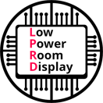

# Low Power Room Display

---

<!-- Für die Nummerierung am besten die Nummerierung der vorgehenden Überschrift verwenden und einen Index dran hängen, dann gibt es am wenigsten Überscheidungen. 
Beispiel: Erstes Bild im Kapitel 2.1 -> Abbildung 2.1.1 -->

<!-- So wird ein Bild angegeben -->
<!-- Keyword "Figure:" Abbildung <Nummer>: <Bildunterschrift> -->
Figure: Abbildung 2.1.1: Das ist ein Bild { #_fig_211 }

{ width=30% }

<!-- So wird ein Bild referenziert -->
In [Abbildung 2.1.1](#_fig_211) ist folgendes zu sehen. 

<!-- So wird eine Tabelle angegeben -->
<!-- Keyword "Table:" Abbildung <Nummer>: <Tabellenunterschrift> -->
Table: Tabelle 2.4: Das ist eine Tabelle { #_tab_24 }

| heading 1| heading 2 | 
| - | - | 
| content 1 | content 2 |
| content 3 | content 4 |

<!-- So wird eine Tabelle referenziert -->
In [Tabelle 2.4](#_tab_24) ist folgendes zu sehen. 

---

Hallo

Project documentation for the Low Power Room Display (LPRD) project.
